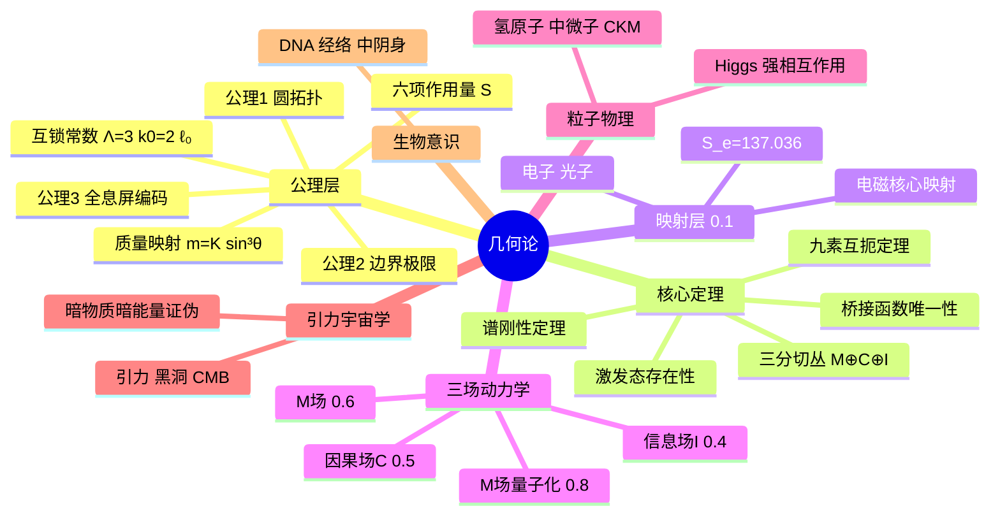
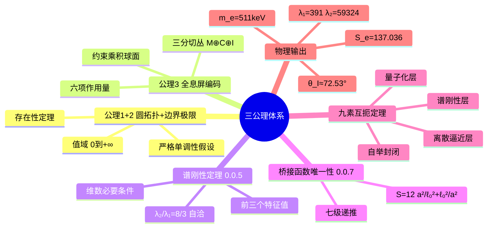
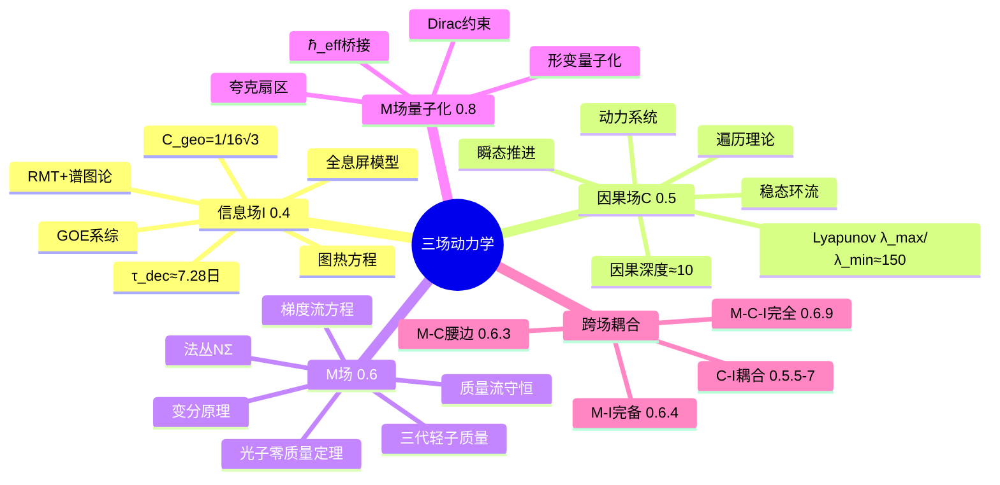
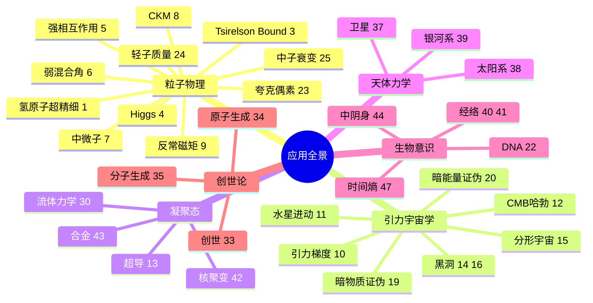

# 几何论思维导图全集

**编号：** 50  
**版本：** 260701.1  
**类型：** 导航/索引工具  
**依赖基础：** 全部0.X–49号文章  

---

## 本文说明

本文提供几何论体系的**多视角思维导图**，共四张：

| 图号 | 视角 | 适合读者 |
|------|------|----------|
| 图1 | 总览全景 | 初次接触几何论 |
| 图2 | 公理→定理推导链 | 关注数学基础 |
| 图3 | 三场动力学（I/C/M） | 关注动力学结构 |
| 图4 | 应用领域分类 | 关注物理/宇宙/生物应用 |

每张图以**缩进文本**呈现（兼容所有阅读器），并附**Mermaid mindmap**（支持HTML渲染器）。

---

## 图1：几何论总览全景

```
几何论（Geometric Theory）
│
├── 【公理层】三条公理 + 三个互锁常数
│   ├── 公理1：圆拓扑公理（参数空间 D = S¹\{p₀,p*}, 0.0.3）
│   ├── 公理2：边界极限公理（几何量连续性+边界行为, 0.0.3）
│   ├── 公理3：全息屏编码条件（θ_M+θ_C+θ_I=90°, 0.0.6/0.0.7）
│   ├── 互锁常数：Λ=3, k₀=2, ℓ₀
│   ├── 六项作用量：S = Σ 1/sin²θ_i + Σ_{i<j} 1/(sinθ_i sinθ_j)
│   └── 质量映射：m = K·sin³θ_M, K=839.758793 keV
│
├── 【核心定理层】纯数学导出
│   ├── 九素互扼定理（三公理+三常数+三工具层互锁, 0.0.7/0.1）
│   ├── 谱刚性定理（前三个Laplace特征值→等距, 0.0.5）
│   ├── 桥接函数唯一性（S(a)=12(a²/ℓ₀²+ℓ₀²/a²), 0.0.7）
│   ├── 激发态存在性定理（值域(0,+∞), 0.0.3）
│   ├── 约束乘积球面：M(a)=S³(a)×S³(a/√Λ)×S³(a/√(Λk₀))
│   └── 三分切丛：TΣ = M ⊕ C ⊕ I（物质/因果/信息）
│
├── 【映射层】几何→物理（0.1）
│   ├── 单一核心映射：M-C腰边耦合 ↔ 电磁相互作用
│   ├── 电子（源模，m_e≈511 keV）
│   ├── 光子（传播模，质量=0，速度=c）
│   ├── 精细结构常数 S_e=137.035999084
│   └── 唯一外部锚点：真空光速 c
│
├── 【三场动力学】0.4–0.6
│   ├── 信息场 I（0.4）：随机矩阵/谱图论/全息屏/退相干
│   ├── 因果场 C（0.5）：遍历理论/动力系统/Lyapunov
│   ├── M场（质量场）（0.6）：法丛/梯度流/质量流/变分原理
│   └── M场量子化（0.8）：Dirac约束/形变量子化/ℏ_eff
│
├── 【量纲桥与跨场耦合】0.2–0.3
│   ├── 量纲桥（0.3.X）：几何尺度↔物理单位
│   ├── 几何约束截面（0.2.X）
│   ├── 跨扇区耦合（0.1.2）
│   ├── C-I耦合（0.5.5–0.5.7）
│   ├── M-C腰边耦合（0.6.3）
│   ├── M-I完备性耦合（0.6.4）
│   └── M-C-I三场完全耦合（0.6.9）
│
├── 【粒子物理】1–9, 23–25
│   ├── 氢原子超精细结构（1）
│   ├── 量子纠缠/Tsirelson Bound（3）
│   ├── Higgs呼吸模式（4）
│   ├── 强相互作用/联合截面（5）
│   ├── 弱混合角/弱电整合（6）
│   ├── 中微子质量谱与振荡（7）
│   ├── CKM矩阵/夸克混合（8）
│   ├── 反常磁矩（9）
│   ├── 夸克偶素谱（23）
│   ├── 三代轻子质量刚性（24）
│   └── 中子衰变（25）
│
├── 【引力与宇宙学】10–20, 46
│   ├── 引力=核子数几何梯度（10）
│   ├── 水星近日点进动（11）
│   ├── CMB声学峰与哈勃常数（12）
│   ├── 黑洞与信息悖论（14）
│   ├── 分形层级宇宙（15）
│   ├── 黑洞辐射频谱（16）
│   ├── 放射性测年几何修正（17）
│   ├── 星系旋转曲线/暗物质证伪（19）
│   ├── 宇宙加速膨胀/暗能量证伪（20）
│   └── 物质界收缩时间（46）
│
├── 【凝聚态与化学】13, 30, 42–43
│   ├── 超导转变温度（13）
│   ├── 几何流体力学（30）
│   ├── 核聚变几何筛选（42）
│   └── 合金设计（43）
│
├── 【天体力学】37–39
│   ├── 卫星系统解析（37）
│   ├── 太阳系精密轨道（38）
│   └── 银河系结构（39）
│
├── 【生物与意识】21–22, 31, 40–41, 44
│   ├── 人体三界不可约定理（21）
│   ├── DNA双螺旋/RNA-蛋白质（22）
│   ├── 信息场三阶段相变（31）
│   ├── 经络的几何起源（40）
│   ├── 因果场相位节点漂移（41）
│   └── 中阴身几何证明（44）
│
├── 【创世与演化】32–36, 49
│   ├── 创世（33）
│   ├── 原子生成：千区并行与完美态筛选（34）
│   ├── 分子生成（35）
│   └── 第八级不可计算自由度（49）
│
└── 【基础常数锁定】
    ├── S_e = 137.035999084（精细结构常数倒数）
    ├── λ₁^eff = 391.05, λ₂^eff = 59324.3（Hessian软硬模）
    ├── χ_L = 1.509×10⁻¹⁰ m（特征长度）
    ├── χ_T = 3.616×10⁻¹⁷ s（特征时间）
    ├── K = 839.758793 keV（质量映射常数）
    ├── Γ_geo = 5.75×10⁻²³（几何衰减宽度）
    ├── τ_dec ≈ 7.28 日（退相干时间）
    └── θ_I ≈ 72.53°（信息场上饱和稳态）
```

### Mermaid版（图1）



---

## 图2：公理→定理推导链

```
【输入】三条公理 + 三个互锁常数
│
├── 公理1（圆拓扑） + 公理2（边界极限）
│   └──→ 激发态存在性定理（0.0.3 §2.5）
│   └──→ 值域定理 S(D_±) = (0,+∞)（0.0.3 §2.4）
│   └──→ 严格单调性（构造性假设，0.0.3 §2.3）
│
├── 公理3（全息屏编码：θ_M+θ_C+θ_I=90°）
│   └──→ 三分切丛 TΣ = M⊕C⊕I（0.0.6）
│   └──→ 六项作用量 S(θ) = Σ1/sin²θ_i + Σ1/(sinθ_i sinθ_j)（0.0.6）
│   └──→ S在(30°,30°,30°)取最小值24（0.0.6 定理4.4）
│   └──→ 约束乘积球面 M(a)（0.0.5 定义3.1）
│
├── 约束乘积球面 + Laplace-Beltrami谱
│   └──→ 谱刚性定理（0.0.5 定理5.1）
│   │   ├── 前三个特征值 λ₁,λ₂,λ₃ → 唯一确定 a,b,c
│   │   ├── λ₂/λ₁=8/3 作为内部自洽检验
│   │   └── 维数必要条件（0.0.5 §6）
│   └──→ Dirac指标定理 Â(M(a))=1（0.0.5 §7.1）
│   └──→ 谱作用量/热核展开（0.0.5 §7.2–7.5）
│   └──→ 法丛曲率–Hessian锁定（0.0.5 §7.4）
│
├── 桥接函数类 + 尺度倒数对偶 + 基态锁定 + 谱渐近
│   └──→ 桥接函数唯一性 S(a)=12(a²/ℓ₀²+ℓ₀²/a²)（0.0.7 定理5.3）
│   └──→ 七级递推 N_eff≤7, Bott周期截断（0.0.7 §6）
│
├── 三公理 + 三互锁常数 + 三工具层
│   └──→ 九素互扼定理（0.0.7 §8, 0.1）
│   │   ├── 量子化层：Berezin-Toeplitz
│   │   ├── 谱刚性层：Hessian正定性
│   │   └── 离散逼近层：全息屏谱图论
│   └──→ 六个互扼环节 → 超定方程组 → 唯一锁定互锁常数
│   └──→ 自举封闭链条（无外部自由参数，c为唯一锚点）
│
├── 九素互扼 → 电子基态角度锁定
│   └──→ S₀=137 → S_e=137.035999084（七级递推）
│   └──→ θ_M^e, θ_C^e, θ_I^e 唯一确定
│   └──→ K=839.758793 keV（质量映射常数）
│   └──→ m_e=511 keV（电子质量）
│
├── 电子基态角度 → Hessian矩阵
│   └──→ 软模 λ₁^eff=391.05, 硬模 λ₂^eff=59324.3
│   └──→ 软硬模比 Λ_H≈150 → 双曲结构
│   └──→ Hessian正定性 → 谱刚性支持
│
└── 几何→物理映射（0.1）
    ├── 单一核心映射：M-C腰边耦合 ↔ 电磁
    ├── 量纲桥：χ_L=1.509×10⁻¹⁰m, χ_T=3.616×10⁻¹⁷s
    ├── 信息场上饱和：θ_I≈72.53°
    └── 退相干时间：τ_dec≈7.28日
```

### Mermaid版（图2）



---

## 图3：三场动力学（I/C/M）详细结构

```
三场动力学全景
│
├── 【信息场 I】（0.4 系列）
│   ├── 数学工具：随机矩阵理论（RMT）+ 谱图论
│   ├── 核心结构
│   │   ├── Hessian矩阵 → GOE系综分析（0.4 §2）
│   │   │   ├── 本征值间距比 → Wigner-Dyson普适性
│   │   │   └── 谱刚性的随机矩阵表述
│   │   ├── 全息屏模型（0.4 §3）
│   │   │   ├── 图拉普拉斯 → Laplace-Beltrami（N→∞极限）
│   │   │   ├── 空间分辨率 Δr_min = χ_L·δη/π = λ_C（偏差<0.14%）
│   │   │   └── 像素计数 N_pixel(r) = 4πr²/Δr_min²
│   │   ├── 几何因子 C_geo = 1/(16√3)（0.4 §4）
│   │   └── 退相干因果深度 N_dec（0.4 §5）
│   ├── 动力学方程
│   │   ├── 信息场几何流：图热方程（0.4 §6）
│   │   ├── 非齐次推广 → 静态极限Poisson方程
│   │   ├── Cheeger不等式与代数连通度（0.4 §7）
│   │   └── 退相干时间 τ_dec≈7.28日（图热核衰减率确定）
│   ├── 跨场耦合
│   │   ├── 信息界 I³ 块随机矩阵结构（0.4 §9）
│   │   ├── H_CI 块关联参数（0.4 §9.1）
│   │   └── → C-I耦合（0.5.5–0.5.7）
│   └── 子文章：0.4.1–0.4.6
│       ├── 0.4.1–0.4.2：信息场基础
│       ├── 0.4.3：三分切丛子结构组合数学
│       ├── 0.4.4：信息场统一动力学方程（三层封闭）
│       ├── 0.4.5：观测映射链（谱解码→物理预言）
│       └── 0.4.6：C_geo 几何因子
│
├── 【因果场 C】（0.5 系列）
│   ├── 数学工具：遍历理论（Ergodic Theory）+ 动力系统
│   ├── 核心结构
│   │   ├── 坐标系（0.5 §2）
│   │   │   ├── ξ：近似硬模方向（λ₂≈59324）
│   │   │   ├── η：近似软模方向（λ₁≈391）
│   │   │   └── 与0.2.1截面坐标的过渡关系
│   │   ├── 瞬态因果推进（0.5 §2.2）
│   │   └── 稳态因果环流（0.5 §2.3）
│   ├── 遍历理论框架（0.5 §3）
│   │   ├── 保测变换与遍历性
│   │   ├── Birkhoff遍历定理 → 覆盖定理
│   │   └── 混合性与信息覆盖
│   ├── 动力系统表述（0.5 §4）
│   │   ├── 因果时间τ = 单参数李群 exp(τX) 弧长参数
│   │   ├── Lyapunov指数：λ_max/λ_min≈150（双曲结构确认）
│   │   └── Poincaré截面与回归时间
│   ├── 关键数值
│   │   ├── 因果深度 N_cause≈10
│   │   └── 硬方向冻结的Lyapunov解释（0.5 §6）
│   ├── C-I耦合（0.5 §7）
│   │   ├── 覆盖定理的Birkhoff形式
│   │   └── 速率自洽的谱条件
│   └── 子文章：0.5.1–0.5.7
│       ├── 0.5.1：Liouville提升与熵单调性
│       ├── 0.5.2：C-I交互自由能与联合H-定理
│       ├── 0.5.3：ρ_CI*弱耦合求解
│       ├── 0.5.4：非摄动求解（时间尺度分离）
│       ├── 0.5.5：一阶耦合遍历平均抵消（Fredholm约束）
│       ├── 0.5.6：谱三元组→密度Liouville桥接
│       └── 0.5.7：C-I双场联合演化
│
├── 【M场（质量场）】（0.6 系列）
│   ├── 几何地位：法丛 NΣ（0.6 §2）
│   │   ├── M沿法向，C/I在切空间 TΣ
│   │   └── η坐标：M场动力学的自然变量
│   ├── 梯度流方程（0.6 §3）
│   │   ├── ∂_τ θ_M = −Γ_M · ∂S/∂θ_M
│   │   ├── 迁移率 Γ_M 由 Hessian 软硬模比锁定
│   │   └── 与0.5因果场动力学的对偶结构
│   ├── 质量流与守恒律（0.6 §4）
│   │   ├── J_M = 3K sin²θ_M cosθ_M · ∇θ_M
│   │   ├── 连续性方程
│   │   └── M-C-I三角关系
│   ├── 变分原理（0.6 §5）
│   │   └── 六项作用量在法丛上的约束极值
│   ├── 耦合结构
│   │   ├── M-C腰边耦合（0.6.3）：电子-光子对
│   │   ├── M-I完备性耦合（0.6.4）：θ_M↔θ_I反相关
│   │   ├── M场呼吸模式（0.6.5）
│   │   ├── M场谱分析（0.6.6）
│   │   └── M-C-I三场完全耦合（0.6.9）
│   └── 子文章：0.6.1–0.6.9
│       ├── 0.6.1：法向几何结构
│       ├── 0.6.2：质量生成动力学
│       ├── 0.6.3：M-C腰边耦合
│       ├── 0.6.4：M-I耦合
│       ├── 0.6.5：呼吸模式
│       ├── 0.6.6：谱分析
│       ├── 0.6.7：三代轻子质量统一描述
│       ├── 0.6.8：光子零质量定理
│       └── 0.6.9：M-C-I三场完全耦合
│
└── 【M场量子化】（0.8 系列）
    ├── 0.8.0：M场量子化总论
    ├── 0.8.1：扩展相空间（法向辛结构+梯度流哈密顿嵌入）
    ├── 0.8.2：Dirac约束量子化（约束代数+动量映射）
    ├── 0.8.3：形变量子化（M场量子谱+梯度流桥接）
    ├── 0.8.4：ℏ_eff桥接与三路交叉验证
    ├── 0.8.5：量子修正预言合集+实验对比路线图
    └── 0.8.6：夸克扇区量子化
```

### Mermaid版（图3）



---

## 图4：应用领域全景分类

```
几何论应用全景（1–49号文章）
│
├── 【粒子物理与标准模型】1–9, 23–25
│   │
│   ├── 量子电动力学（QED）
│   │   ├── 1：氢原子超精细结构（21cm线几何推导）
│   │   └── 9：反常磁矩（g-2的几何起源）
│   │
│   ├── 量子纠缠基础
│   │   └── 3：Tsirelson Bound的几何定理
│   │
│   ├── 电弱统一
│   │   ├── 4：Higgs呼吸模式（126 GeV的几何根源）
│   │   └── 6：弱混合角与弱电整合
│   │
│   ├── 强相互作用
│   │   ├── 5：联合截面与强相互作用（ℰ映射三扇区联合提升）
│   │   └── 23：夸克偶素谱的高维几何起源
│   │
│   ├── 中微子物理
│   │   └── 7：中微子质量谱与振荡（倒伏相极限下的软模分裂）
│   │
│   ├── 夸克混合
│   │   └── 8：CKM矩阵与夸克混合的几何起源
│   │
│   ├── 轻子质量
│   │   └── 24：三代轻子质量的刚性（对比丘成桐流形与小出公式）
│   │
│   └── 核子物理
│       └── 25：中子衰变几何起源
│
├── 【引力与宇宙学】10–20, 46
│   │
│   ├── 引力理论
│   │   ├── 10：引力作为核子数的几何梯度
│   │   └── 11：水星近日点进动（42.98"/世纪，偏差<0.05%）
│   │
│   ├── 宇宙微波背景
│   │   └── 12：CMB声学峰与哈勃常数差异量级
│   │
│   ├── 黑洞物理
│   │   ├── 14：黑洞与信息悖论
│   │   └── 16：黑洞辐射频谱
│   │
│   ├── 宇宙大尺度结构
│   │   └── 15：分形层级宇宙
│   │
│   ├── 暗物质/暗能量（证伪路径）
│   │   ├── 19：星系旋转曲线与暗物质的证伪
│   │   └── 20：宇宙加速膨胀与暗能量的证伪
│   │
│   └── 宇宙演化
│       ├── 17：放射性测年的几何修正
│       └── 46：物质界收缩时间与宇宙尺度的几何结构
│
├── 【凝聚态物理】13, 30, 42–43
│   │
│   ├── 超导
│   │   └── 13：超导转变温度的几何模型
│   │
│   ├── 流体力学
│   │   └── 30：几何流体力学与空气动力学
│   │
│   ├── 核物理应用
│   │   └── 42：核聚变的几何筛选
│   │
│   └── 材料科学
│       └── 43：合金设计
│
├── 【天体力学】37–39
│   │
│   ├── 37：卫星系统的解析
│   ├── 38：太阳系精密轨道
│   └── 39：银河系结构
│
├── 【化学】0.2.4
│   │
│   └── 0.2.4：化学映射（几何约束截面→化学元素周期律）
│
├── 【生物学】21–22, 31, 40–41
│   │
│   ├── 人体
│   │   └── 21：人体三界不可约定理
│   │
│   ├── 分子生物学
│   │   └── 22：DNA双螺旋与RNA-蛋白质的几何模型
│   │
│   ├── 信息-物质循环
│   │   └── 31：信息场编码的三阶段相变与物质界循环结构
│   │
│   └── 经络（中医理论几何化）
│       ├── 40：经络的几何起源——因果场与信息场的耦合
│       └── 41：因果场相位节点在生物体表面曲率微扰下的漂移定理
│
├── 【意识与超越】44, 47–49
│   │
│   ├── 中阴身
│   │   └── 44：中阴身几何证明
│   │
│   ├── 时间哲学
│   │   └── 47：时间熵与时间纠缠的几何模型
│   │
│   ├── 信息-意识
│   │   └── 48：信息场饱和稳态的相位标记与集体锁定
│   │
│   └── 不可计算性
│       └── 49：第八级不可计算自由度的几何起源
│
├── 【创世论】32–36
│   │
│   ├── 33：创世
│   ├── 34：原子生成——千区并行与完美态筛选
│   └── 35：分子生成
│
└── 【与现代物理的关系】2, 18, 26–29, 32, 36, 45
    │
    ├── 2：几何论与现代物理的衔接
    └── 其他元理论/反思文章
```

### Mermaid版（图4）



---

## 附录A：按编号速查表

| 编号 | 标题关键词 | 领域 |
|------|-----------|------|
| 0.0.3 | 激发态参数空间公理化 | 公理基础 |
| 0.0.5 | 乘积球面谱刚性 | 核心定理 |
| 0.0.6 | 三分切丛与全息屏 | 公理基础 |
| 0.0.7 | 10方几何空间 | 公理基础 |
| 0.1 | 几何动力学（单一核心映射） | 映射层 |
| 0.1.1 | 三对偶几何空间与扇区耦合 | 映射层 |
| 0.1.2 | 跨扇区耦合前置因子 | 映射层 |
| 0.2.1 | 几何约束截面 | 量纲桥 |
| 0.2.2 | 全息宇宙 | 量纲桥 |
| 0.2.3 | 弯曲结构量子化/核幻数 | 量纲桥 |
| 0.2.4 | 化学映射 | 量纲桥 |
| 0.3.X | 量纲桥系列 | 量纲桥 |
| 0.4 | 信息场动力学总论 | I场 |
| 0.5 | 因果场动力学总论 | C场 |
| 0.6 | M场动力学总论 | M场 |
| 0.8 | M场量子化系列 | 量子化 |
| 1 | 氢原子超精细结构 | 粒子物理 |
| 2 | 与现代物理衔接 | 元理论 |
| 3 | 量子纠缠/Tsirelson Bound | 粒子物理 |
| 4 | Higgs呼吸模式 | 粒子物理 |
| 5 | 强相互作用 | 粒子物理 |
| 6 | 弱混合角 | 粒子物理 |
| 7 | 中微子质量谱 | 粒子物理 |
| 8 | CKM矩阵 | 粒子物理 |
| 9 | 反常磁矩 | 粒子物理 |
| 10 | 引力=核子数几何梯度 | 引力 |
| 11 | 水星近日点进动 | 引力 |
| 12 | CMB哈勃 | 宇宙学 |
| 13 | 超导 | 凝聚态 |
| 14 | 黑洞与信息悖论 | 宇宙学 |
| 15 | 分形层级宇宙 | 宇宙学 |
| 16 | 黑洞辐射频谱 | 宇宙学 |
| 17 | 放射性测年修正 | 交叉应用 |
| 19 | 暗物质证伪 | 宇宙学 |
| 20 | 暗能量证伪 | 宇宙学 |
| 21 | 人体三界不可约 | 生物 |
| 22 | DNA/RNA | 生物 |
| 23 | 夸克偶素谱 | 粒子物理 |
| 24 | 三代轻子质量刚性 | 粒子物理 |
| 25 | 中子衰变 | 粒子物理 |
| 30 | 几何流体力学 | 凝聚态 |
| 31 | 信息场三阶段相变 | 生物/意识 |
| 33 | 创世 | 创世论 |
| 34 | 原子生成 | 创世论 |
| 35 | 分子生成 | 创世论 |
| 37 | 卫星系统 | 天体力学 |
| 38 | 太阳系轨道 | 天体力学 |
| 39 | 银河系结构 | 天体力学 |
| 40 | 经络几何起源 | 生物 |
| 41 | 相位节点漂移 | 生物 |
| 42 | 核聚变筛选 | 凝聚态 |
| 43 | 合金设计 | 材料 |
| 44 | 中阴身 | 意识 |
| 46 | 物质界收缩时间 | 宇宙学 |
| 47 | 时间熵 | 意识/时间 |
| 48 | 信息场饱和稳态 | I场 |
| 49 | 第八级不可计算自由度 | 基础 |

---

## 附录B：诚实标注

1. **图1–4为导航工具**，不包含新推导或新结论。所有信息来自对应文章的摘要与目录。
2. **文章状态分层**：公理层（定理）、核心定理层（定理）、三场动力学（定理+构造性框架+假设混合）、应用层（推导+模型+诚实标注混合）。具体各命题的逻辑地位见原文。
3. **Mermaid图**为简化版，细节以缩进文本为准。
4. **开放问题**（如C_geo猜想状态、GM引力路径、a/e/T内生计算等）在原文章中已诚实标注，本导图不重复。

---

**文档版本：** 260701.1  
**下一步：** 欢迎读者提出修改建议或补充遗漏。
