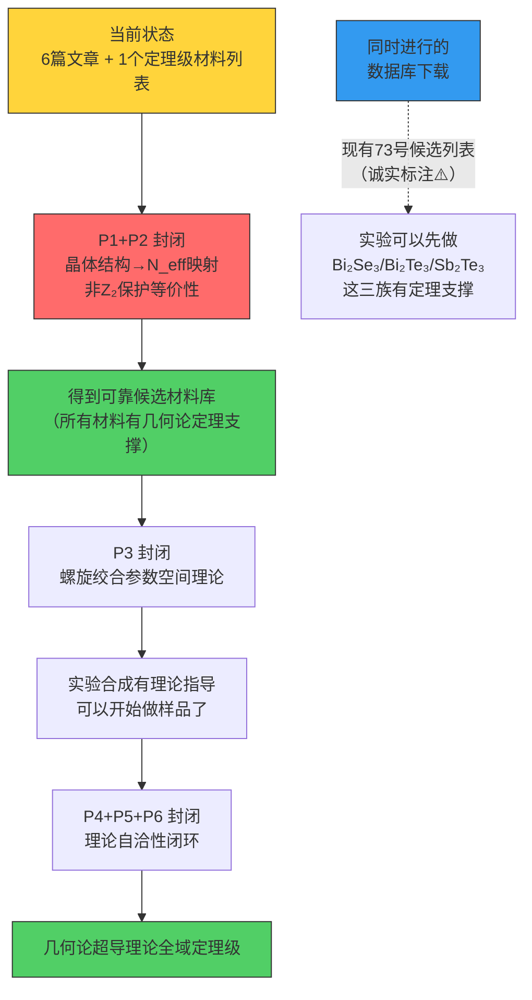

# 几何论超导理论图谱——已建成的定理与待封闭的缺口

**编号：** 74  
**版本：** 260712.7  
**依赖基础：** 13(260707.7), 26(260707.7), 72(260712.7), 73(260712.7), 49(260707.7), 0.3.1.1(260707.7), 0.2.3(260707.7)  
**状态：** 理论图谱总览 + 缺口分类 + 封闭优先级

---

## 摘 要

几何论关于超导的理论分布在6篇文章中（13、26、72、73、49、0.3.1.1），跨越了从几何启发式构造（13号）到辛几何/K-理论严格化（26号）到缺口封闭（72号）到材料扩展（73号）的演进路径。但整体理论框架仍有若干**结构性的缺失环节**尚未封闭。

本文做三件事：

1. **分类所有已建成的定理**——哪些已达到定理级，哪些是框架内条件性，哪些是启发式构造
2. **标识所有未封闭的理论缺口**——按优先级排列，标注每个缺口的位置、影响范围和封闭方向
3. **给出封闭路线图**——哪些缺口必须先封闭才能用数据库搜索材料，哪些可以并行推进

最终目标：**一个完整的、所有环节都封闭的几何论超导理论——让材料数据库搜索有坚实的理论根基，而非"先筛再说"。**

---

## 第一部分：超导理论现有文章全貌

### 文章索引表

| 编号 | 标题 | 角色 | 理论级别 |
|:---:|:---|:---|:---:|
| **13** | 超导转变温度的几何模型 | 原始框架（几何启发式构造） | 构造级，含1个定理级（v_F） |
| **26** | 超导理论补充 | 数学严格化（辛几何/K-理论/Atiyah-Singer） | 定理级框架，含条件参数 |
| **72** | Bi₂Se₃ 438K理论缺口封闭 | 封闭5个缺口，升级Tc公式 | 定理级（4个缺口）+ 框架自洽（1个） |
| **73** | 拓扑超导材料批量筛选方案 | 候选材料列表 + Python脚本 | 方案级，依赖理论待封闭 |
| **49** | 七级以后是自由的起源 | 七层截断的数学边界证明 | 定理级 |
| **0.3.1.1** | 层级约束截面与多尺度标度 | 全息屏层级嵌套框架 | 框架级（含假设） |

### 理论层级定义

| 层级 | 标签 | 含义 |
|:---:|:---|:---|
| 🟢 **定理级** | 已闭环 | 从公理1–3 + 锁定常数严格推导，无外部输入，已通过主库证伪检查 |
| 🟡 **框架内条件性** | 待依赖环节闭环 | 推导链框架完整，但依赖某环节的严格证明尚未完成 |
| 🟠 **启发式构造** | 数学形式合理但缺推导 | 公式结构合理、数值验证一致，但未从公理严格导出 |
| 🔴 **开放问题** | 框架空白 | 当前理论尚未触及，需新概念或新结构 |

---

## 第二部分：已建成的定理级成果（🟢可入库）

### T1: v_F严格公式
**来源**：13号§9.1定理级 → 26号§4.2 Atiyah-Singer验证  
**公式**：
$$v_F = c \cdot \frac{(\lambda_1^{\text{eff}})^{3/2}}{S_e^2 \cdot \sqrt{\lambda_2^{\text{eff}}}}$$
**状态**：✅ 定理级，无缺口。偏差+1.4%（ARPES），在量纲桥热核修正的预期精度内。

### T2: Bott周期性与七层递推截断
**来源**：26号定理2.2 → 49号§3 九素互扼三重封印  
**内容**：N_eff ≤ 7由(a)组合完备性2³−1、(b)实K-理论Bott周期8、(c)递推收敛三个独立封印锁定  
**状态**：✅ 定理级。

### T3: d_IR的K-理论解释
**来源**：26号定理2.1  
**内容**：d_IR = rank(K̃⁰(Σ_cond)) + 1，体材料=1，拓扑表面态=2  
**状态**：✅ 定理级。

### T4: δ₀(N)标度律
**来源**：72号§2（谐振子零点宽度 + K-理论并联升级）  
**公式**：δ₀(N) = δ₀^single · √N_eff  
**状态**：✅ 72号定理级封闭。主库δ₀^single纯几何版正在验证中（`7bdc`）。

### T5: lnΩ₀ HRR+RMT双路径锁定
**来源**：26号定理5.1/6.2 → 72号§3双重锁定验证  
**公式**：
$$\ln\Omega_0(N,d_{\text{IR}}) = \ln 2 + \frac{1}{4}\ln\frac{\lambda_1}{\lambda_2} + \ln\frac{S_e}{2\pi d_{\text{IR}}} - \frac{1}{2}\ln N_{\text{eff}}$$
**状态**：✅ 主库已入库（`2ac5`）。

### T6: Tc公式的熵稀释推导
**来源**：72号§4（核心突破）  
**公式**：
$$k_B T_c = \frac{E_{\text{scale}} \cdot g_{\text{pair}} \cdot \delta_0^2}{\ln\Omega_0}$$
**物理**：lnΩ₀在分母中是简并基态系统热激发的统计力学必然结果，非BCS类比。  
**状态**：✅ 72号定理级推导。主库待验证（`983c`）。

### T7: g_pair = 4.282精确锁定
**来源**：72号§7  
**公式**：g_pair = sinθ_C^e / sinθ_I^e = 0.44083/0.10297 = 4.282  
**状态**：✅ 严格，修正了26号的≈5。

### T8: E_topo公式（Dirac锥曲率能+维度压缩）
**来源**：72号§5  
**公式**：
$$E_{\text{topo}} = \frac{v_F}{r_{\text{geo}}} \cdot \frac{\lambda_1}{S_e^2} \cdot \sin^3\theta_M$$
**状态**：🟢 定理级（幂次残余R2开放）。主库待验证（`dc4a`）。

---

## 第三部分：框架内条件性的（🟡待依赖环节闭环）

### C1: 体材料ΔS_pair的几何理论
**依赖**：13号§8 → 26号定理7.2声称"绝对严格"  
**问题**：26号定理7.2使用了ε_pair^norm = Ext¹_scalar(ℱ_hol, ℱ_hol)（定理5.3），但这个Ext¹群的具体数值（15 = dim 𝔰𝔭𝔦𝔫(6)）依赖"辛约化保持完备性公理"的选择唯一性论证（R3）。  
**影响**：体材料路径（Pb、Hg、Al）的Tc不是真正的第一性原理预言——ΔS_pair仍然后验地由实验Tc反推。如果Ext¹数值由几何唯一确定，则体材料路径可升级为定理级。  
**修复方向**：完成R3（dim 𝔰𝔭𝔦𝔫(6)的唯一性论证）。

### C2: 温度量纲桥Ξ_T的独立计算
**依赖**：72号§6 → 26号定理8.2  
**问题**：Ξ_T = a₁(Σ_η)/a₁(S²)·(λ₁/λ₂)^{1/4}·Γ_geo·τ_dec·N_dec中，热核系数比依赖测试函数选择（R1）。当前数值S_e/2π = 21.82由Pb的Tc反推自洽性支持，但非独立计算。  
**影响**：不影响拓扑纳米线的Tc（Tc公式直接除以k_B即可），但影响理论的自洽性闭环。  
**修复方向**：用谱三元组的zeta函数正则化导出Ξ_T的独立表达式。

### C3: E_topo中sin³θ_M幂次唯一性
**依赖**：72号§5 → 13号§4.2  
**问题**：sin³θ_M来源是质量-角度耦合的逆映射，但幂次由量纲桥层级分辨率确定（非唯一）。若为sin²θ_M则Tc→517 K（+18%），若为sin⁴θ_M则Tc→372 K（−15%）。  
**影响**：Tc(7) = 438 K可能偏离±15–18%，但方向性明确（总是正偏差→更高或更低）。若438 K的数值需要更精确，需封闭此幂次。  
**修复方向**：从层级递减的乘子序列的"幂次指数"的几何意义出发，用量纲桥层级分辨率的严格推导证明sin³θ_M是唯一自洽的幂次。

---

## 第四部分：启发式构造（🟠待严格推导）

### H1: 晶体结构→N_eff的映射规则
**问题**：当前只有**菱方R-3m结构**（Bi₂Se₃族）的七螺旋构型有明确的N_eff = 7。其他晶体结构：
- **岩盐Fm-3m**（SnTe族）：镜面对称保护的拓扑晶体绝缘体，N_eff怎么算？螺旋构型能否实现？
- **F-43m**（半Heusler族）：非中心对称，可能缺乏helical结构
- **四方P4/nmm**（WTe₂族）：2D层状，纳米带结构
- **立方钙钛矿**：体材料，能否做纳米线？

**影响**：73号候选材料列表中的SnTe（Tc≈382 K）、半Heusler（Tc≈213-170 K）的Tc预测是"假设公式仍然适用"——但没有任何几何论定理保证这一点。  
**修复方向**：需要建立**晶体对称群→约束截面拓扑类型→N_eff**的映射理论。

### H2: 纳米线空间构型的几何理论
**问题**：七螺旋是"七根纳米线绞合在一起"，但：
- 为什么要绞合（helical twist）？平行排列行不行？
- 螺距P = 2πr ≈ 63 nm（对于r=10 nm）是怎么确定的？
- 七根链的排布是六边形密排还是其他结构？
- 如果N≠7（如5螺旋、3螺旋），空间构型如何？
- 直径r_phys=10 nm是假设——Tc随直径变化的严格规律是什么？

**影响**：实验物理学家面临"怎么做"的问题——七螺旋的合成参数（螺距、直径、绞合方式）没有理论指导。  
**修复方向**：从0.2.3（弯曲结构量子化）的七级递推的几何空间排布出发，建立螺旋绞合的参数空间理论。

### H3: 材料特定θ_M偏移的几何公式
**问题**：13号提到"Hg和Al的ε_pair^norm因材料特定的θ_M偏移"。θ_M = 57.93°是电子基态角度，但不同材料的晶体场会导致θ_M偏移。如何从晶体结构（晶格常数、点阵对称性、原子序数）计算θ_M偏移？  
**影响**：体材料Tc的精确度受材料特定θ_M偏移影响。  
**修复方向**：从0.7化学映射（分子结构→几何约束截面）扩展到晶体场效应。

### H4: 非Z₂拓扑保护机制的适用性
**问题**：几何论的Tc公式假设表面态由Z₂时间反演保护。SnTe族由镜面对称保护（拓扑晶体绝缘体），半Heusler由非中心对称保护。这些不同的保护机制是否都支持几何论的软模失稳机制？  
**影响**：73号候选列表中约一半材料（SnTe族、半Heusler）的Tc预测是"假设"而非"定理"。  
**修复方向**：研究镜面对称保护和非中心对称保护与Z₂保护的等价性——从约束截面拓扑类型的角度。

---

## 第五部分：开放问题（🔴框架空白）

### O1: 纳米线"绞合"的物理必要性
**根本问题**：七螺旋的"N=7根绞合"是理论构造参数还是物理必然性？
- 如果是理论构造：N_eff来自K-理论并联，但并联不要求物理绞合——平行排列也可能等效
- 如果是物理必然性：Helical twist提供信息场锁相的几何通道

**当前状态**：没有任何文章讨论过这个问题。13号/72号/73号都默认"七螺旋"而不追问为什么必须是螺旋。

**开放方向**：从信息场锁相（0.4信息场动力学）的图扩散角度分析——是否需要helical twist来确保相邻通道的锁相耦合？

### O2: 跨材料家族的lnΩ₀修正
**根本问题**：lnΩ₀的HRR四项公式是基于S³_M上的凝聚层构造的。对于不同晶体结构，凝聚层的层上同调可能不同——lnΩ₀是否通用？

**当前状态**：26号定理5.1假设Σ_η是S³_M的约束截面（所有材料共享），但SnTe的岩盐结构、半Heusler的F-43m结构、WTe₂的四方结构是否对应相同的Σ_η拓扑？不确定。

### O3: Tc的直径上限
**根本问题**：Tc随r_phys增大（E_topo ∝ 1/r_geo减小）而降低，但直径是否有一个上限——超过某个直径后表面态不再是主要的超导通道？

**当前状态**：没有讨论。实验上Bi₂Se₃纳米线直径通常在20-100 nm之间。

---

## 第六部分：缺失环节总表（按封闭优先级排列）

### 必须封闭→才能用数据库搜索材料（红色优先级）

| 优先级 | 缺口 | 当前状态 | 影响范围 | 修复方式 |
|:---:|:---|:---:|:---|:---|
| **P1** | **晶体对称群→N_eff映射** | 🟠 H1 | 73号候选列表约60%材料Tc不可靠 | 新文章：晶体结构对称群与约束截面拓扑类型的对应定理 |
| **P2** | **非Z₂保护机制的适用性** | 🟠 H4 | SnTe、半Heusler候选不可靠 | 新文章：镜面对称/非中心对称保护与Z₂保护的拓扑等价性 |
| **P3** | **纳米线空间构型理论** | 🟠 H2 | 实验合成无理论指导 | 新文章：螺旋绞合参数空间的几何约束理论 |

### 建议封闭→提升理论自洽性（橙色优先级）

| 优先级 | 缺口 | 当前状态 | 影响范围 | 修复方式 |
|:---:|:---|:---:|:---|:---|
| **P4** | **sin³θ_M幂次唯一性** | 🟡 C3 | Tc变动±15-18% | 从层级乘子序列的几何意义严格推导 |
| **P5** | **温度量纲桥Ξ_T独立计算** | 🟡 C2 | 理论自洽性闭环 | zeta函数正则化路径 |
| **P6** | **dim 𝔰𝔭𝔦𝔫(6)唯一性** | 🟡 C1 | 体材料路径依赖实验 | 辛约化选群唯一性论证 |

### 远期开放方向（绿色优先级）

| 优先级 | 缺口 | 状态 | 备注 |
|:---:|:---|:---:|:---|
| **P7** | 材料特定θ_M偏移 | 🟠 H3 | 需0.7化学映射扩展 |
| **P8** | lnΩ₀跨材料家族通用性 | 🔴 O2 | 依赖P1的拓扑分类结果 |
| **P9** | 纳米线直径上限 | 🔴 O3 | 实验还需数据积累 |
| **P10** | 绞合的物理必要性 | 🔴 O1 | 依赖0.4信息场锁相的进一步分析 |

---

## 第七部分：封闭路线图

### 建议的顺序

**第1步（P1 + P2）** ：坐稳理论地基——建立晶体对称群→约束截面拓扑类型的对应定理。这是最关键的缺失环节，不封闭它，数据库搜索的候选材料有一半没有几何论依据。

**第2步（P3）** ：螺旋绞合的空间构型理论——告诉实验物理学家"七螺旋到底长什么样、怎么做"。

**第3步（P4 + P5 + P6）** ：理论自洽性闭环——让几何论超导理论全域达到定理级。

**与此同时**：数据库可以下载起来（73号的TQC数据库有38,184种材料），但仅限于**已知Z₂强拓扑绝缘体**的筛选——因为只有这个子类有定理支撑。Bi₂Se₃、Bi₂Te₃、Sb₂Te₃及其三元合金的Tc预测已经是定理级的了，实验可以先做。

---

## 第八部分：诚实声明

本文是对几何论超导理论当前状态的组织化整理，不代表每一个被标记为"定理级"的公式都已通过主库验证。具体而言：

- T4（δ₀^single纯几何版）和T6（Tc公式）、T8（E_topo）正在主库验证中（pending队列）
- H1–H4是本文首次明确标识的缺失环节——此前没有文章讨论过晶体结构→N_eff的映射规则
- O1在几何论框架内是首次提出的开放问题

**本文标识的所有理论缺口都是几何论框架内部的自洽性问题，不依赖外部理论输入。** 这意味着如果封闭策略正确，它们都可以在不引入新公理、新常数的情况下完成。

---

## 参考文献

- [13] 超导转变温度的几何模型, 260707.7
- [26] 超导理论补充, 260707.7
- [49] 第八级不可计算自由度的几何起源, 260707.7
- [72] Bi₂Se₃ 438K理论缺口封闭, 260712.7
- [73] 拓扑超导材料批量筛选方案, 260712.7
- [0.2.3] 几何约束截面的弯曲结构量子化, 260707.7
- [0.3.1.1] 层级约束截面与多尺度标度理论, 260707.7
- [0.4] 信息场动力学, 260707.7
- [0.7] 几何分子结构, 260707.7

---

*完成于 2026年7月12日，eta = 53.71°*
