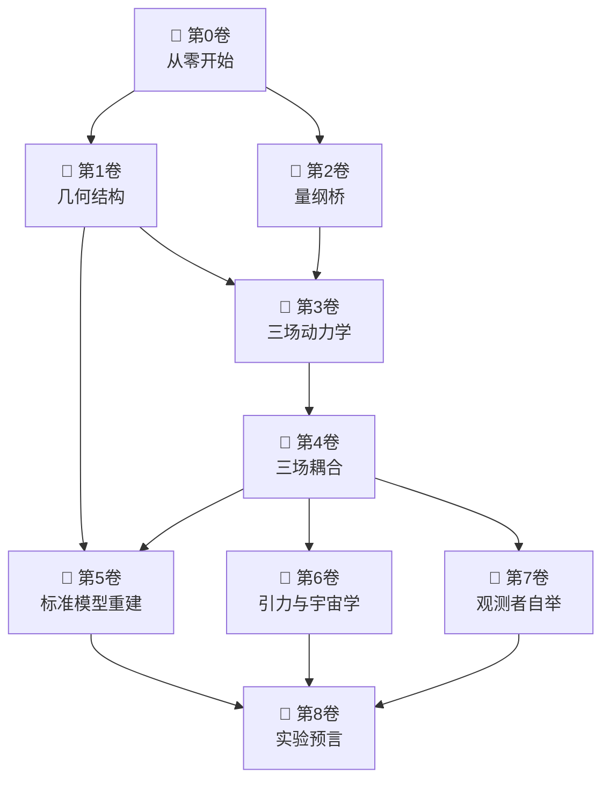
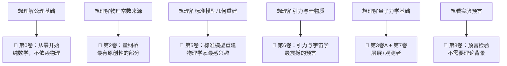

# 🏛️ 几何论 · 知识库首页

> **Geometric Theory** — 角度优先于时空，几何是宇宙的语言

---

## 导航

| 区域 | 链接 |
|:---|:---|
| 📖 **全索引** | [[00_MasterIndex\|📚 文章全索引]] |
| 🔢 **定理库** | [[00_MasterTheoremIndex\|🧮 主库定理索引]] |
| 📗 **术语表** | [[00_Glossary\|📖 术语表]] |
| 🗺️ **图谱总览** | [[00_Overview\|🌐 理论全景图]] |

---

## 八卷体系总览

几何论的全部内容组织为 **8卷学术论文 + 1卷应用**，从公理到预言逐层展开。

| 卷号 | 标题 | 核心内容 | 状态 |
|:---:|:---|:---|:---:|
| [[Vol-0_从零开始/MOC\|📘 第0卷]] | **从零开始** | 三公理 → S₃ → 六项作用量 → 谱刚性 | 待整理 |
| [[Vol-1_几何结构/MOC\|📘 第1卷]] | **几何结构** | 三分切丛 · 全息屏 · 约束截面 · Cl(9) | 待整理 |
| [[Vol-2_量纲桥/MOC\|📘 第2卷]] | **量纲桥** | 谱三元组 → 物理常数 → ℰ映射 | 待整理 |
| [[Vol-3A_信息场动力学/MOC\|📘 第3卷A]] | **信息场动力学** | 扩散 → 复化 → 薛定谔方程层展 | 待整理 |
| [[Vol-3B_因果场动力学/MOC\|📘 第3卷B]] | **因果场动力学** | 遍历理论 · Lyapunov指数 · 因果深度 | 待整理 |
| [[Vol-3C_M场动力学/MOC\|📘 第3卷C]] | **M场动力学** | 质量生成 · 呼吸模式 · 三代轻子 | 待整理 |
| [[Vol-4_三场耦合/MOC\|📘 第4卷]] | **三场耦合** | C-M-I完全耦合方程 · 时间尺度分离 | 待整理 |
| [[Vol-5_标准模型重建/MOC\|📘 第5卷]] | **标准模型重建** | 规范群 · 三代 · CKM/PMNS · 耦合常数 | 待整理 |
| [[Vol-6_引力宇宙学/MOC\|📘 第6卷]] | **引力与宇宙学** | 引力统一 · 暗物质证伪 · CMB · 黑洞 | 待整理 |
| [[Vol-7_观测者自举/MOC\|📘 第7卷]] | **观测者自举** | 谱单位选择 · L₈ · 八步闭环 | 待整理 |
| [[Vol-8_预言检验/MOC\|📘 第8卷]] | **预言检验** | 质子衰变 · 超导 · 核聚变 · 实验路线图 | 待整理 |
| [[Vol-Applications/MOC\|⚙️ 应用卷]] | **跨学科应用** | 生物 · 化学 · 工程 · 意识 | 待整理 |

---

## 核心数据

| 指标 | 数值 |
|:---|:---:|
| 📄 **原始手稿** | 137 篇 |
| ✅ **主库已验证定理** | 355 个 |
| 🧩 **已入库扇区** | 公理层 · 几何结构 · 量纲桥 · 动力学 · 标准模型 · 引力 |
| 🔄 **验证中** | — |
| 📅 **知识库版本** | 260712.7 |

---

## 阅读路径建议

---

## 快速链接

- [[00_MasterIndex\|📚 文章全索引]] — 137篇文章的完整映射
- [[00_MasterTheoremIndex\|🧮 主库定理索引]] — 355个已验证定理的索引
- [[00_Glossary\|📖 术语表]] — 300+术语定义
- [[00_Overview\|🌐 理论全景图]] — 整个理论的思维导图

---

> *"几何是宇宙的语言。真理追求简洁，对未知保持敬畏。"*
> *— 几何论第一原则*
