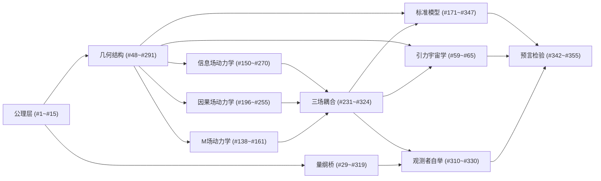

# 🧮 主库定理索引

> **355个几何论定理的分类索引**
> 版本：260712.7 | 最近入库：#355

---

## 使用说明

本索引将主库已验证定理按专题领域分类。每条记录格式为：
`#编号` — 定理名（简要描述）

在Obsidian笔记中引用：`[[#编号|定理名]]` 或直接引用编号 `#编号`。

---

## 一、公理与基础（#1~#15）

| 编号 | 定理名 | 说明 |
|:---:|:---|:---|
| #1 | d²=0 | 外微分平方为零（基本代数事实） |
| #2 | 分支拓扑结构 D_± ≅ (0,1) | 分支同胚于开区间 |
| #3 | 三分切丛置换群刚性 G≅S₃ | 扇区标记的对称性 |
| #4 | 互锁常数 Λ=3, k₀=2 | 基础整数常数 |
| #5 | 扇区置换刚性 | 置换群同构唯一性 |
| #6 | 乘积流形谱分离 | 谱结构分解 |
| #7 | 模空间参数化 | 单参数a的模空间 |
| #8 | 第一特征值坐标化 | θ坐标的谱基础 |
| #9 | 三分切丛分解 TM=M⊕C⊕I | 切丛的扇区直和分解 |
| #10 | **公理3：全息屏编码条件** | θ₁+θ₂+θ₃=90° |
| #11 | Hamilton向量场与辛相轨线 | 辛几何基础结构 |
| #12 | 对称轴单值化定理 | 对称性锁定 |
| #13 | 参数化映射显式构造 | 坐标化构造 |
| #14 | 幻数与六项作用量代数联系 | 幻数序列的代数根源 |
| #15 | **M(a)约束等谱刚性** | 乘积球面谱唯一性 |

---

## 二、几何结构——三分切丛与全息屏（#48~#68）

| 编号 | 定理名 | 说明 |
|:---:|:---|:---|
| #48 | 九素互扼锁定结构 | 三公理×三常数×三工具 |
| #54 | **切丛平方根分解 TΣ≅O(2)** | 全息屏全纯切丛 |
| #67 | 三分切丛投影诱导配对结构 | 幻数序列 (k+1)² |
| #68 | 投影配对结构（重建版） | 张量积态空间维数 |
| #95 | 跨扇区耦合谱刚性 | ΔH同型唯一确定 |
| #107 | 刚度约束比 λ₂/λ₁≈149.8 | Hessian硬软模比 |
| #129 | 扇区投影因子相等 f_M=f_Σ=1/2 | KO-维数9≡1(mod 8) |
| #140 | N体联合Hessian块对角结构 | M-同步约束下可分离 |
| #143 | 谱间隙定理 Λ_H=152.41 | 约束流形特征值比 |
| #145 | **谱间隙定理（完整版）** | λ_fast/λ_slow=59598/391.05 |
| #164 | 谱权重6:2:1 | S₃谱展开三级权重 |
| #187 | 约束Hessian在对称点的谱分离 | S₃→Z₃不可约表示 |
| #239 | SU(3)结构 | 三分切丛复化U(3)→SU(3) |
| #244 | (c₁+c₂)/2=5 | 九素互扼整数定理 |
| #280 | 约束截面软模零点宽度 | 谱几何公式 δ₀^single |
| #283 | 全息屏铺满定理 | 三扇区投影完整性 |
| #288 | 切丛平方根分解+幻数定理 | 综合版 |
| #289 | 约束截面Hessian闭式 | 解析闭式表达式 |
| #291 | 投影切丛曲率-作用量对偶 | Hessian与曲率R的对偶 |

---

## 三、量纲桥——从纯几何到物理常数（#29, #175, #319等）

| 编号 | 定理名 | 说明 |
|:---:|:---|:---|
| #29 | **谱单位选择定理** | ℓ₀唯一确定（Vol=1归一化） |
| #175 | **α=1/S_e 电磁耦合** | 精细结构常数的几何形式 |
| #213 | sin²θ_W | 弱混合角的几何构造 |
| #254 | 观测者角度分辨率 δη=1/√λ₁ | 最小可分辨角 0.05057 rad |
| #261 | 观测者谱分辨量 R_𝒪 | 纯几何导出量 |
| #267 | 谱间隙比 Λ_H=152.41 | 约束Hessian刚性锁定 |
| #276 | **α_s = √(N·λ₁/λ₂)·sinθ_M** | 强耦合常数的几何形式 |
| #297 | 全息屏编码条件（公理3重申） | θ_M+θ_C+θ_I=90° |
| #303 | 刚度约束比（重申） | λ₂/λ₁≈149.8 |
| #315 | 观测者角度分辨尺度固定 | δη_𝒪=0.05057 rad |
| #319 | **C：谱单位选择定理** | (χ_L, χ_T, K)唯一选出 |
| #328 | **2D动能项定理4.2** | 呼吸模式动能项的几何形式 |
| #347 | 有效磁矩 μ_eff/μ_B=5.430 | 几何投影比值 |

---

## 四、信息场动力学——量子力学层展（#150~#270）

| 编号 | 定理名 | 说明 |
|:---:|:---|:---|
| #150 | **信息密度场定义** | ρ: Σ×[0,∞)→ℝ⁺ |
| #151 | KL散度互信息分解恒等式 | D_KL = D_KL + D_KL + I |
| #231 | **三层动力学框架** | 扩散层→响应层→稳态层 |
| #237 | **三层投影算子结构** | Π_obs = Π_spec ∘ Π_disc ∘ Π_bridge |
| #238 | C场条件稳态存在唯一 | 绝热消除定理 |
| #246 | 三场时间尺度分离 τ_C:τ_M:τ_I | ≈1:152:10²¹ |
| #268 | **定理3.1：信息场复化** | Ψ=√ρ·exp(iφ_I) |
| #270 | **定理4.2：复化→薛定谔方程** | i∂_τΨ = Ĥ_geom Ψ |
| #324 | 多体作用量可加性 | S_joint(N)=N·S_p |

---

## 五、因果场动力学（#196~#255）

| 编号 | 定理名 | 说明 |
|:---:|:---|:---|
| #196 | C场密度指数收敛速率 | 全变差下谱隙控制 |
| #205 | **瞬态H-定理** | C场KL散度单调递减 |
| #255 | **因果深度几何步数** | N_cause = 10 |
| #345 | 空劫因果推进暂停引理 | 物质界瓦解→因果暂停 |

---

## 六、M场动力学——质量生成与呼吸模式（#138~#161）

| 编号 | 定理名 | 说明 |
|:---:|:---|:---|
| #138 | **Φ-慢模线性对应** | 呼吸模式与软模映射 |
| #144 | 法向动力算子谱分解 | λ_slow=391.05, λ_fast=59598 |
| #146 | Whitney和分解 | 切丛-法丛正交分解 |
| #149 | Hessian整体缩放定理化 | 呼吸模式Hessian推导 |
| #161 | **呼吸模式势能** | 从S(θ)展开 |

---

## 七、三场耦合（#231~#324）

| 编号 | 定理名 | 说明 |
|:---:|:---|:---|
| #231 | 三层动力学框架 | 扩散→响应→稳态 |
| #235 | **渗透约束松弛定理** | N=2联合截面 δ₁₂=3.57×10⁻³ rad |
| #237 | 三层投影算子结构 | 观测映射链 |
| #238 | C场条件稳态唯一 | 绝热消除存在与唯一性 |
| #324 | 多体作用量可加性 | 冻结极限下S_joint=N·S_p |

---

## 八、标准模型重建（#171~#347）

| 编号 | 定理名 | 说明 |
|:---:|:---|:---|
| #171 | **三代拓扑必然性 N_gen=3** | dim(Δ²)+1=3 |
| #175 | α=1/S_e | 电磁耦合几何形式 |
| #213 | sin²θ_W几何构造 | 弱混合角 |
| #216 | N=2→1D相空间 | 介子离散谱 |
| #217 | **N=3重子可传播性** | 2维构型+4维相空间 |
| #239 | SU(3)结构 | 三分切丛复化群 |
| #276 | α_s几何形式 | 强耦合常数 |
| #333 | 颜色单态定理 | 夸克禁闭拓扑证明 |
| #342 | 聚变几何共振定理 | T_res=39.53 MK |
| #347 | 有效磁矩 | μ_eff/μ_B=5.430 |

---

## 九、引力与宇宙学（#59, #10~#20）

| 编号 | 定理名 | 说明 |
|:---:|:---|:---|
| #59 | **引力统一——Hessian谱三投影** | 引力作为几何投影 |
| #25 | 约束切空间Hessian显式形式 | 对称点v^T H v = 124‖v‖² |
| #40 | 六项代价函数严格凸性引理 | 全局严格凸 |
| #65 | 六项作用量Hessian全局非退化 | det(H)>0 |
| #248 | 九素互扼Hessian约束 | 整数极限(c₁+c₂)/2=5 |
| #255 | 因果深度 N_cause=10 | 几何步数定理 |

---

## 十、观测者自举（#310~#330）

| 编号 | 定理名 | 说明 |
|:---:|:---|:---|
| #225 | **Cl(8)残余不可分解性** | A(f₈)128维零映射 |
| #232 | 法向不可约模 I(e₉) | Cl(9)256维投影归零 |
| #254 | 观测者角度分辨率 | δη=1/√λ₁ |
| #261 | 观测者谱分辨量 R_𝒪 | 纯几何量 |
| #310 | **第八级不可计算自由度存在定理** | L₈的几何起源 |
| #312 | **观测者谱条件(P1)-(P5)** | A_obs的定义 |
| #315 | 观测者角度分辨尺度固定 | δη_𝒪=0.05057 rad |
| #319 | **谱单位选择定理** | K的唯一性 |
| #327 | 穴位作为因果场相位节点 | 五节点定理 |
| #330 | 三阴三阳维度定理 | — |

---

## 十一、应用与预言（#342~#355）

| 编号 | 定理名 | 说明 |
|:---:|:---|:---|
| #342 | 聚变几何共振定理 | T_res=39.53 MK |
| #345 | 空劫因果推进暂停引理 | 成住坏空周期 |
| #347 | 有效磁矩 | μ_eff/μ_B=5.430 |

---

## 十二、逻辑关系图

---

> 本索引随主库更新。最新同步时间：260712.7
> 完整定理内容可通过 `search_master_truth(num='#编号')` 查询
