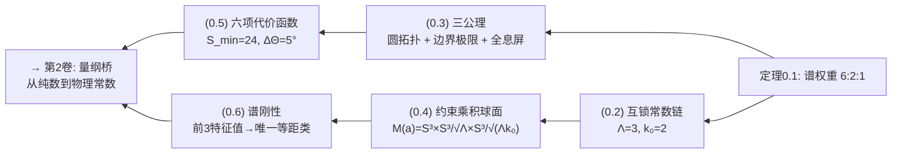

# 0.1 零维源点与S₃

> **本卷导读：** 第0卷是全几何论体系的纯数学入口。它不从物理出发，不从时空出发，甚至不从空间出发——它从"存在"出发。读者不需要任何物理知识，只需要大学数学（群论、微分几何基础）。

## 0.1.0 本章概述

本章回答一个看似简单的问题：**几何的起点可以是什么？**

我们采取的立场是：几何的起点不是欧几里得的"点"，不是笛卡尔的"坐标系"，不是黎曼的"流形"，而是一个更原初的本体——**零维源点**。它不携带度量，不定义切空间，不预设任何内部方向。它唯一不可约减的性质是：**存在**。

从这一最简本体出发，我们论证：零维源点必然携带非平凡对称性，且最小非交换群的唯一选择是 $S_3$。进而通过谱展开，证明 $S_3$ 的正规子群链自动诱导三级谱层级，谱权重比为 $6:2:1$。

**这一比值是整个几何论体系所有定量预言的起点。** 它不来自实验输入，不来自拟合，不来自外部假设——它仅仅是 $S_3$ 群论结构的内蕴不变量在"展开"这一操作下的自然输出。

---

## 0.1.1 零维源点

### 定义与动机

**定义 0.1（零维源点）** 零维源点 $\mathcal Z$ 是一个没有广延的几何对象：
- 不携带度量
- 不定义切空间
- 不预设任何内部方向
- 唯一不可约减的性质是：**存在**

$\mathcal Z$ 不是"空无一物"——空无一物是 $∅$，而 $\mathcal Z$ 是"尚未展开的几何起点"。一切后续结构并不预先以空间形式存在于其中，但可以以**对称性潜势**的方式被编码。

**为什么需要零维源点？**

传统几何学从一个前提开始："存在空间"。欧氏几何从点、线、面开始；微分几何从流形开始；代数几何从概形开始。这些出发点都预设了一个承载几何结构的舞台。

几何论的出发点是：**舞台本身也是被生成的**。零维源点就是这个"生成前的状态"——它不预设舞台，但它携带舞台可能的对称性结构。

### 最简非平凡对称性

零维源点 $\mathcal Z$ 仅有"存在"这一属性，但"存在"本身若要有内部区分——若要从无结构中产生结构——就需要对称性。

**命题 0.1（最简非交换对称群）** 在有限群中，能够表达"非平凡内部区分"的最小自然选择是 $S_3$。

*论证。* 平凡群 $\{e\}$ 不包含任何结构区分；$S_2 \cong \mathbb Z_2$ 是交换群，仅能表达单一的二元翻转，无法支持多个相互不同的约束方向。$S_3$ 是最小的非交换有限群，且具有非平凡正规子群链

$$
\{e\} \lhd A_3 \lhd S_3.
$$

这条链提供了最简三层层级结构：平凡层、循环层与全对称层。它既足够简单，又已包含非交换性与层次性，因此成为零维源点最小而非平凡的对称载体。∎

### 出发点

几何论的整个体系的起点是：

> **零维源点 $\mathcal Z$ 携带对称群 $S_3$。**

这不是一个可以被推导的结论——它是出发点本身。凡出发点皆不可被证明，只能被判断是否合理。$S_3$ 的"最小非平凡"论证（命题0.1）提供了选择动机，但最终这是理论的本体论承诺。

> **意义注释：** 这个出发点的强度与"空间是三维的"或"时间是线性连续的"等传统前提处于同一层级。不同的在于：$S_3$ 的数学结构远比三维空间的直觉更为丰富——它携带着不可约表示、正规子群链、谱权重等结构，这些结构在后文中将一一显化为基础物理量。

---

## 0.1.2 谱展开

### 谱展开的定义

零维源点本身不携带可分辨的内部结构，但其对称性潜势可以通过展开过程进入可分辨态。

**定义 0.2（谱展开）** 谱展开是指：从零维源点 $\mathcal Z$ 的对称性 $S_3$ 出发，将其结构潜势展开为一系列可分辨谱层级的过程。每一层级由 $S_3$ 的正规子群链中的特定子群 $H$ 标记，对应一个独立的谱分量空间。

> **直观理解：** 想象一个没有展开的种子。种子内部的对称性决定了它未来展开的方向和可能的形态。谱展开就是这个"展开"的数学对应——它不引入外部动力学方程，而是让对称性自身的层级结构自然显化。

### 正规子群链与三级层级

$S_3$ 的正规子群链

$$
\{e\} \lhd A_3 \lhd S_3
$$

是唯一的非平凡正规子群链。它天然地将 $S_3$ 的结构组织为三个层级：

| 层级 | 子群 $H$ | 阶 $|H|$ | 指数 $[S_3:H]$ |
|:---:|:---:|:---:|:---:|
| 全对称层 | $S_3$ | 6 | 1 |
| 循环层 | $A_3$ | 3 | 2 |
| 平凡层 | $\{e\}$ | 1 | 6 |

由拉格朗日定理，子群指数满足

$$
[S_3:H] = \frac{|S_3|}{|H|} = \frac{6}{|H|},
$$

因此三级指数分别为

$$
[S_3:S_3] = 1,\quad [S_3:A_3] = 2,\quad [S_3:\{e\}] = 6.
$$

这三个指数将直接决定谱展开各层级的谱权重。

> **为什么是"唯一"？** $S_3$ 的子群结构非常简单：除了平凡群 $\{e\}$ 和全群 $S_3$ 本身之外，唯一的非平凡真子群是 $A_3 \cong \mathbb Z_3$（3阶循环群），而它是正规的。因此 $\{e\} \lhd A_3 \lhd S_3$ 是唯一可能的非平凡正规子群链。在本框架中，"唯一性"不是偶然——它保证了谱权重的确定性。

---

## 0.1.3 齐性空间与谱层级空间

谱展开的每一层级需要一个数学载体来承载其独立的谱分量。自然的载体是相应子群对应的齐性空间上的函数空间。

**定义 0.3（谱层级空间）** 对正规子群链中的每一级子群 $H$，定义其**谱层级空间**为齐性空间 $S_3/H$ 上的复值函数空间，记作 $L^2(S_3/H)$。对有限群，此即

$$
L^2(S_3/H) \cong \mathbb C[S_3/H],
$$

其中 $\mathbb C[S_3/H]$ 是以陪集为基的复向量空间。

**命题 0.2（谱层级维数）** 谱层级空间的维数等于相应子群的指数：

$$
\dim L^2(S_3/H) = [S_3:H].
$$

*证明。* 函数空间 $L^2(S_3/H)$ 的标准基由齐性空间 $S_3/H$ 的示性函数 $\{\delta_{gH}\}_{gH \in S_3/H}$ 给出。该基的基数即为陪集空间 $S_3/H$ 的元素个数，由定义等于指数 $[S_3:H]$。因此

$$
\dim L^2(S_3/H) = |S_3/H| = [S_3:H].
$$
∎

对三级层级分别应用命题0.2，得到：

| 层级 | 子群 $H$ | 谱层级空间 | 维数 |
|:---:|:---:|:---:|:---:|
| 全对称层 | $S_3$ | $L^2(S_3/S_3)$ | 1 |
| 循环层 | $A_3$ | $L^2(S_3/A_3)$ | 2 |
| 平凡层 | $\{e\}$ | $L^2(S_3/\{e\})$ | 6 |

### 谱权重

零维源点无优先方向，因此谱展开中各层级的统计权重应由该层级可独立分辨的状态数决定。

**定义 0.4（谱权重）** 在谱展开中，子群 $H$ 所对应层级的**谱权重** $w_H$ 定义为其谱层级空间的维数：

$$
w_H := \dim L^2(S_3/H).
$$

> **该定义的合理性：** $L^2(S_3/H)$ 的维数直接量化了该层级可承载的独立谱模式数目。在无权偏置的前提下，各层级的相对统计权重即为此数目之比。

---

## 0.1.4 主结果：谱权重 6:2:1

**定理 0.1（谱权重，主库 #164）** 在 $S_3$ 对称性下，谱展开的三级谱权重之比唯一确定为

$$
w_{\{e\}} : w_{A_3} : w_{S_3} = 6 : 2 : 1.
$$

*证明。* 由定义0.4与命题0.2，

$$
w_{\{e\}} = \dim L^2(S_3/\{e\}) = [S_3:\{e\}] = 6,
$$
$$
w_{A_3} = \dim L^2(S_3/A_3) = [S_3:A_3] = 2,
$$
$$
w_{S_3} = \dim L^2(S_3/S_3) = [S_3:S_3] = 1.
$$

因此权重比为 $6:2:1$。∎

> **结构注释：** 谱权重 $6:2:1$ 并非外部假设，而是 $S_3$ 正规子群链的内蕴不变量经谱展开自然涌现的结果：
> - **6** 对应最大展开层级（最小子群 $\{e\}$），承载最精细的谱结构；
> - **2** 对应中间层级（交错子群 $A_3$），承载偶奇二分结构；
> - **1** 对应基态层级（全群 $S_3$），承载整体对称的均匀背景。
>
> 这一权重分配完全由群论结构决定，不依赖任何几何实现、编码规范或物理量纲。

---

## 0.1.5 几何论的后续路径

定理0.1锁定了 $6:2:1$ 这一纯数学结果。但它不是终点——它是所有后续物理推论的**第一个几何输入**。下图展示了从 $6:2:1$ 出发的完整推导路径：

其中：
- **互锁常数** $\Lambda = 3$，$k_0 = 2$ 是 $S_3$ 群论函数的必然输出（命题2.0），对应共轭类数和极大正规子群指数；
- **三公理**将纯群论结构延拓为连续几何框架；
- **约束乘积球面**将 $6:2:1$ 几何实现为三个球面的尺度比；
- **六项代价函数**从三角度构造出作用量 $S$，为后续物理映射提供桥梁；
- **谱刚性**保证约束流形的几何完全由谱数据唯一确定。

---

## 0.1.6 开放问题

1. **超越 $S_3$ 的可能？** 若零维源点的对称群不是 $S_3$ 而是 $S_4$（四扇区），则 $\Lambda=5$、$k_0=2$，谱权重比将完全不同。是否可能存在其他相域使用不同的群结构？这是理论边界的问题，不在CIM相内讨论。

2. **谱展开的动力学化：** 谱展开目前是一个"快照"式的展开操作。是否存在一个谱展开的动力学方程，描述从 $\mathcal Z$ 到完整谱结构的演化过程？这个问题将导向0.4卷的信息场动力学。

3. **"存在"本身的几何化：** 零维源点 $\mathcal Z$ 被设定为携带对称性 $S_3$，但 $\mathcal Z$ 本身是几何理论内部的起点，还是元理论层面的选择？这涉及几何论的自举闭环问题，将在第7卷深入讨论。

---

## 参考文献

1. Artin, M. (2011). *Algebra* (2nd ed.). Pearson.（拉格朗日定理、正规子群链）
2. Fulton, W., & Harris, J. (1991). *Representation Theory: A First Course*. Springer.（诱导表示与齐性空间上的函数空间）
3. Serre, J.-P. (1977). *Linear Representations of Finite Groups*. Springer.（有限群表示论）
4. 几何论主库定理 [[#164]] — 谱权重 $6:2:1$
5. 几何论主库定理 [[#3]] — 三分切丛置换刚性 $G \cong S_3$
6. 几何论主库定理 [[#4]] — 互锁常数 $\Lambda=3, k_0=2$
