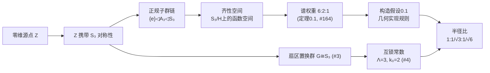

# 0.2 谱展开与互锁常数

> **本卷路线图：** 前一章从零维源点出发，锁定了谱权重 $6:2:1$（定理0.1，主库 #164）。本章将这组纯群论比值转化为三个几何常数：$\Lambda=3$、$k_0=2$，并建立从群论到乘积球面尺度的桥梁。这些常数将贯穿整个体系。

---

## 0.2.1 互锁常数的群论根源

谱权重 $6:2:1$ 是 $S_3$ 正规子群链的内蕴不变量。现在我们从 $S_3$ 的群论结构中提取两个基本常数，它们将直接驱动后续所有几何构造。

### 三分切丛的置换对称性

在进入具体定义之前，我们需要先理解这些常数将在什么样的几何结构中被使用。

**定义 0.5（三分切丛）** 在将要构造的九维乘积流形 $M = S^3 \times S^3 \times S^3$ 上，切丛自然地分解为三个 $S^3$ 因子切丛的直和：

$$
TM = \mathcal{M} \oplus \mathcal{C} \oplus \mathcal{I}.
$$

这个分解被称为**三分切丛**，三个扇区 $\mathcal{M}$、$\mathcal{C}$、$\mathcal{I}$ 在几何上完全等价——任意扇区之间的置换都应诱导流形的等距自同构。

> **注：** 三分切丛的命名 $\mathcal{M}$（物质）、$\mathcal{C}$（因果）、$\mathcal{I}$（信息）在目前阶段仅作标记之用。它们的物理含义将在第2卷（量纲桥）和第3卷（三场动力学）中逐步显化。在纯数学层面，它们只是三个结构等价的几何扇区。

### 扇区置换的刚性

**引理 0.1（三分切丛置换群的刚性）** 设 $TM = \mathcal{M} \oplus \mathcal{C} \oplus \mathcal{I}$ 为三分切丛，$G$ 为其扇区置换对称群。若 $G$ 在三个扇区上的作用忠实且可迁，并包含任意两扇区对换，则 $G \cong S_3$。

> **主库引用：** 本引理的等价形式已入库为 **#3（三分切丛置换刚性 $G\cong S_3$）**。

*证明。* 三个对象的忠实置换群必为 $S_3$ 的子群。可迁性要求轨道大小为3，故 $|G| \geq 3$。$S_3$ 的可迁子群仅有 $A_3 \cong \mathbb Z_3$（循环群）与 $S_3$ 本身。若要求包含对换（奇置换），则 $A_3$ 不足，唯一可能为 $S_3$。∎

> **哲学注释：** 这个"刚性"表明，如果几何结构承认三个等价扇区且允许任意两者互换，那么对称群自动是 $S_3$。没有自由参数，没有选择余地。这是第一个"自由度冻结"的例子——在几何论中，许多看似可选的参数被结构的自洽性锁定为唯一值。

### 定义与计算

**定义 0.6（互锁函数与紧致函数）** 设 $G$ 为有限群，定义：
- **互锁函数** $\Lambda(G) := |\text{Conj}(G)|$（共轭类数，等于 $G$ 的不可约复表示数）；
- **紧致函数** $k_0(G) := [G : N_{\max}]$（极大正规子群的指数）。

**命题 0.3（互锁常数的计算，主库 #4）** 对于三分切丛的置换对称群 $G = S_3$：

$$
\Lambda(S_3) = 3, \quad k_0(S_3) = 2.
$$

*证明。* $S_3$ 的共轭类分解为：
- 恒等元 $\{e\}$（1个）
- 对换 $\{(12), (13), (23)\}$（3个）
- 3-循环 $\{(123), (132)\}$（2个）

共3个共轭类，故 $\Lambda(S_3) = |\text{Conj}(S_3)| = 3$。

$S_3$ 的正规子群只有 $\{e\}$ 与 $A_3 \cong \mathbb Z_3$（交错子群）。极大正规子群为 $A_3$，其指数 $[S_3:A_3] = 6/3 = 2$，故 $k_0(S_3) = 2$。∎

> **这些不是自由参数。** $\Lambda = 3$ 和 $k_0 = 2$ 不是人为设定的，而是 $S_3$ 群论函数的必然取值。若三分切丛具有 $S_4$ 置换对称性（四扇区结构），则 $\Lambda(S_4) = 5$、$k_0(S_4) = 2$，那将是一个与几何论完全不同的理论。几何论之所以锁定 $\Lambda=3$、$k_0=2$，根源在于其群结构为 $S_3$（三扇区）。

### 从群论常数到几何尺度

互锁常数 $\Lambda=3$ 和 $k_0=2$ 本身是纯群论的输出。但在后续几何构造中，它们将扮演一个关键角色——**确定三个球面因子的尺度比**。

群论到几何的桥梁由以下假设建立：

**构造假设 0.1（尺度比实现规则）** 谱权重 $6:2:1$（定理0.1）的几何实现为三个球面因子的半径比。若某一层几何由剩余对称性 $H$ 控制，则其特征长度平方与 $|H|^{-1}$ 成正比。以 $S_3$ 正规子群链 $\{e\} \lhd A_3 \lhd S_3$ 的三层阶数倒数比为

$$
\frac{1}{|\{e\}|} : \frac{1}{|A_3|} : \frac{1}{|S_3|} = 1 : \frac13 : \frac16 = 6 : 2 : 1.
$$

取平方根并归一化，得半径比

$$
R_1 : R_2 : R_3 = 1 : \frac{1}{\sqrt{3}} : \frac{1}{\sqrt{6}}.
$$

> **重要澄清：** 这个假设不是从群论推导出来的——它是一种几何实现方案。$6:2:1$ 本身是纯群论结果（定理0.1），但将其"翻译"为球面尺度比需要引入额外的几何实现规则。这个规则的合理性在于：
> 1. 它是$6:2:1$最直接的几何翻译（阶数倒数正比于谱权重）；
> 2. 它导出的球面半径比 $1:1/\sqrt{3}:1/\sqrt{6}$ 恰好与 $\Lambda=3$、$k_0=2$ 兼容；
> 3. 后续所有定量预言（精细结构常数、质量谱、耦合常数等）均以该规则为起点。

---

## 0.2.2 谱展开的完整逻辑链

将前两章的推理整理为完整的链条：

### 关键节点总结

| 节点 | 性质 | 说明 |
|:---|:---:|:---|
| 零维源点 $\mathcal Z$ 携带 $S_3$ | ⛳ **出发点** | 理论的本体论承诺，不可再被推导 |
| 谱权重 $6:2:1$ | ✅ **已入库 #164** | 严格从 $S_3$ 群论导出 |
| $\Lambda=3$，$k_0=2$ | ✅ **已入库 #4** | 严格从 $S_3$ 群论导出 |
| 尺度比实现规则 | ⚠️ **构造性假设** | 将群论权重翻译为几何尺度，合理但非必然 |
| 半径比 $1:1/\sqrt{3}:1/\sqrt{6}$ | ✅ **已入库 #15** | 在构造假设0.1下唯一确定 |

### 谱展开的三部曲

谱展开的过程可以用一个比喻来理解：

1. **压缩（零维源点→$S_3$）：** 所有几何可能性被压缩在一个没有广延的源点中，但它携带的对称性 $S_3$ 代表了"展开后"可能结构的蓝图。

2. **分层（正规子群链→谱权重）：** $S_3$ 的正规子群链 $\{e\}\lhd A_3\lhd S_3$ 提供了三层结构——精细层（$\{e\}$）、偶奇层（$A_3$）、均匀层（$S_3$）。各层的独立状态数（谱权重）由群指数确定。

3. **实现（谱权重→互锁常数→尺度比）：** 将三层权重"展开"为三个可度量的几何因子，互锁常数 $\Lambda=3$、$k_0=2$ 决定了因子之间的比例关系。

---

## 0.2.3 下一步：三公理

谱权重 $6:2:1$ 和互锁常数 $\Lambda=3$、$k_0=2$ 是纯离散的群论输出。要将其延拓为连续的几何框架，需要引入三条基础公理：

| 公理 | 内容 | 作用 |
|:---|:---|:---|
| **公理1（圆拓扑）** | 激发态参数空间 $D = S^1 \setminus \{p_0, p_*\}$ | 将离散谱延拓为连续参数空间 |
| **公理2（边界极限）** | 几何量 $S$ 连续且边界趋于 $0$ 和 $+\infty$ | 保证值域全覆盖 |
| **公理3（全息屏编码）** | $\theta_M + \theta_C + \theta_I = 90^\circ$ | 三分扇区投影到二维全息屏的完备性条件 |

这些公理将在下一章（0.3）中详细阐述。

---

## 0.2.4 开放问题

1. **尺度比实现规则的选择唯一性：** 构造假设0.1将谱权重 $6:2:1$ 翻译为半径比 $1:1/\sqrt{3}:1/\sqrt{6}$，但这是否是唯一的几何实现？其他等价的实现方案是否存在？若存在，它们是否导出不同的物理预言？

2. **$S_3$ 之外的可能：** 前文指出若扇区置换群为 $S_4$ 则 $\Lambda=5$、$k_0=2$。这是否对应几何论之外的"其他相域"？$S_4$ 结构导出的物理会是怎样的？

3. **从离散到连续的必然性：** 谱展开在现阶段是离散的群论操作。三公理的引入提供了连续延拓，但"为什么需要连续延拓"这一问题本身——离散谱权重已经包含了所有结构信息——尚未被充分论证。连续参数空间的引入是否带有额外的假设？

---

## 参考文献

1. Artin, M. (2011). *Algebra* (2nd ed.). Pearson.
2. 几何论主库定理 [[#3]] — 三分切丛置换刚性
3. 几何论主库定理 [[#4]] — 互锁常数 $\Lambda=3, k_0=2$
4. 几何论主库定理 [[#164]] — 谱权重 $6:2:1$
5. 几何论主库定理 [[#15]] — 乘积球面类的谱刚性
