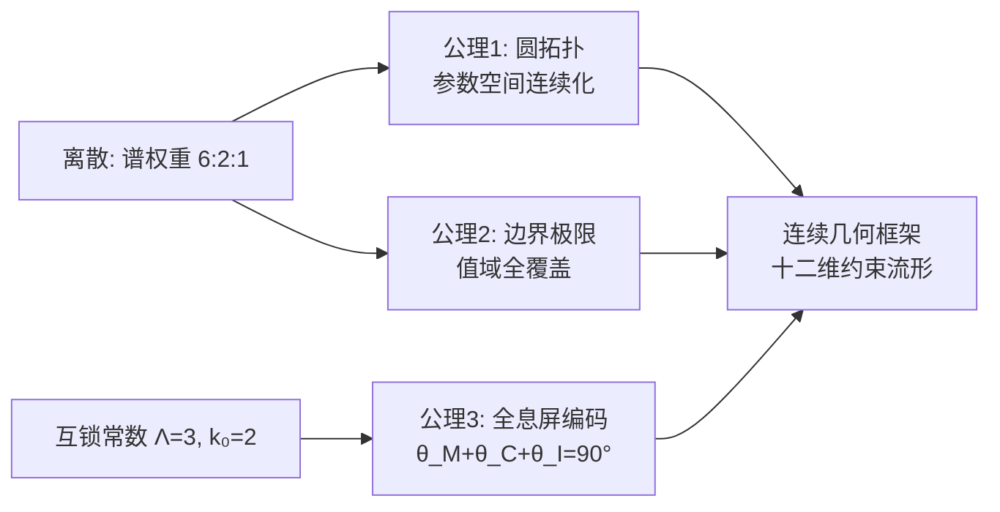
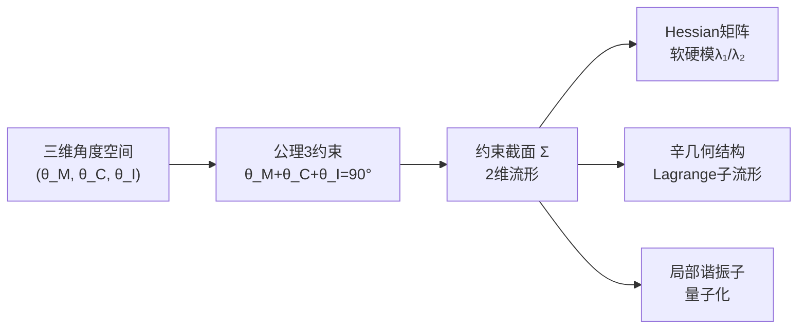

# 0.3 三公理

> **本卷路线图：** 前两章从零维源点出发，通过 $S_3$ 群论锁定了谱权重 $6:2:1$ 和互锁常数 $\Lambda=3$、$k_0=2$。但这些是**离散**的群论输出——它们告诉我们"有多少层级"和"层级间什么比例"，但没有告诉我们如何从离散层级"展开"为连续几何结构。
>
> 本章建立连续框架所需的三条基础公理。三公理不来自 $S_3$ 群论的推导，而是零维源点的对称性潜势在连续几何中的自然表达。

---

## 0.3.0 从离散到连续

谱权重 $6:2:1$ 给出了三级离散谱。但物理世界不仅需要离散谱，还需要连续参数空间来描述激发态、相互作用和连续演化。

离散的谱权重如何过渡到连续的几何？三公理提供了这个桥梁：

**三条公理各司其职：**
- **公理1** 定义参数空间的拓扑结构（它是怎样的"形状"）
- **公理2** 定义几何量的分析性质（它的值域和边界行为）
- **公理3** 定义扇区之间的约束关系（三分切丛的投影完备性）

---

## 0.3.1 公理1：圆拓扑公理

> **主库引用：** 本公理及其推论已在 0.0.3 中正式建立。

### 陈述

**公理 1（圆拓扑公理）** 激发态参数空间 $D$ 由一维紧致连通流形 $S^1$（圆）去掉两个不同点 $p_0$ 与 $p_*$ 得到：

$$
D = S^1 \setminus \{p_0, p_*\}, \qquad p_0 \neq p_*.
$$

去掉的两点分别称为**真空点**（$p_0$）与**退化点**（$p_*$）。由此，$D$ 由两个连通分支组成：

$$
D_+ \cong (0,1), \qquad D_- \cong (0,1),
$$

每个分支同胚于开区间。

> **为什么要去掉两个点？**
> - $p_0$（真空点）：对应基态/真空，此时几何量为零（$S=0$）；
> - $p_*$（退化点）：对应退化极限，此时几何量发散到无穷（$S\to +\infty$）；
> 
> 参数空间 $D$ 的"开区间"性质意味着：激发态永远不能恰好处于真空或退化极限——它只能无限趋近。这对应于物理中"真空态是极限而非可达"的直觉。

### 拓扑结构

**引理 0.2（分支的拓扑结构）** 设 $S^1$ 为标准的单位圆 $\{e^{i\phi} \mid \phi \in [0,2\pi)\}$。去掉两点 $p_0 = e^{i\phi_0}$ 与 $p_* = e^{i\phi_*}$（不妨设 $0 \leq \phi_0 < \phi_* < 2\pi$），则 $S^1 \setminus \{p_0,p_*\}$ 恰有两个连通分支：

$$
D_+ = \{e^{i\phi} \mid \phi_0 < \phi < \phi_*\}, \quad
D_- = \{e^{i\phi} \mid \phi_* < \phi < \phi_0 + 2\pi\}.
$$

每个分支作为 $S^1$ 的子空间拓扑，均同胚于开区间 $(0,1)$。

*证明。* 考虑标准覆叠映射 $\pi: \mathbb{R} \to S^1$，$\pi(\phi)=e^{i\phi}$。在 $\mathbb{R}$ 上，$\pi^{-1}(S^1\setminus\{p_0,p_*\}) = \mathbb{R} \setminus \{\phi_0 + 2k\pi,\ \phi_* + 2k\pi \mid k \in \mathbb{Z}\}$。该集合的每个连通分支均为开区间 $(\phi_0 + 2k\pi,\ \phi_* + 2k\pi)$ 或 $(\phi_* + 2k\pi,\ \phi_0 + 2(k+1)\pi)$。由于 $\pi$ 在长度为 $2\pi$ 的区间上的限制是同胚，这些开区间在 $S^1$ 中的像恰为 $D_+$ 与 $D_-$。每个开区间同胚于 $(0,1)$，故 $D_\pm \cong (0,1)$。∎

### 为什么是 $S^1$ 而不是别的拓扑？

**理由一：周期性。** 激发态参数天然具有周期结构。在后续的几何实现中，角度参数 $\theta$ 自然地生活在圆上——角度的周期性是参数空间取 $S^1$ 的拓扑根源。

**理由二：最小紧致化。** $S^1$ 是一维空间中唯一紧致的连通流形（除了闭区间但闭区间有边界）。去掉两个点后得到的 $D$ 具有"开区间"的拓扑，既有足够的连通性让连续映射有好的性质，又保留了边界的渐近结构。

**理由三：与离散谱的兼容。** $S^1$ 的拓扑与 $S_3$ 群论中的循环结构 $A_3 \cong \mathbb Z_3$ 在更深层次上兼容——圆是对称群 $U(1)$ 的几何载体，而 $A_3$ 是 $U(1)$ 的三阶子群。

---

## 0.3.2 公理2：边界极限公理

### 陈述

**公理 2（边界极限公理）** 在参数空间 $D$ 上存在公理化几何量 $S_{\text{axiom}}: D \to (0, +\infty)$，满足：

1. **连续性**：$S_{\text{axiom}}$ 在每个连通分支 $D_\pm$ 上连续；
2. **真空极限**：当 $x$ 沿任一分支逼近 $p_0$ 时，$\displaystyle \lim_{x \to p_0} S_{\text{axiom}}(x) = 0$；
3. **退化极限**：当 $x$ 沿任一分支逼近 $p_*$ 时，$\displaystyle \lim_{x \to p_*} S_{\text{axiom}}(x) = +\infty$。

> **重要澄清：** 公理2不要求 $S_{\text{axiom}}$ 在 $D_+$ 与 $D_-$ 上具有相同的函数表达式，也不要求 $S_{\text{axiom}}$ 在整个 $D$ 上连续（$p_0$ 与 $p_*$ 不在 $D$ 中）。因此 $S_{\text{axiom}}$ 可以是两个独立分支上的不同函数，只要各自满足边界条件即可。

### 值域定理

仅由公理1和公理2，不需要函数的具体形式，就可以推出关于值域的重要结论：

**定理 0.2（值域）** 在公理1与公理2下，$S_{\text{axiom}}$ 在每个连通分支 $D_\pm$ 上的值域为

$$
S_{\text{axiom}}(D_\pm) = (0, +\infty).
$$

*证明。* 由公理1，$D_\pm \cong (0,1)$ 是连通集。由公理2，$S_{\text{axiom}}$ 在 $D_\pm$ 上连续，故像集 $S_{\text{axiom}}(D_\pm)$ 是 $\mathbb R$ 中的连通子集，即区间。由真空极限，$\inf S_{\text{axiom}}(D_\pm) = 0$；由退化极限，$\sup S_{\text{axiom}}(D_\pm) = +\infty$。由于 $p_0, p_* \notin D$，端点 $0$ 与 $+\infty$ 均不可达。因此 $S_{\text{axiom}}(D_\pm) = (0, +\infty)$。∎

> **这个定理的意义极为深远：** 仅从参数空间的拓扑（$S^1$去掉两个点）和两个边界条件（$0$ 和 $+\infty$），就唯一确定了 $S_{\text{axiom}}$ 的值域为全体正实数。这意味着：**任何正实数$S_0$都可以被某个激发态实现。** 物理上，这意味着精细结构常数倒数 $\alpha^{-1} = S$ 可以取任意正值——但它实际上被锁定为137.035...，这个"锁定"需要更多输入（几何的、自洽性的），这正是后期卷的核心内容。

### 存在性定理

**定理 0.3（存在性）** 对任意给定的正数 $S_0 > 0$，在每个分支 $D_+$ 与 $D_-$ 上各至少存在一个激发态 $x_+ \in D_+$ 与 $x_- \in D_-$，使得

$$
S_{\text{axiom}}(x_+) = S_{\text{axiom}}(x_-) = S_0.
$$

*证明。* 由定理0.2，$S_{\text{axiom}}(D_\pm) = (0, +\infty)$。对任意 $S_0 > 0$，显然 $S_0 \in (0, +\infty)$。故 $S_{\text{axiom}}^{-1}(S_0) \cap D_\pm \neq \varnothing$。∎

### 严格单调性

定理0.3保证了对每个 $S_0$ "至少存在一个"激发态。但要保证"至多一个"（原像唯一性），需要额外假设：

**定义 0.7（严格单调性假设）** 若 $S_{\text{axiom}}$ 在 $D_\pm$ 上严格单调，则对任意 $S_0>0$，定理0.3中的 $x_+$ 与 $x_-$ 唯一确定。

> **逻辑地位：** 严格单调性**不是**从公理1–2推出的定理，而是框架的**构造性假设**。其引入等价于要求 $S_{\text{axiom}}$ 构成 $D_\pm$ 的一个全局坐标函数。在后续章节中，这个假设将被六项代价函数的具体形式所验证（0.4章将证明 $S(\theta)$ 在 $\theta_i \in (0,\pi/2)$ 区域严格凸，从而约束截面上的 $S$ 严格单调）。

### 公理2与谱权重的连接

公理2中的 $S_{\text{axiom}}$ 不是凭空出现的新量——它直接传承自谱权重的结构。在后续的几何实现中：

- $S_{\text{axiom}} = 0$ 对应真空，即对称点 $(\theta_M,\theta_C,\theta_I) = (30^\circ,30^\circ,30^\circ)$；
- $S_{\text{axiom}} \to +\infty$ 对应某角度趋向0°或90°的极限；
- $S_{\text{axiom}}$ 在对称点附近的最小值 $S_{\min}=24$ 由谱权重结构确定（见0.4章）。

---

## 0.3.3 公理3：全息屏编码条件

> **主库引用：** 本公理已入库为 **#10（公理3：$\theta_1+\theta_2+\theta_3=90^\circ$）**。

### 动机

前两条公理建立了参数空间的拓扑和几何量的分析性质。但参数空间 $D$ 是一维的（两个分支各同胚于 $(0,1)$），而几何论需要同时处理三个扇区 $\mathcal{M}$、$\mathcal{C}$、$\mathcal{I}$ 的角度。

如何将一维参数空间扩展为三维角度空间？答案藏在扇区结构和全息屏的概念中。

### 陈述

**公理 3（全息屏编码条件）** 在九维约束乘积球面 $M(a) = S^3(a) \times S^3(a/\sqrt{\Lambda}) \times S^3(a/\sqrt{\Lambda k_0})$ 的三分切丛 $TM(a) = \mathcal{M} \oplus \mathcal{C} \oplus \mathcal{I}$ 上，每个 $\mathbb R^3$ 扇区向二维全息屏 $\Sigma$ 投影。三个扇区投影强度角 $\theta_M, \theta_C, \theta_I \in (0^\circ, 90^\circ)$ 满足完备性约束：

$$
\theta_M + \theta_C + \theta_I = 90^\circ.
$$

### 为什么是 $90^\circ$？

$90^\circ$ 的来源可以这样理解：二维全息屏 $\Sigma$ 是信息编码的终极界面。三分切丛的三个扇区各自携带独立的信息流，当它们投影到 $\Sigma$ 上时，投影强度的总和必须恰好覆盖整个屏——不多不少。

- **少于 $90^\circ$**：信息投影不完全，屏上有"盲区"；
- **多于 $90^\circ$**：信息过度重叠，屏上出现冗余编码；
- **恰好 $90^\circ$**：完美覆盖，每个屏上的点对应唯一的一组扇区投影强度。

$90^\circ$ 作为直角的特殊性来自 $\Sigma$ 的二维性：三个扇区从三维空间投影到二维平面，垂直方向（$\theta = 90^\circ$）被自然识别为"完全投影"。

> **与谱权重的深层联系：** $90^\circ$ 被 $\Lambda=3$ 三等分得到基态角 $30^\circ$——这正是谱权重 $6:2:1$ 中的均匀层（层 $S_3$ 对应 $1$，几何上表现为所有扇区平等的构型）。$30^\circ$ 再被 $\Lambda k_0=6$ 均分得到宏观角度量子 $\Delta\Theta = 5^\circ$，这些将在0.4章中详细展开。

### 公理3的几何意义

公理3将三维角度空间约束为一个二维流形（约束截面）。这个截面在后续章节中将成为所有几何计算的核心舞台：

---

## 0.3.4 三公理的互动

三条公理不是孤立的，它们构成一个自洽的框架：

| 公理 | 输入 | 输出 | 与前后文的关系 |
|:---|:---|:---|:---|
| **公理1（圆拓扑）** | $S_3$ 的周期性 | 参数空间 $D = S^1\setminus\{p_0,p_*\}$ | 延拓了 $S_3$ 的循环子群 $A_3 \cong \mathbb Z_3$ |
| **公理2（边界极限）** | 谱权重的"无穷"潜势 | 几何量 $S: D\to(0,\infty)$ 连续 | 值域 $(0,\infty)$ 为后续 $S_e=137.035...$ 提供可能性空间 |
| **公理3（全息屏）** | 三分切丛 | $\theta_M+\theta_C+\theta_I=90^\circ$，定义约束截面 | 将一维参数空间延拓为二维截面 |

### 三公理的独立性

**定理 0.4（独立性）** 三条公理不可互相推导，每条公理提供独立的数学结构。

- 公理1不蕴含公理2：$S^1\setminus\{p_0,p_*\}$ 上的函数可以不是连续的，也可以不趋于 $0$ 或 $+\infty$。
- 公理1+2不蕴含公理3：一维参数空间 $D$ 上的函数 $S$ 无法导出三维角度空间到二维截面的约束。
- 公理3不蕴含公理1和2：角度约束 $90^\circ$ 本身不保证参数空间是 $S^1$ 拓扑，也不保证 $S$ 的值域。

---

## 0.3.5 公理体系的合法性与边界

几何论的三条公理不是"实验观察到的"，也不是"从更基本理论推导出的"。它们是**构建性公理**——为几何论框架提供出发点的理论选择。

> **与其他理论的比较：**
> - 欧氏几何的五条公理描述了点、线、面的关系；
> - 爱因斯坦场方程的"时空弯曲"是一个物理假设；
> - 几何论的三条公理描述了**激发态参数空间**的拓扑、分析性质和扇区约束。

公理的合法性来源不是"不可辩驳的真理性"，而是它们的**推导产出力**——从这三条公理出发，能否推导出可被实验检验的定量预言（如精细结构常数、质量谱、耦合常数等）。这是整部理论最终的检验标准。

---

## 0.3.6 开放问题

1. **公理系统的等价表述：** 当前的三公理是构建几何论框架的最小公理集吗？是否存在更少的公理可以推导出相同的几何结构？

2. **$S^1$ 拓扑的替代可能：** 公理1选择 $S^1$ 作为参数空间拓扑是否有其他选择（如 $\mathbb R$ 去掉两点、开区间等）？$S^1$ 的紧致性在后续推导中是否有不可替代的作用？

3. **$90^\circ$ 的更深层来源：** 公理3的 $90^\circ$ 是否可以从描述全息屏几何的更深层原理中导出，还是必须作为原始公理接受？

---

## 参考文献

1. Lee, J. M. (2012). *Introduction to Smooth Manifolds* (2nd ed.). Springer.
2. 几何论主库定理 [[#10]] — 公理3：$\theta_1+\theta_2+\theta_3=90^\circ$
3. 0.0.3《激发态参数空间的公理化与存在性定理》— 三公理的原始建立
4. 0.0.7《十方几何空间的数学结构》— 三分切丛与全息屏的原始构造
