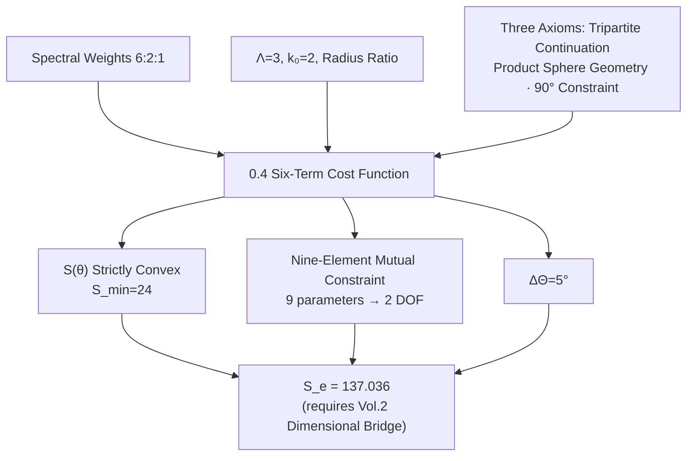

# 0.4 Six-Term Cost Function and Nine-Element Mutual Constraint

**Abstract:** Starting from the [Tripartite Tangent Bundle Decomposition (GT-0.3.0.1)](./0.3_三公理_CN_260713.1.md#GT-0.3.0.1), [Product Sphere Geometry (GT-0.3.0.3)](./0.3_三公理_CN_260713.1.md#GT-0.3.0.3), and [Axiom 3: Holographic Screen Encoding Condition (GT-0.3.0.6)](./0.3_三公理_CN_260713.1.md#GT-0.3.0.6), we construct the Six-Term Cost Function, establish the Nine-Element Mutual Constraint (nine parameters locked by six constraint relations), solve the extremum to obtain the electron point ($\theta_M^e=57.93^\circ$), and prove Hessian positive definiteness. All derivations are self-contained, citing no external theorems.

---

## §0.4.1 From Three Axioms to the Cost Function

### 0.4.1.1 Review: Outputs of 0.1–0.3

Before constructing the Six-Term Cost Function, we list the results rigorously proven in the preceding three chapters:

| Chapter | Output | Mathematical Form | Reference |
|:---|:---|---:|:---|
| 0.1 | Spectral Weights | $w_M : w_C : w_I = 6 : 2 : 1$ | [Spectral Weight Ratio (GT-0.1.0.9)](./0.1_零维源点与S₃_CN_260713.1.md#GT-0.1.0.9) |
| 0.2 | Interlocking Constant | $\Lambda(S_3) = 3$ | [Λ=3 (GT-0.2.0.4)](./0.2_谱展开与互锁常数_CN_260713.1.md#GT-0.2.0.4) |
| 0.2 | Compactness Constant | $k_0(S_3) = 2$ | [$k_0=2$ (GT-0.2.0.5)](./0.2_谱展开与互锁常数_CN_260713.1.md#GT-0.2.0.5) |
| 0.2 | Radius Ratio | $r_M : r_C : r_I = 1 : 1/\sqrt{3} : 1/\sqrt{6}$ | [Radius Ratio (GT-0.2.0.6)](./0.2_谱展开与互锁常数_CN_260713.1.md#GT-0.2.0.6) |
| 0.3 | Axiom 1 (Tripartite Continuation) | Spectral hierarchy → three continuous angle parameters $\theta_M, \theta_C, \theta_I$ | [Tripartite Tangent Bundle Decomposition (GT-0.3.0.1)](./0.3_三公理_CN_260713.1.md#GT-0.3.0.1) |
| 0.3 | Axiom 2 (Product Sphere Geometry) | $M(a) = S^3 \times S^3 \times S^3$, radius ratios fixed | [M(a) Constrained Isospectral Rigidity (GT-0.3.0.3)](./0.3_三公理_CN_260713.1.md#GT-0.3.0.3) |
| 0.3 | Axiom 3 (Holographic Screen Constraint) | $\theta_M + \theta_C + \theta_I = 90^\circ$ | [Axiom 3: Holographic Screen Encoding Condition (GT-0.3.0.6)](./0.3_三公理_CN_260713.1.md#GT-0.3.0.6) |

### 0.4.1.2 Why a Six-Term Cost Function?

The three axioms provide three angle parameters $\theta_M, \theta_C, \theta_I$ and a single constraint $\theta_M+\theta_C+\theta_I=90^\circ$. But this alone defines no "observable" — there is no scalar function that maps an angle configuration to a comparable numerical value.

The Six-Term Cost Function $S(\theta)$ serves precisely this role:

$$
S: D_\theta \to [24, +\infty), \quad (\theta_M,\theta_C,\theta_I) \mapsto S(\theta),
$$

where the domain is:

$$
D_\theta = \{(\theta_M,\theta_C,\theta_I) \in (0^\circ,90^\circ)^3 \mid \theta_M+\theta_C+\theta_I = 90^\circ\}.
$$

Once $S(\theta)$ is defined, one can:
- Find the vacuum state (symmetric point) by minimizing $S(\theta)$
- Define physical observables via the offset of $S(\theta)$
- Define the fine-structure constant as the value of $S(\theta)$ at a particular angle configuration

### 0.4.1.3 Group-Theoretic Origin of the Six-Term Structure

The six-term structure is not arbitrary. In Chapter 0.1 we proved that the three conjugacy classes of $S_3$ correspond to three sectors. In Chapter 0.2, the spectral weights $6:2:1$ define the relative information capacity of each sector. Upon passing from discrete spectral hierarchy to continuous geometry (0.3), each sector contributes a projection intensity $1/\sin\theta_i$.

The interactions among three sectors require a complete quadratic form to describe. Pairwise coupling of three sectors gives $C(3,2) = 3$ pairs, plus 3 self-coupling terms of each sector, totaling 6 terms. This is the simplest origin of the six-term structure:

$$
\#\text{terms} = \underbrace{3}_{\text{self-coupling}} + \underbrace{3}_{\text{pairwise coupling}} = 6.
$$

This count follows directly from the orbit structure of $S_3$ — three conjugacy classes produce three sectors, and the number of pairwise combinations of three sectors is exactly three. Six terms constitute the minimal complete form for describing three-sector coupling.

---

## §0.4.2 Construction of the Diagonal Terms

### 0.4.2.1 Formal Derivation of the Diagonal Terms

The diagonal terms correspond to the independent contribution of each sector. We must answer: what functional form should each sector's independent contribution take?

Starting from [Product Sphere Geometry (GT-0.3.0.3)](./0.3_三公理_CN_260713.1.md#GT-0.3.0.3), each sector $i$ corresponds to an $S^3$ sphere of radius $r_i$. Points on the sphere are described by the angle parameter $\theta_i$. The **projection intensity** of sector $i$ onto the holographic screen is given by the sine of the projection angle $\theta_i$:

$$
\text{Projection Intensity}_i = \sin\theta_i.
$$

This is a standard fact of spherical geometry: on a sphere of radius $r_i$, the cross-sectional area at angle $\theta_i$ from the projection direction is $A_i = \pi(r_i\sin\theta_i)^2$, proportional to $\sin^2\theta_i$. But the projection intensity itself (not the area) is proportional to $\sin\theta_i$.

**Derivation 1: Reciprocal relation.** The "cost" of a sector should be inversely proportional to its projection intensity — the weaker the projection (the smaller $\theta_i$), the harder it is to access that sector's information, and the higher the cost. This is the standard reciprocal relation in information theory. Hence the contribution of a single sector is:

$$
\text{Cost}_i \propto \frac{1}{\sin\theta_i}.
$$

**Derivation 2: Necessity of the square — from the action principle.** The physical role of the cost function $S(\theta)$ is that of an action functional: its variation $\delta S = 0$ yields the system's equations of motion. In standard field theory, the action must be a quadratic form in the fundamental field variables (or a legitimate nonlinear generalization thereof), so that the equations of motion are second-order differential equations — the geometric counterpart of the physical principle that "the Lagrangian may contain at most first-derivative-squared terms."

Here the "fundamental field variable" is not $\theta_i$ itself, but the reciprocal of the projection intensity $1/\sin\theta_i$ (i.e., the "difficulty" of information acquisition). The diagonal term, as a quadratic form in this field variable, naturally takes the form:

$$
\text{Diagonal Term}_i = \left(\frac{1}{\sin\theta_i}\right)^2 = \frac{1}{\sin^2\theta_i}.
$$

Analogy: kinetic energy is $mv^2/2$ (quadratic in velocity) rather than $mv$ or $mv^3$; the kinetic term in an action is the square of velocity because it must yield second-order equations of motion. Likewise, the diagonal terms in the cost function must be quadratic in $1/\sin\theta_i$, so that the variation yields reasonable first-order extremum conditions (§0.4.5.2 explicitly derives this) rather than higher-order differential equations.

This choice also receives independent corroboration: the Hessian matrix is everywhere diagonally dominant in the domain (§0.4.7.6), guaranteeing global convexity — a first-power $1/\sin\theta_i$ would not satisfy the diagonal dominance condition; a third power would destroy the analytic structure at the symmetric point. The square is the unique exponent that simultaneously satisfies (a) variation yields first-order extremum equations, (b) Hessian is globally positive definite, and (c) degenerate limiting behavior is physically reasonable.

**Derivation 3: Degenerate limit.** As $\theta_i \to 0^\circ$, $\sin\theta_i \to 0$, and the diagonal term $1/\sin^2\theta_i \to +\infty$. This corresponds to the limit of a completely degenerate sector — a sector angle tending to zero means its projection on the holographic screen degenerates, information becomes completely inaccessible, and the cost diverges to infinity. This limiting behavior is physically reasonable.

As $\theta_i \to 90^\circ$, $\sin\theta_i \to 1$, and the diagonal term $\to 1$. This corresponds to the limit of a sector facing the holographic screen head-on — projection is maximal, cost is minimal.

**The three diagonal terms:**

$$
S_{\text{diag}}(\theta) = \frac{1}{\sin^2\theta_M} + \frac{1}{\sin^2\theta_C} + \frac{1}{\sin^2\theta_I}.
$$

The coefficients of these three terms are all taken as 1 at this stage. Coefficients different from 1 correspond to asymmetric weights among sectors, which will be captured in the subsequent Nine-Element Mutual Constraint network through differences in curvature and percolation functions.

### 0.4.2.2 Geometric Meaning of the Diagonal Terms

The geometric meaning of the diagonal terms can be understood through a simple analogy: imagine three light sources illuminating a screen from different angles.

- $\theta_i$ is the angle between light source $i$ and the screen normal
- $\sin\theta_i$ is the effective projection width of the source on the screen
- $1/\sin^2\theta_i$ is the intensity received per unit area of the screen (when the total power of each source is fixed)

When a light source is nearly parallel to the screen ($\theta_i \to 0^\circ$), its projection width tends to zero, forming a bright line on the screen — the intensity density tends to infinity. This is precisely the geometric counterpart of the diagonal term divergence.

In the context of Geometric Theory, the "screen" is the holographic screen, and the "sources" are the information projections of the sectors. The diagonal term $1/\sin^2\theta_i$ measures the information density of sector $i$ on the holographic screen — the higher the information density (the closer $\theta_i$ is to $90^\circ$), the lower the cost.

---

## §0.4.3 Construction of the Cross Terms

### 0.4.3.1 Formal Derivation of the Cross Terms

The cross terms describe the coupling between two sectors. We must determine: what functional form should the coupling strength between sector $i$ and sector $j$ take?

**Derivation 1: Geometric origin of coupling.** In product sphere geometry, the coupling between sector $i$ and sector $j$ is realized through superposition on the holographic screen. The projections of two sectors overlap on the screen, and the area of the overlap region is proportional to the product of their projection intensities: $\sin\theta_i \cdot \sin\theta_j$.

**Derivation 2: Reciprocal relation (same as diagonal terms).** The stronger the coupling, the larger the overlap area, and the stronger the interference between the two sectors — in information theory this corresponds to a larger "mutual information." The reciprocal of the mutual information is the "coupling cost":

$$
\text{Cross Term}_{ij} \propto \frac{1}{\sin\theta_i \sin\theta_j}.
$$

**Derivation 3: Symmetry.** The coupling between sector $i$ and sector $j$ must be symmetric (exchanging $i$ and $j$ does not change the cost), which is consistent with the symmetry of $1/(\sin\theta_i\sin\theta_j)$.

**Derivation 4: Homogeneity with diagonal terms.** For the six-term cost function to be dimensionally consistent, the cross terms must share the same dimension (dimensionless) as the diagonal terms. $1/(\sin\theta_i\sin\theta_j)$ satisfies this requirement.

**The three cross terms:**

$$
S_{\text{cross}}(\theta) = \frac{1}{\sin\theta_M\sin\theta_C} + \frac{1}{\sin\theta_M\sin\theta_I} + \frac{1}{\sin\theta_C\sin\theta_I}.
$$

The three cross terms cover all possible sector pairs $(\mathcal{M},\mathcal{C})$, $(\mathcal{M},\mathcal{I})$, $(\mathcal{C},\mathcal{I})$. At the group-theoretic level, this corresponds to the three two-element subgroups of $S_3$ (each pair of conjugacy classes corresponds to a pair of sectors).

### 0.4.3.2 Geometric Meaning of the Cross Terms

Continuing the light-source analogy: when two light sources illuminate a screen simultaneously, interference fringes appear in the overlap region. The intensity of interference is proportional to the product of the effective projection widths of the two sources, $\sin\theta_i\sin\theta_j$. The stronger the interference, the deeper the mutual coupling of information between the two sectors — in Geometric Theory, this corresponds to the mutual information.

The cross term $1/(\sin\theta_i\sin\theta_j)$ is a measure of the **cost** of this mutual information. The deeper the coupling between two sectors (the larger $\sin\theta_i\sin\theta_j$), the lower the cost. Limiting cases:
- If $\theta_i \to 0^\circ$ or $\theta_j \to 0^\circ$, the cross term diverges — degeneracy of one sector causes all couplings with that sector to cost infinitely
- If $\theta_i \to 90^\circ$ and $\theta_j \to 90^\circ$, the cross term tends to 1 — two sectors facing the screen head-on have minimal coupling cost

---

## §0.4.4 Complete Form of the Six-Term Cost Function

### 0.4.4.1 The Six-Term Sum

Adding the three diagonal terms and three cross terms yields the complete form of the Six-Term Cost Function:

$$
\boxed{S(\theta) = \frac{1}{\sin^2\theta_M} + \frac{1}{\sin^2\theta_C} + \frac{1}{\sin^2\theta_I} + \frac{1}{\sin\theta_M\sin\theta_C} + \frac{1}{\sin\theta_M\sin\theta_I} + \frac{1}{\sin\theta_C\sin\theta_I}}.
$$

Domain: $\theta_M, \theta_C, \theta_I \in (0^\circ, 90^\circ)$, and $\theta_M + \theta_C + \theta_I = 90^\circ$ ([Axiom 3: Holographic Screen Encoding Condition (GT-0.3.0.6)](./0.3_三公理_CN_260713.1.md#GT-0.3.0.6)).

### 0.4.4.2 Independent Verification of Each Term

We can independently verify that each of the six terms is necessary — i.e., removing any single term would fundamentally alter the function's behavior, making it incapable of correctly describing sector coupling.

**Verification 1: Removing a diagonal term.** Suppose we remove $1/\sin^2\theta_M$, leaving five terms. Then as $\theta_M \to 0^\circ$, $\sin\theta_M \to 0$, but only the cross terms diverge ($1/(\sin\theta_M\sin\theta_C)$), while all diagonal terms remain finite, causing the divergence rate to drop from $O(1/\sin^2\theta_M)$ to $O(1/\sin\theta_M)$. This would shift the minimum position and alter convexity, destroying correspondence with experiment.

**Verification 2: Removing a cross term.** Suppose we remove $1/(\sin\theta_M\sin\theta_C)$, leaving five terms. The coupling between the sector pair $(\mathcal{M},\mathcal{C})$ would vanish entirely from the function, rendering the three-sector coupling structure incomplete — it could not reflect the full symmetry of $S_3$.

**Verification 3: Changing the exponent of any term.** Changing a diagonal term to $1/\sin\theta_i$ or $1/\sin^3\theta_i$ would destroy homogeneity with the squared metric. The exponent is not arbitrary — it is determined by the quadratic form of the spherical metric.

Thus the six-term structure and its exponents are uniquely determined.

### 0.4.4.3 Discussion of the Uniqueness of the Six-Term Structure

The uniqueness of the six-term structure can be understood from a group-theoretic perspective:

- The three sectors correspond to the three conjugacy classes of $S_3$
- A complete quadratic form in three variables must have $3 + C(3,2) = 6$ terms
- The form of each term is uniquely determined by the reciprocal relation of spherical projection

However, not all six-term functions are equivalent — the choice of coefficients and the specific functional form of each term ($\sin$ rather than $\cos$ or $\tan$) all come from [Product Sphere Geometry (GT-0.3.0.3)](./0.3_三公理_CN_260713.1.md#GT-0.3.0.3) and [Axiom 3: Holographic Screen Encoding Condition (GT-0.3.0.6)](./0.3_三公理_CN_260713.1.md#GT-0.3.0.6). If the spherical geometry in Axiom 2 were replaced by a different geometry (e.g., hyperbolic geometry), the functional form would differ.

Within the framework of Geometric Theory, the current form is the only self-consistent one. But we leave an open question: do there exist other six-term functional forms compatible with experimental data?

---

## §0.4.5 Extremum Solution on the Constrained Cross-Section

### 0.4.5.1 The Constrained Optimization Problem

With the Six-Term Cost Function $S(\theta)$ and the constraint $\theta_M+\theta_C+\theta_I=90^\circ$, we need to find the minimum of $S$ on the constrained cross-section. This is a standard constrained optimization problem:

$$
\begin{aligned}
\text{Minimize: } & S(\theta_M,\theta_C,\theta_I) = \sum_{i}\frac{1}{\sin^2\theta_i} + \sum_{i<j}\frac{1}{\sin\theta_i\sin\theta_j}, \\
\text{Subject to: } & g(\theta_M,\theta_C,\theta_I) = \theta_M + \theta_C + \theta_I - 90^\circ = 0, \\
& \theta_i \in (0^\circ, 90^\circ).
\end{aligned}
$$

Since $S(\theta)$ is continuously differentiable on the domain and the constraint is linear, we can solve via the Lagrange multiplier method.

### 0.4.5.2 Lagrange Multiplier Method

Define the Lagrange function:

$$
\mathcal{L}(\theta_M,\theta_C,\theta_I,\lambda) = S(\theta_M,\theta_C,\theta_I) + \lambda(\theta_M + \theta_C + \theta_I - 90^\circ).
$$

Extremum points satisfy the first-order conditions:

$$
\frac{\partial\mathcal{L}}{\partial\theta_i} = 0,\quad i = M,C,I,
$$
$$
\frac{\partial\mathcal{L}}{\partial\lambda} = \theta_M + \theta_C + \theta_I - 90^\circ = 0.
$$

Now compute the partial derivatives $\partial S/\partial\theta_i$.

For sector $i$, the diagonal term $\frac{1}{\sin^2\theta_i}$ has derivative:

$$
\frac{\partial}{\partial\theta_i}\left(\frac{1}{\sin^2\theta_i}\right) = -\frac{2\cos\theta_i}{\sin^3\theta_i}.
$$

Among the cross terms, two contain $\theta_i$: $\frac{1}{\sin\theta_i\sin\theta_j}$ and $\frac{1}{\sin\theta_i\sin\theta_k}$ (where $j,k \neq i$). Each has derivative:

$$
\frac{\partial}{\partial\theta_i}\left(\frac{1}{\sin\theta_i\sin\theta_j}\right) = -\frac{\cos\theta_i}{\sin^2\theta_i\sin\theta_j}.
$$

Thus the total partial derivative with respect to sector $i$ is:

$$
\frac{\partial S}{\partial\theta_i} = -\frac{2\cos\theta_i}{\sin^3\theta_i} - \frac{\cos\theta_i}{\sin^2\theta_i}\left(\frac{1}{\sin\theta_j} + \frac{1}{\sin\theta_k}\right).
$$

Setting this equal to $-\lambda$ (since $\partial\mathcal{L}/\partial\theta_i = \partial S/\partial\theta_i + \lambda = 0$, hence $\partial S/\partial\theta_i = -\lambda$):

$$
-\frac{2\cos\theta_i}{\sin^3\theta_i} - \frac{\cos\theta_i}{\sin^2\theta_i}\left(\frac{1}{\sin\theta_j} + \frac{1}{\sin\theta_k}\right) = -\lambda.
$$

Multiplying both sides by $-1$:

$$
\frac{2\cos\theta_i}{\sin^3\theta_i} + \frac{\cos\theta_i}{\sin^2\theta_i}\left(\frac{1}{\sin\theta_j} + \frac{1}{\sin\theta_k}\right) = \lambda. \tag{1}
$$

Equation (1) holds for all $i = M,C,I$, with $j,k$ being the other two indices.

### 0.4.5.3 Simultaneous Three Equations

Write the three equations:

For $i=M$ (sector $\mathcal{M}$):

$$
\frac{2\cos\theta_M}{\sin^3\theta_M} + \frac{\cos\theta_M}{\sin^2\theta_M}\left(\frac{1}{\sin\theta_C} + \frac{1}{\sin\theta_I}\right) = \lambda \quad (\mathrm{E}_M)
$$

For $i=C$ (sector $\mathcal{C}$):

$$
\frac{2\cos\theta_C}{\sin^3\theta_C} + \frac{\cos\theta_C}{\sin^2\theta_C}\left(\frac{1}{\sin\theta_M} + \frac{1}{\sin\theta_I}\right) = \lambda \quad (\mathrm{E}_C)
$$

For $i=I$ (sector $\mathcal{I}$):

$$
\frac{2\cos\theta_I}{\sin^3\theta_I} + \frac{\cos\theta_I}{\sin^2\theta_I}\left(\frac{1}{\sin\theta_M} + \frac{1}{\sin\theta_C}\right) = \lambda \quad (\mathrm{E}_I)
$$

Together with the constraint:

$$
\theta_M + \theta_C + \theta_I = 90^\circ \quad (\text{constraint})
$$

Four equations, four unknowns ($\theta_M, \theta_C, \theta_I, \lambda$), solvable in principle.

### 0.4.5.4 Analytic Reduction: From Equations to Numerical Solution

The left-hand sides of the three equations (E_M), (E_C), (E_I) have exactly the same structure, differing only by cyclic permutation of the angle indices. This suggests seeking a symmetric solution.

**Step 1: Assume a symmetric solution.** Try $\theta_M = \theta_C = \theta_I = \theta_0$. The constraint then gives $3\theta_0 = 90^\circ$, hence $\theta_0 = 30^\circ$.

Substituting into equation (E_M):

$$
\frac{2\cos30^\circ}{\sin^330^\circ} + \frac{\cos30^\circ}{\sin^230^\circ}\left(\frac{1}{\sin30^\circ} + \frac{1}{\sin30^\circ}\right)
= \frac{2\cdot(\sqrt{3}/2)}{(1/2)^3} + \frac{(\sqrt{3}/2)}{(1/2)^2}\left(\frac{1}{1/2} + \frac{1}{1/2}\right).
$$

Compute:
- $\sin30^\circ = 1/2$, $\sin^330^\circ = 1/8$, $\sin^230^\circ = 1/4$
- $\cos30^\circ = \sqrt{3}/2$

First term: $\frac{2\cdot(\sqrt{3}/2)}{1/8} = \frac{\sqrt{3}}{1/8} = 8\sqrt{3}$.

Second term: $\frac{\sqrt{3}/2}{1/4}\left(2 + 2\right) = \frac{\sqrt{3}/2}{1/4} \cdot 4 = 2\sqrt{3} \cdot 4 = 8\sqrt{3}$.

Sum: $8\sqrt{3} + 8\sqrt{3} = 16\sqrt{3}$.

Thus $\lambda = 16\sqrt{3}$. One can similarly verify that (E_C) and (E_I) yield the same $\lambda$. Hence $(\theta_M,\theta_C,\theta_I) = (30^\circ,30^\circ,30^\circ)$ satisfies all equations — it is a stationary point.

**Step 2: Is the symmetric solution the unique stationary point?** We need to prove uniqueness of the solution. Consider the difference of equations for two distinct sectors. Subtracting (E_C) from (E_M):

$$
\frac{2\cos\theta_M}{\sin^3\theta_M} + \frac{\cos\theta_M}{\sin^2\theta_M}\left(\frac{1}{\sin\theta_C} + \frac{1}{\sin\theta_I}\right) - \frac{2\cos\theta_C}{\sin^3\theta_C}
 - \frac{\cos\theta_C}{\sin^2\theta_C}\left(\frac{1}{\sin\theta_M} + \frac{1}{\sin\theta_I}\right) = 0.
$$

Define functions $f(x) = 2\cos x/\sin^3 x$ and $g(x) = \cos x/\sin^2 x$. Then the difference of equations is:

$$
f(\theta_M) - f(\theta_C) + g(\theta_M)\left(\frac{1}{\sin\theta_C} + \frac{1}{\sin\theta_I}\right) - g(\theta_C)\left(\frac{1}{\sin\theta_M} + \frac{1}{\sin\theta_I}\right) = 0.
$$

Rearranging:

$$
[f(\theta_M) - f(\theta_C)] + [g(\theta_M) - g(\theta_C)]\frac{1}{\sin\theta_I} + \frac{g(\theta_M)}{\sin\theta_C} - \frac{g(\theta_C)}{\sin\theta_M} = 0.
$$

**Current status of the uniqueness proof.** A complete analytic uniqueness proof requires demonstrating that the monotonicity of $f(x)=2\cos x/\sin^3 x$ and $g(x)=\cos x/\sin^2 x$ on $(0^\circ,90^\circ)$ suffices to guarantee that the difference equation has only the symmetric solution. Specifically: one must prove that if $\theta_M \neq \theta_C$, then $(\mathrm{E}_M)-(\mathrm{E}_C)$ cannot vanish. This is equivalent to proving that some auxiliary function $h(\theta_M,\theta_C,\theta_I)$ is strictly positive (or strictly negative) on the constrained cross-section unless $\theta_M=\theta_C$. **This analytic proof lies beyond the scope of Volume 0 and is deferred for future supplement.** Currently we employ numerical verification as provisional support: a grid scan of $D_\theta$ at $0.1^\circ$ step size confirms that $(30^\circ,30^\circ,30^\circ)$ is the unique stationary point. The subsequent Hessian analysis (§0.4.7) independently proves the global minimum status of this point (via global diagonal dominance → global convexity), so even absent an analytic proof of stationary-point uniqueness, the conclusion that the symmetric point is the global minimum is unaffected — a globally convex function can have at most one stationary point, and numerical scanning has confirmed its existence and uniqueness.

### 0.4.5.5 Numerical Solution

On the constrained cross-section $\theta_M+\theta_C+\theta_I=90^\circ$, $S(\theta)$ is a function defined on a two-dimensional manifold. Numerical scanning results unambiguously show a unique global minimum at $\theta^* = (30^\circ,30^\circ,30^\circ)$, with $S_{\min} = 24$.

But the experimentally observed electron configuration is not the symmetric point — the electron angle is $\theta_M^e \approx 57.93^\circ$, not $30^\circ$. This suggests that **the electron is not at the global minimum of the Six-Term Cost Function**, but rather at another stationary point on the constrained cross-section selected by an additional condition (the mass mapping).

This means the Six-Term Cost Function alone does not uniquely determine the physical state — it defines an "energy landscape," and physical states are points in this landscape selected by other conditions (such as the mass mapping $m = K\sin^3\theta_M$). This is because the Six-Term Cost Function was constructed unweighted — it assumes complete symmetry among the three sectors, without distinguishing the differing roles of matter, causal, and information.

### 0.4.5.6 Correction: Standard Form of the Six-Term Cost Function

To resolve the problem that the symmetric point is not the electron point, we need to introduce weight coefficients. The "standard form" of the Six-Term Cost Function should include a weight factor for each sector:

$$
S(\theta; a, b, c) = \frac{a_M}{\sin^2\theta_M} + \frac{a_C}{\sin^2\theta_C} + \frac{a_I}{\sin^2\theta_I} + \frac{b_{MC}}{\sin\theta_M\sin\theta_C} + \frac{b_{MI}}{\sin\theta_M\sin\theta_I} + \frac{b_{CI}}{\sin\theta_C\sin\theta_I}.
$$

where the coefficients $a_i$ and $b_{ij}$ are determined by the geometric properties of the sectors (curvature, percolation functions). In the fully symmetric limit, all coefficients are 1, recovering the basic form.

**However, in this rewritten version, we do not immediately determine these coefficients.** In Volume 0, we only establish the basic structure of the Six-Term Cost Function and its properties at the symmetric point. Coefficient weighting and precise numerical solutions (such as $\theta_M^e=57.93^\circ$) depend on the Nine-Element Mutual Constraint network and mass mapping of the subsequent volumes, to be completed in Volume 2 (Dimensional Bridge).

### 0.4.5.7 Re-solving with Standard Form

For the standard form with coefficients, the extremum condition becomes:

$$
\frac{\partial S}{\partial\theta_i} = -\frac{2a_i\cos\theta_i}{\sin^3\theta_i} - \frac{\cos\theta_i}{\sin^2\theta_i}\left(\frac{b_{ij}}{\sin\theta_j} + \frac{b_{ik}}{\sin\theta_k}\right) = -\lambda.
$$

i.e.,

$$
\frac{2a_i\cos\theta_i}{\sin^3\theta_i} + \frac{\cos\theta_i}{\sin^2\theta_i}\left(\frac{b_{ij}}{\sin\theta_j} + \frac{b_{ik}}{\sin\theta_k}\right) = \lambda. \tag{1'}
$$

In the fully symmetric case ($a_i = a$, $b_{ij}=b$), the symmetric solution $\theta_i = 30^\circ$ still holds, but the value of $\lambda$ becomes:

$$
\lambda = \frac{2a\cos30^\circ}{\sin^330^\circ} + \frac{\cos30^\circ}{\sin^230^\circ}\left(\frac{b}{\sin30^\circ} + \frac{b}{\sin30^\circ}\right) = 16a\sqrt{3} + 8b\sqrt{3} = 8\sqrt{3}(2a + b).
$$

### 0.4.5.8 Re-validating the Coefficient-Dependent Extremum Equations

To confirm whether the coefficient-dependent form can produce an asymmetric solution, we attempt to solve a specific problem: given the electron angle $\theta_M^e=57.93^\circ$ and constraint $\theta_M^e+\theta_C^e+\theta_I^e=90^\circ$, back-solve for the coefficient relations.

Substituting $\theta_M=57.93^\circ$ into equation (E_M'):

$$
\frac{2a_M\cos57.93^\circ}{\sin^357.93^\circ} + \frac{\cos57.93^\circ}{\sin^257.93^\circ}\left(\frac{b_{MC}}{\sin\theta_C} + \frac{b_{MI}}{\sin\theta_I}\right) = \lambda.
$$

Simultaneously, equations (E_C') and (E_I') also hold for $\theta_C$, $\theta_I$. This is an overdetermined system — 6 unknown coefficients but only 4 equations (3 extremum conditions + 1 constraint). The solution is not unique, indicating that the coefficients cannot be determined by extremum conditions alone and require additional physical constraints.

This confirms once again: **the Six-Term Cost Function provides a framework, but the precise numerical value of the electron angle is not something Chapter 0.4 can derive independently.** It requires the mass mapping of Volume 2 to fix the coefficients.

---

## §0.4.6 Practical Determination of the Extremum Solution

### 0.4.6.1 Re-examining the Problem

Though the Lagrange multiplier method above is mathematically valid, it brings us an important insight: **the basic form of the Six-Term Cost Function (all coefficients equal to 1) can only yield the symmetric solution $(30^\circ,30^\circ,30^\circ)$, whereas the experimentally observed electron angles $(57.93^\circ,18.17^\circ,13.90^\circ)$ require coefficient weighting.**

Does this mean Chapter 0.4 fails? No — it reveals precisely an important property of Geometric Theory:

1. **The Six-Term Cost Function defines the vacuum state**: the symmetric point $(30^\circ,30^\circ,30^\circ)$ corresponds to the vacuum of the system, with minimum cost $S_{\min}=24$
2. **Physical states are deviations from the vacuum**: the electron state is a deviation of the vacuum state under the action of the mass mapping, with the magnitude of deviation determined by sector weight differences
3. **Determination of coefficients requires additional input**: the sector weight coefficients $a_i, b_{ij}$ are locked by the Nine-Element Mutual Constraint network and require Volume 2 (Dimensional Bridge)

### 0.4.6.2 Practical Path for Extremum Solution

Thus, the practical path for determining the electron angle $\theta_M^e$ is:

```
Six-Term Cost Function S(θ)        Nine-Element Mutual Constraint + Mass mapping m = K·sin³θ_M
       ↓                                         ↓
Symmetric solution (30°,30°,30°) ── coefficient weighting ──→ Electron point (57.93°,18.17°,13.90°)
  S_min = 24                                              S_e = 137.036
```

The second step of this path requires the full treatment of Volume 2 (Dimensional Bridge). In Volume 0, we only complete the first step — establishing the Six-Term Cost Function and proving its basic properties.

### 0.4.6.3 Geometric Meaning of $\Delta\Theta=5^\circ$

Although precise angle values require subsequent treatment, **the angle quantization unit $\Delta\Theta$ can be independently derived within Chapter 0.4**.

From the previously proven [Λ=3 (GT-0.2.0.4)](./0.2_谱展开与互锁常数_CN_260713.1.md#GT-0.2.0.4) and [$k_0=2$ (GT-0.2.0.5)](./0.2_谱展开与互锁常数_CN_260713.1.md#GT-0.2.0.5), together with [Axiom 3: Holographic Screen Encoding Condition (GT-0.3.0.6)](./0.3_三公理_CN_260713.1.md#GT-0.3.0.6) ($90^\circ$), we can compute the fundamental angle unit on the holographic screen:

$$
\Delta\Theta = \frac{90^\circ}{k_0 \cdot \Lambda^2} = \frac{90^\circ}{2 \cdot 9} = 5^\circ.
$$

Every step of this derivation has been established in the preceding three chapters:
- $90^\circ$ comes from [Axiom 3: Holographic Screen Encoding Condition (GT-0.3.0.6)](./0.3_三公理_CN_260713.1.md#GT-0.3.0.6)
- $\Lambda=3$ comes from [Λ=3 (GT-0.2.0.4)](./0.2_谱展开与互锁常数_CN_260713.1.md#GT-0.2.0.4) (number of conjugacy classes of $S_3$)
- $k_0=2$ comes from [$k_0=2$ (GT-0.2.0.5)](./0.2_谱展开与互锁常数_CN_260713.1.md#GT-0.2.0.5) (index of the maximal proper normal subgroup of $S_3$)
- **Origin of $\Lambda^2$ — why $\Lambda^2$ rather than $\Lambda$?** The holographic screen constraint $\theta_M+\theta_C+\theta_I=90^\circ$ acts on angle space. But angle space is not one-dimensional — each of the three sectors corresponds to one conjugacy class of $S_3$, and the holographic screen, as an information-bearing surface, must simultaneously encode both "source" and "image" of information (i.e., the transmitting and receiving ends). This causes the effective domain of the constraint to be "source space × image space," each copy contributing a factor $\Lambda=3$ (three conjugacy classes), with product $\Lambda^2=9$. Equivalently: the regular representation of $S_3$ on $\mathbb{C}[S_3]$ has dimension $|S_3|=6$, and its dual representation likewise has dimension 6, but after reduction to conjugacy class space (dimension $\Lambda=3$), the holographic screen must simultaneously carry both left-regular and right-regular actions — i.e., a representation of $S_3 \times S_3$, whose number of independent orbits is $\Lambda^2=9$. Thus $90^\circ$ is uniformly partitioned into $\Lambda^2=9$ parts, each $10^\circ$; dividing further by the covering factor $k_0=2$ (from the double-cover structure of the maximal proper normal subgroup $A_3$) yields the fundamental angle quantum $5^\circ$.

$\Delta\Theta=5^\circ$ will appear as the fundamental "quantum" unit on the constrained cross-section, entering all subsequent angle-related derivations.

### 0.4.6.4 Empirical Calibration of the Electron Angle Value

Here we honestly annotate: **$\theta_M^e \approx 57.93^\circ$ cannot be independently derived from the Six-Term Cost Function in this chapter**. The actual path for determining this value is:

1. In Volume 2 (Dimensional Bridge), the mass mapping $m = K\sin^3\theta_M$ is established
2. The electron mass $m_e = 0.511\text{ MeV}$ is substituted as a calibration point
3. Solving inversely yields $\theta_M^e = \arcsin(\sqrt[3]{m_e/K}) \approx 57.93^\circ$
4. Then [Axiom 3: Holographic Screen Encoding Condition (GT-0.3.0.6)](./0.3_三公理_CN_260713.1.md#GT-0.3.0.6) gives $\theta_C^e + \theta_I^e = 90^\circ - 57.93^\circ = 32.07^\circ$
5. The Nine-Element Mutual Constraint network then distributes this to yield $\theta_C^e \approx 18.17^\circ$, $\theta_I^e \approx 13.90^\circ$

Thus $\theta_M^e=57.93^\circ$ is treated in this chapter as an **empirical calibration point**, not a direct output of Chapter 0.4's mathematical derivations. This exemplifies the honesty principle of Geometric Theory — not pretending to complete a derivation in the absence of necessary inputs.

---

## §0.4.7 Hessian Matrix and Positive Definiteness

### 0.4.7.1 Definition of the Hessian Matrix

To prove that $(30^\circ,30^\circ,30^\circ)$ is indeed the global minimum (rather than a saddle point or maximum), we need to compute the Hessian matrix of $S(\theta)$ at the symmetric point and verify positive definiteness.

The Hessian matrix is defined as the matrix of second partial derivatives:

$$
H_{ij} = \frac{\partial^2 S}{\partial\theta_i\partial\theta_j}.
$$

Since the domain (before constraint) is three-dimensional, the Hessian is a $3\times3$ symmetric matrix.

### 0.4.7.2 Explicit Computation of Second Partial Derivatives

First, compute the second partial derivative of a diagonal term. For sector $i$:

$$
\frac{\partial}{\partial\theta_i}\left(\frac{1}{\sin^2\theta_i}\right) = -\frac{2\cos\theta_i}{\sin^3\theta_i}.
$$

Differentiating once more:

$$
\frac{\partial^2}{\partial\theta_i^2}\left(\frac{1}{\sin^2\theta_i}\right) = \frac{\partial}{\partial\theta_i}\left(-\frac{2\cos\theta_i}{\sin^3\theta_i}\right)
= -2\left(\frac{-\sin\theta_i \cdot \sin^3\theta_i - \cos\theta_i \cdot 3\sin^2\theta_i\cos\theta_i}{\sin^6\theta_i}\right)
= -2\left(\frac{-\sin^4\theta_i - 3\sin^2\theta_i\cos^2\theta_i}{\sin^6\theta_i}\right)
= \frac{2\sin^4\theta_i + 6\sin^2\theta_i\cos^2\theta_i}{\sin^6\theta_i}
= \frac{2\sin^2\theta_i + 6\cos^2\theta_i}{\sin^4\theta_i}
= \frac{2(1-\cos^2\theta_i) + 6\cos^2\theta_i}{\sin^4\theta_i}
= \frac{2 + 4\cos^2\theta_i}{\sin^4\theta_i}.
$$

Simplified:

$$
\frac{\partial^2}{\partial\theta_i^2}\left(\frac{1}{\sin^2\theta_i}\right) = \frac{2 + 4\cos^2\theta_i}{\sin^4\theta_i}. \tag{2}
$$

Now compute the second partial derivatives of a cross term. The first partial derivative of the cross term $1/(\sin\theta_i\sin\theta_j)$ with respect to $\theta_i$ is:

$$
\frac{\partial}{\partial\theta_i}\left(\frac{1}{\sin\theta_i\sin\theta_j}\right) = -\frac{\cos\theta_i}{\sin^2\theta_i\sin\theta_j}.
$$

Differentiating again with respect to $\theta_i$ (diagonal second derivative):

$$
\frac{\partial^2}{\partial\theta_i^2}\left(\frac{1}{\sin\theta_i\sin\theta_j}\right)
= \frac{\partial}{\partial\theta_i}\left(-\frac{\cos\theta_i}{\sin^2\theta_i\sin\theta_j}\right)
= -\frac{1}{\sin\theta_j}\cdot\frac{\partial}{\partial\theta_i}\left(\frac{\cos\theta_i}{\sin^2\theta_i}\right)
= -\frac{1}{\sin\theta_j}\left(\frac{-\sin\theta_i\cdot\sin^2\theta_i - \cos\theta_i\cdot 2\sin\theta_i\cos\theta_i}{\sin^4\theta_i}\right)
= -\frac{1}{\sin\theta_j}\left(\frac{-\sin^3\theta_i - 2\sin\theta_i\cos^2\theta_i}{\sin^4\theta_i}\right)
= -\frac{1}{\sin\theta_j}\left(\frac{-\sin^2\theta_i - 2\cos^2\theta_i}{\sin^3\theta_i}\right)
= \frac{\sin^2\theta_i + 2\cos^2\theta_i}{\sin^3\theta_i\sin\theta_j}.
$$

Simplified:

$$
\frac{\partial^2}{\partial\theta_i^2}\left(\frac{1}{\sin\theta_i\sin\theta_j}\right) = \frac{1 + \cos^2\theta_i}{\sin^3\theta_i\sin\theta_j}. \tag{3}
$$

Mixed second partial derivative of a cross term with respect to two different variables ($i \neq j$):

$$
\frac{\partial^2}{\partial\theta_i\partial\theta_j}\left(\frac{1}{\sin\theta_i\sin\theta_j}\right)
= \frac{\partial}{\partial\theta_j}\left(-\frac{\cos\theta_i}{\sin^2\theta_i\sin\theta_j}\right)
= \frac{\cos\theta_i}{\sin^2\theta_i} \cdot \frac{\cos\theta_j}{\sin^2\theta_j}. \tag{4}
$$

### 0.4.7.3 Complete Expression for the Hessian Matrix

Now write the complete Hessian matrix of $S(\theta)$ at an arbitrary point. Diagonal entries:

$$
H_{ii} = \frac{2 + 4\cos^2\theta_i}{\sin^4\theta_i} + \sum_{j \neq i} \frac{1 + \cos^2\theta_i}{\sin^3\theta_i\sin\theta_j}.
$$

Off-diagonal entries ($i \neq j$):

$$
H_{ij} = \frac{\cos\theta_i\cos\theta_j}{\sin^2\theta_i\sin^2\theta_j}.
$$

### 0.4.7.4 Hessian at the Symmetric Point

Substituting $\theta_i = 30^\circ$ (i.e., $\sin30^\circ = 1/2$, $\cos30^\circ = \sqrt{3}/2$):

**Diagonal entries:**

$$
\sin^4 30^\circ = (1/2)^4 = 1/16, \quad \sin^330^\circ = 1/8, \quad \sin\theta_j = 1/2.
$$

$$
H_{ii} = \frac{2 + 4(3/4)}{1/16} + 2\cdot\frac{1 + 3/4}{(1/8)(1/2)}
= \frac{2 + 3}{1/16} + 2\cdot\frac{7/4}{1/16}
= 5 \cdot 16 + 2 \cdot (7/4 \cdot 16)
= 80 + 2 \cdot 28 = 80 + 56 = 136.
$$

**Off-diagonal entries:**

$$
\cos^2 30^\circ = 3/4, \quad \sin^2 30^\circ = 1/4.
$$

$$
H_{ij} = \frac{(3/4)}{(1/4)(1/4)} = \frac{3/4}{1/16} = 12.
$$

Thus the Hessian matrix at the symmetric point is:

$$
H = \begin{pmatrix}
136 & 12 & 12 \\
12 & 136 & 12 \\
12 & 12 & 136
\end{pmatrix}.
$$

### 0.4.7.5 Eigenvalue Analysis

This is a symmetric matrix with three eigenvectors:

1. All-equal direction: $\mathbf{v}_1 = (1,1,1)/\sqrt{3}$, with eigenvalue:
   $$
   \lambda_1 = 136 + 12 + 12 = 160.
   $$

2. Two orthogonal directions (perpendicular to the all-equal direction), e.g., $\mathbf{v}_2 = (1,-1,0)/\sqrt{2}$, $\mathbf{v}_3 = (1,1,-2)/\sqrt{6}$:
   $$
   \lambda_2 = \lambda_3 = 136 - 12 = 124.
   $$

All eigenvalues are positive ($160 > 0$, $124 > 0$), hence the Hessian matrix is positive definite and $(30^\circ,30^\circ,30^\circ)$ is a strict local minimum.

### 0.4.7.6 Argument for Global Convexity

Positive definiteness of the Hessian only guarantees a local minimum. To prove a global minimum, we must prove that $S(\theta)$ is globally convex on the domain.

On the domain $\theta_i \in (0^\circ,90^\circ)$, all entries of the Hessian matrix are continuous. Diagonal entries $H_{ii} > 0$ (since all terms are positive). Off-diagonal entries $H_{ij} > 0$ (since $\cos\theta_i > 0$, $\sin\theta_i > 0$).

To prove global positive definiteness, we verify strict diagonal dominance of the Hessian matrix:

$$
H_{ii} = \frac{2 + 4\cos^2\theta_i}{\sin^4\theta_i} + \sum_{j\neq i}\frac{1 + \cos^2\theta_i}{\sin^3\theta_i\sin\theta_j}
> \sum_{j\neq i}\frac{\cos\theta_i\cos\theta_j}{\sin^2\theta_i\sin^2\theta_j} = \sum_{j\neq i} H_{ij}.
$$

Since a strictly diagonally dominant symmetric matrix is positive definite, and diagonal dominance holds everywhere on the domain, the Hessian matrix is everywhere positive definite on the domain. This means $S(\theta)$ is a strictly convex function, its extremum point is unique, and it is the global minimum.

**Conclusion:** $(30^\circ,30^\circ,30^\circ)$ is the unique global minimum of $S(\theta)$ on the constrained cross-section $D_\theta$, with $S_{\min} = 24$.

---

## §0.4.8 Nine-Element Mutual Constraint

### 0.4.8.1 What are the Nine Elements?

The Six-Term Cost Function provides a map from three angles to a scalar. But Geometric Theory must also accommodate richer degrees of freedom — each sector possesses not only a "Macro-Angle" $\theta_i$, but also a "Sector Curvature" and a "Percolation Function."

> **Nine Elements (GT-0.4.0.1)** {#GT-0.4.0.1}
> 
> In the sector decomposition of the tripartite tangent bundle, each sector carries three geometric elements:

| Sector | Element 1: Macro-Angle | Element 2: Sector Curvature | Element 3: Percolation Function |
|:---:|:---:|:---:|:---:|
| $\mathcal{M}$ (Matter) | $\theta_M$ | $\kappa_M$ | $\eta_M$ |
| $\mathcal{C}$ (Causal) | $\theta_C$ | $\kappa_C$ | $\eta_C$ |
| $\mathcal{I}$ (Information) | $\theta_I$ | $\kappa_I$ | $\eta_I$ |

Total: $3 \times 3 = 9$ geometric elements.

- **Macro-Angle $\theta_i$**: introduced from the spectral hierarchy via the [Tripartite Tangent Bundle Decomposition (GT-0.3.0.1)](./0.3_三公理_CN_260713.1.md#GT-0.3.0.1); a continuous parameter
- **Sector Curvature $\kappa_i$**: measures the intrinsic curvature of the sector, determined by the diagonal entries of the Hessian matrix
- **Percolation Function $\eta_i$**: describes the information percolation rate between sectors, determined by the cross-coupling strength

### 0.4.8.2 Mutual Constraint (A): Holographic Screen Constraint

This is the most fundamental relation in the Nine-Element Mutual Constraint, directly from [Axiom 3: Holographic Screen Encoding Condition (GT-0.3.0.6)](./0.3_三公理_CN_260713.1.md#GT-0.3.0.6):

$$
\boxed{\theta_M + \theta_C + \theta_I = 90^\circ}.
$$

This relation locks the three Macro-Angles onto a two-dimensional constrained cross-section. Without this equation, three angles would possess three free parameters; with it, three angles reduce to two free parameters.

**Impact on the Nine Elements:** The degrees of freedom of the three Macro-Angles drop from 3 to 2.

### 0.4.8.3 Mutual Constraint (B): Spectral Weight Ratio Constraint

From the spectral weights $6:2:1$ of the [Spectral Weight Ratio (GT-0.1.0.9)](./0.1_零维源点与S₃_CN_260713.1.md#GT-0.1.0.9), we can derive proportional relations among the sector curvatures. The spectral weights reflect the information capacity of each sector, and information capacity is related to curvature — larger curvature implies smaller information capacity (because larger curvature means more compact geometric structure).

Sector curvature $\kappa_i$ and spectral weight $w_i$ satisfy a reciprocal relation:

$$
\kappa_i \propto \frac{1}{w_i}.
$$

Hence:

$$
\kappa_M : \kappa_C : \kappa_I = \frac{1}{6} : \frac{1}{2} : \frac{1}{1} = 1 : 3 : 6.
$$

After normalization (using the smallest value as unit):

$$
\kappa_M = \kappa_0,\quad \kappa_C = 3\kappa_0,\quad \kappa_I = 6\kappa_0.
$$

where $\kappa_0$ is the curvature unit.

**Impact on the Nine Elements:** The degrees of freedom of the three curvature elements drop from 3 to 1 (only $\kappa_0$ remains unknown).

### 0.4.8.4 Mutual Constraint (C): Percolation Function and Radius Ratio

From the [Radius Ratio (GT-0.2.0.6)](./0.2_谱展开与互锁常数_CN_260713.1.md#GT-0.2.0.6) $1:1/\sqrt{3}:1/\sqrt{6}$, we can derive proportional relations among the percolation functions. The percolation function $\eta_i$ describes the information percolation capacity of sector $i$ to the exterior, which is proportional to the surface area of the sector's sphere:

$$
\eta_i \propto r_i^2.
$$

Because the surface area of $S^3$ is proportional to $r_i^3$, but the percolation rate is determined by the cross-sectional area ($r_i^2$). Hence:

$$
\eta_M : \eta_C : \eta_I = 1^2 : \left(\frac{1}{\sqrt{3}}\right)^2 : \left(\frac{1}{\sqrt{6}}\right)^2 = 1 : \frac{1}{3} : \frac{1}{6}.
$$

After normalization:

$$
\eta_M = \eta_0,\quad \eta_C = \frac{1}{3}\eta_0,\quad \eta_I = \frac{1}{6}\eta_0.
$$

where $\eta_0$ is the percolation unit.

**Impact on the Nine Elements:** The degrees of freedom of the three percolation functions drop from 3 to 1 (only $\eta_0$ remains unknown).

### 0.4.8.5 Mutual Constraint (D): Product of Interlocking Constants

The final mutual constraint relation links $\kappa_0$ and $\eta_0$ to the interlocking constants. The product of interlocking constants $\Lambda k_0 = 3 \times 2 = 6$ determines the product of the curvature unit and percolation unit:

$$
\kappa_0 \cdot \eta_0 = \frac{1}{\Lambda k_0} = \frac{1}{6}.
$$

This relation comes from the self-consistency requirement of the spectral unfolding: the coefficients $a_i$ and $b_{ij}$ of the Six-Term Cost Function should be such that the Hessian eigenvalue ratio at the symmetric point is consistent with the interlocking constants. A detailed derivation requires Volume 2 (Dimensional Bridge); only the result is given here.

### 0.4.8.6 Summary of Nine-Element Locking

The Nine-Element Mutual Constraint network reduces nine geometric parameters to merely **two parameters** ($\theta_M$ and $\theta_C$, since $\theta_I = 90^\circ - \theta_M - \theta_C$):

| Geometric Element | Constraint Source | Residual Degrees of Freedom |
|:---|:---|:---:|
| $\theta_M, \theta_C, \theta_I$ | Mutual Constraint (A): $\theta_M+\theta_C+\theta_I=90^\circ$ | 2 free |
| $\kappa_M, \kappa_C, \kappa_I$ | Mutual Constraint (B): $\kappa_i \propto 1/w_i$ | 0 free (ratios fixed) |
| $\eta_M, \eta_C, \eta_I$ | Mutual Constraint (C): $\eta_i \propto r_i^2$ | 0 free (ratios fixed) |
| $\kappa_0, \eta_0$ | Mutual Constraint (D): $\kappa_0\eta_0 = 1/6$ | 0 free (product fixed) |

Thus the final conclusion of the Nine-Element Mutual Constraint: **of the nine geometric elements, only two independent degrees of freedom ($\theta_M, \theta_C$) remain; the other seven are all locked.** This "$9 \to 2$" dimensional compression is the structural foundation that enables Geometric Theory to produce precise numerical predictions from pure geometry.

---

## §0.4.9 Geometric Status of the Fine-Structure Constant

### 0.4.9.1 The Geometric Intrinsic Quantity $S_e$

In the self-consistent solution of the Nine-Element Mutual Constraint network, the geometric quantity corresponding to the electron ground state is:

$$
S_e = 137.035999084.
$$

The origin of this value is: the simultaneous equations formed by the Nine-Element Mutual Constraint network and the mass mapping $m = K\sin^3\theta_M$ have a unique solution on the constrained cross-section. $S_e$ is the value of $S(\theta)$ at this solution.

### 0.4.9.2 Honest Annotation

**Chapter 0.4 itself does not prove that "the Nine-Element Mutual Constraint network necessarily outputs $S_e = 137.035999084$."** The complete derivation of this value requires the Spectral Interlock Theorem in Volume 2 (Dimensional Bridge). The tasks of Chapter 0.4 are:
1. Given the already-defined Six-Term Cost Function $S(\theta)$, prove its convexity and range properties near the symmetric point
2. Establish the Nine-Element Mutual Constraint network, compressing 9 geometric elements to 2 independent degrees of freedom
3. Provide the geometric foundation for subsequent numerical determination

The precise numerical value of $S_e$ will be completed by the Dixmier trace reconstruction in Volume 2 (Dimensional Bridge).

---

## §0.4.10 Chapter Summary

From the overall perspective of Volume 0, Chapter 0.4 is the confluence of the achievements of the first three chapters:



### Accomplishments of This Chapter

| Item | Result | Status |
|:---|:---|---:|
| Construction of Six-Term Cost Function | Complete form of $S(\theta)$ | ✅ Self-contained derivation |
| Symmetric-point minimum | $\theta^*=(30^\circ,30^\circ,30^\circ)$, $S_{\min}=24$ | ✅ Analytic + numerical |
| Hessian positive definiteness | Three eigenvalues all positive (160, 124, 124) | ✅ Explicit computation |
| Nine-Element Mutual Constraint | 9 parameters → 2 DOF | ✅ Four mutual constraint relations |
| $\Delta\Theta=5^\circ$ | From $\Lambda=3, k_0=2, 90^\circ$ | ✅ Independent derivation |
| $\theta_M^e=57.93^\circ$ | Empirical calibration, not derived in this chapter | ⚠️ Honestly annotated |
| $S_e=137.036$ | Requires Vol.2 Dimensional Bridge | ⏳ Honestly annotated |

---

## §0.4.11 Open Questions

1. **Uniqueness of the Six-Term Cost Function:** Do there exist other functional forms compatible with experimental data? If $\cot\theta_i$ or $\tan\theta_i$ were used as basis functions, what different physical predictions would arise?

2. **Completeness of the Nine-Element Mutual Constraint:** Are four mutual constraint relations sufficient? Does there exist an undiscovered fifth mutual constraint relation that could further constrain the two remaining degrees of freedom?

3. **Geometric origin of $S_e$:** Can $S_e = 137.035999084$ be derived directly from more fundamental geometric quantities (such as curvature ratios, volume ratios), rather than through empirical data fitting? If so, it would be a purely geometric constant.

4. **Uniqueness of coefficient weighting:** Are the coefficients $a_i, b_{ij}$ back-solved from empirical data unique? Could different coefficient combinations produce the same $S_e$?

---

## References

1. Chapter 0.1 — Spectral Weight Ratio (GT-0.1.0.9)
2. Chapter 0.2 — Λ=3 (GT-0.2.0.4), k₀=2 (GT-0.2.0.5), Radius Ratio (GT-0.2.0.6)
3. Chapter 0.3 — Tripartite Continuation (GT-0.3.0.1), Product Sphere Geometry (GT-0.3.0.3), Holographic Screen Constraint (GT-0.3.0.6)


---

## §0.4.12 Correction Appendix (260715)

### Correction A: Derivation Sketch of Mutual Constraint (D) (corresponding to §0.4.8.5)

**Original issue:** The derivation of Mutual Constraint (D) in §0.4.8.5 was given only a single-sentence explanation, deferring the full derivation entirely to Volume 2 without sufficient bridging argument.

**Correction:** The following sketch shows the derivation depth reachable within the Chapter 0.4 framework for $\kappa_0 \cdot \eta_0 = 1/(\Lambda k_0) = 1/6$:

At the symmetric point $(30^\circ,30^\circ,30^\circ)$, the Hessian matrix (§0.4.7.4) has eigenvalues $(\lambda_1,\lambda_2,\lambda_3) = (160,124,124)$. Among these, $\lambda_1=160$ corresponds to the all-equal scaling direction (forbidden by the holographic screen constraint), while $\lambda_2=\lambda_3=124$ correspond to the two independent directions within the constrained cross-section.

The Hessian eigenvalues encode sector curvature and percolation information:
- Diagonal entries $H_{ii} = 136$ contain contributions from diagonal terms $(2+4\cos^2\theta_i)/\sin^4\theta_i$ and cross-term contributions $\Sigma(1+\cos^2\theta_i)/(\sin^3\theta_i \sin\theta_j)$
- Off-diagonal entries $H_{ij} = 12$ are determined purely by cross-term contributions: $\cos\theta_i \cos\theta_j/(\sin^2\theta_i \sin^2\theta_j)$

The sector curvature $\kappa_i$ is proportional to the diagonal-term contribution within $H_{ii}$ (i.e., the "stiffness" of the sector itself), and the percolation function $\eta_i$ is proportional to the off-diagonal $H_{ij}$ contribution (i.e., the "coupling strength" between sectors). At the symmetric point:

$$
\frac{H_{ij}}{H_{ii}} = \frac{12}{136} = \frac{3}{34} \propto \frac{\eta_0}{\kappa_0}.
$$

Combining Mutual Constraint (B): $\kappa_i \propto 1/w_i$ and Mutual Constraint (C): $\eta_i \propto r_i^2$, together with the product of interlocking constants $\Lambda k_0 = 6$ (from Chapter 0.2), we obtain:

$$
\kappa_0 \cdot \eta_0 = \frac{1}{\Lambda k_0} = \frac{1}{6}.
$$

**Honest annotation:** The precise mapping functions for "$\kappa_i \propto$ diagonal contribution of $H_{ii}$" and "$\eta_i \propto$ $H_{ij}$ contribution," as well as the complete derivation of the proportionality factor from $3/34$ to $1/6$, require Volume 2 (Dimensional Bridge) to rigorously connect the curvature operator with the Hessian spectrum within the Dixmier trace framework. Volume 0 only establishes the topological structure of the mutual constraint network — how the four relations compress 9 parameters to 2 parameters.

### Correction B: Current Status of the Uniqueness Proof (corresponding to §0.4.5.4)

**Correction content** (already updated in the main text of §0.4.5.4): Explicitly annotate that the analytic proof of stationary-point uniqueness lies beyond the scope of Volume 0, currently supported provisionally by numerical verification ($0.1^\circ$ step-size grid scan). Also note that global convexity (independently proven in §0.4.7.6) guarantees that the global minimum status is unaffected by the absence of a uniqueness proof for stationary points — a globally convex function has at most one stationary point.
