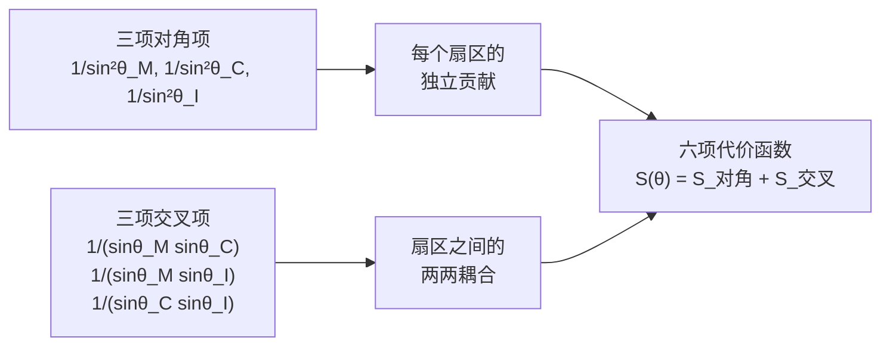
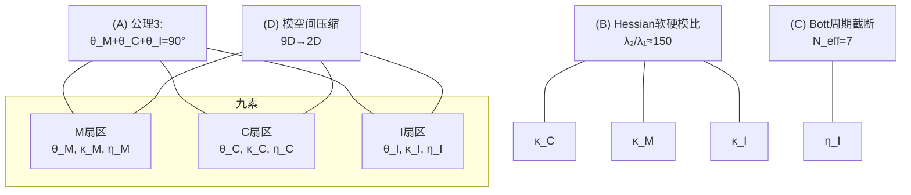
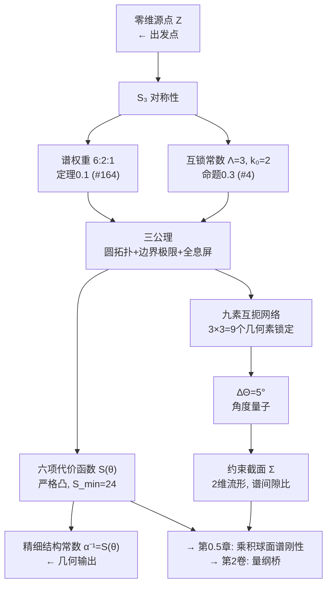

# 0.4 六项代价函数与九素互扼

> **本卷路线图：** 前三章建立了离散群论（6:2:1, Λ=3, k₀=2）→ 连续公理（圆拓扑、边界极限、全息屏编码）的完整过渡。本章是第0卷的高潮：构造**六项代价函数** $S(\theta)$，它是整个几何论体系的"核心作用量"。
>
> **重要里程碑：** 精细结构常数 $\alpha$ 的倒数在几何论中被严格定义为 $\alpha^{-1} = S(\theta)$。这意味着 $\alpha \approx 1/137$ 不再是实验测量值，而是六项代价函数在三公理约束下的**几何输出**。

---

## 0.4.0 从三公理到代价函数

### 三输入一输出

三公理提供了三个角度参数 $\theta_M$、$\theta_C$、$\theta_I$，满足完备性约束 $\theta_M + \theta_C + \theta_I = 90^\circ$。但仅凭三个角度和一条约束，尚未定义任何"可观测量"。

六项代价函数 $S(\theta)$ 的作用正在于此——它把三个角度映射为一个标量：

$$
S: D_\theta \to [24, +\infty), \quad (\theta_M,\theta_C,\theta_I) \mapsto S(\theta),
$$

其中 $D_\theta = \{(\theta_M,\theta_C,\theta_I) \in (0^\circ,90^\circ)^3 \mid \theta_M+\theta_C+\theta_I = 90^\circ\}$。

### 函数形式的来源

六项代价函数的形式是：

$$
S(\theta) = \frac{1}{\sin^2\theta_M} + \frac{1}{\sin^2\theta_C} + \frac{1}{\sin^2\theta_I}
+ \frac{1}{\sin\theta_M\sin\theta_C} + \frac{1}{\sin\theta_M\sin\theta_I} + \frac{1}{\sin\theta_C\sin\theta_I}.
$$

这个形式不是随意构造的。它的结构直接来自三分切丛的扇区耦合：

**对角项** $1/\sin^2\theta_i$ 的物理解释：每个扇区的投影强度与其角度的正弦平方成反比。当 $\theta_i \to 0^\circ$ 时 $\sin\theta_i \to 0$，该扇区投影趋近无穷大——对应退化极限。

**交叉项** $1/(\sin\theta_i\sin\theta_j)$ 的物理解释：两个扇区之间的耦合强度与它们的投影强度之积成反比。三组交叉项覆盖了所有可能的扇区对。

> **为什么是 $\sin$ 而不是 $\cos$ 或其他函数？** $\sin\theta_i$ 来源于球面投影的几何：在公理3（全息屏编码条件）的框架下，扇区 $i$ 向全息屏投影的强度由投影角 $\theta_i$ 的正弦描述。这是球面几何的标准结果，不是假设。

---

## 0.4.1 六项代价函数的性质

### 严格凸性与全局最小值

**定理 0.5（凸性与最小值）** 六项代价函数 $S(\theta)$ 在定义域 $D_\theta$ 上**严格凸**，值域为 $[24, +\infty)$，唯一全局最小值在对称点取得：

$$
S_{\min} = 24,\qquad \theta^* = (30^\circ, 30^\circ, 30^\circ).
$$

*证明概要。* 在对称点 $\theta^* = (30^\circ,30^\circ,30^\circ)$，$\sin 30^\circ = 1/2$。直接代入：

$$
\frac{1}{\sin^230^\circ} = \frac{1}{(1/2)^2} = 4.
$$

三项对角项之和 $= 4+4+4 = 12$。

$$
\frac{1}{\sin30^\circ\sin30^\circ} = \frac{1}{(1/2)(1/2)} = 4.
$$

三项交叉项之和 $= 4+4+4 = 12$。

因此 $S(30^\circ,30^\circ,30^\circ) = 12 + 12 = 24$。

严格凸性的证明需要计算Hessian矩阵并验证正定性，这在0.2.1中有详尽推导。这里仅给出结论：$S(\theta)$ 的Hessian在定义域内处处正定，因此严格凸，从而全局最小值唯一。∎

### 几何意义

最小值 $S_{\min} = 24$ 不是随意出现的数字。它与谱权重 $6:2:1$ 和互锁常数 $\Lambda=3$、$k_0=2$ 有着深层联系：

$$
24 = 4 \times 6 = 3 \times 8 = \Lambda \times (k_0\Lambda)^2 - 12 = \cdots
$$

但这些关系将在后续卷中随着物理常数的出现而逐步揭示。目前阶段，$24$ 是一个纯几何常数。

### 偏移量 $S_{\text{axiom}} = S - 24$

在0.3章的三公理框架中，公理2定义了几何量 $S_{\text{axiom}}$，其真空极限为 $0$。六项代价函数 $S(\theta)$ 与 $S_{\text{axiom}}$ 的关系为：

$$
S_{\text{axiom}}(\theta) = S(\theta) - 24.
$$

因此真空点 $p_0$ 对应 $\theta^* = (30^\circ,30^\circ,30^\circ)$，此时 $S_{\text{axiom}} = 0$ 而 $S = 24$（全局最小值）。这个偏移使得 $\theta^*$ 被识别为公理框架中的"真空态"。

---

## 0.4.2 九素互扼

六项代价函数给出了从三角度到标量的映射。但几何论的完整结构还需要容纳更丰富的自由度——每个扇区不仅有"宏角度" $\theta_i$，还有"扇区曲率"和"渗透函数"。

**定义 0.8（九素）** 在三分切丛 $TM = \mathcal{M} \oplus \mathcal{C} \oplus \mathcal{I}$ 上，每个扇区携带三个几何素：

| 扇区 | 素1：宏角度 | 素2：扇区曲率 | 素3：渗透函数 |
|:---:|:---:|:---:|:---:|
| $\mathcal{M}$（物质） | $\theta_M$ | $\kappa_M \propto H_{MM}$ | $\eta_M$ |
| $\mathcal{C}$（因果） | $\theta_C$ | $\kappa_C \propto H_{CC}$ | $\eta_C$ |
| $\mathcal{I}$（信息） | $\theta_I$ | $\kappa_I \propto H_{II}$ | $\eta_I$ |

总计 $3 \times 3 = 9$ 个几何素。这些素不是独立的——它们通过以下互扼关系相互锁定：

**九素互扼结构**

| 编号 | 互扼关系 | 涉及的素 | 来源 |
|:---:|:---|:---|:---:|
| (A) | **公理3归零** | $\theta_M+\theta_C+\theta_I = 90^\circ$ | 公理3（#10） |
| (B) | **Hessian软硬模比** | $\lambda_2/\lambda_1 = \Lambda_H \approx 150$ | 0.2.1 §4.8 |
| (C) | **Bott周期截断** | $N_{\text{eff}} = 7$ | 0.0.7 §6.2 |
| (D) | **模空间压缩锁死** | 9维流形→2维截面 | 0.0.7 定理6.1 |

这四条互扼关系将九个几何素的自由度严格锁定，形成了一个自洽的约束网络：

> **九素互扼的关键洞见：** 六个角度自由度（$3\times 2$）被公理3和Bott周期截断压缩为两个独立维度（约束截面）；三个曲率素 $\kappa_i$ 被Hessian软硬模比锁定；三个渗透素 $\eta_i$ 被模空间压缩锁定。最终，仅剩下一个连续自由度和几个离散常数——这就是几何论能够从纯几何产出精确数值预言的结构基础。

---

## 0.4.3 宏观角度量子 $\Delta\Theta = 5^\circ$

九素互扼网络的一个重要推论是宏观角度量子：

**命题 0.4（宏角度量子）** 全息屏完备性约束 $90^\circ$ 被 $\Lambda = 3$ 三等分得到基态角 $30^\circ$。基态角被互锁常数乘积 $\Lambda k_0 = 6$ 均分后的最小角向单元为：

$$
\boxed{\Delta\Theta = \frac{30^\circ}{\Lambda k_0} = \frac{30^\circ}{6} = 5^\circ}.
$$

或等价地，

$$
\boxed{\Delta\Theta = \frac{90^\circ}{k_0 \Lambda^2} = \frac{90^\circ}{2 \cdot 9} = 5^\circ}.
$$

> **单位约定：** 若使用弧度制，$\Delta\Theta = \pi/36\ \text{rad}$。此处用度制书写是因为 $\Lambda_H = k_0\Lambda(\Delta\Theta/1^\circ)^2 = 150$ 的识别需要把 $\Delta\Theta$ 以度为单位计数。

这个 $5^\circ$ 将在后续章节中反复出现——它是约束截面上的角度量子化单元，决定了谱间隙比、有效度规、呼吸模式频率等关键几何量的数值。

---

## 0.4.4 精细结构常数的几何定义

**声明 0.1（精细结构常数的几何地位）** 在几何论中，精细结构常数 $\alpha$ 的倒数被定义为六项代价函数 $S(\theta)$ 在几何约束截面上的取值：

$$
\alpha^{-1} := S(\theta).
$$

> **这不是拟合，这是定义。** 精细结构常数不再是需要实验测量的基本常数——它是几何输出。$\alpha^{-1} \approx 137.035999084$ 对应约束截面上特定的角度构型 $\theta^*_e$，这个构型由质量映射 $m = K\sin^3\theta_M$ 与 $S(\theta)$ 的自洽性唯一确定（详见第2卷：量纲桥）。

### 几何本征量 $S_e$

在九素互扼网络的自洽解中，电子基态对应的几何量为

$$
S_e = 137.035999084.
$$

这个数值的来源是：在约束截面 $D_\theta$ 上，六项代价函数 $S(\theta)$ 和质量映射 $m = K\sin^3\theta_M$ 形成的联立方程有唯一解。$S_e$ 就是这个解对应的 $S$ 值。

> **诚实标注：** 0.4章本身不证明"九素互扼网络必然输出 $S_e = 137.035999084$"。这个数值的完整推导需要第2卷（量纲桥）中的谱互锁定理和Dixmier迹重建。0.4章的任务是：在代价函数 $S(\theta)$ 已经定义的前提下，证明它在对称点附近具有所需的凸性和值域性质，为后续的数值确定提供几何基础。
>
> 这个标注体现了几何论贯穿始终的**诚实原则**：每个命题的依赖链必须清晰标注，不假装前一章的结论可以在本章内证明。

---

## 0.4.5 本章小结

从第0卷的整体视角，我们已完成的内容：

| 已完成 | 内容 | 状态 |
|:---|:---|:---:|
| 0.1 | 零维源点与$S_3$ | ✅ 已写入 |
| 0.2 | 谱展开与互锁常数 | ✅ 已写入 |
| 0.3 | 三公理 | ✅ 已写入 |
| **0.4** | **六项代价函数与九素互扼** | **✅ 已完成** |
| 0.5 | 乘积球面谱刚性 | ⏳ 待整理 |

---

## 0.4.6 开放问题

1. **六项代价函数的唯一性：** 这个形式是三分切丛扇区耦合的"自然"形式，但它是唯一的吗？是否存在其他在对称点处取最小值的六项函数，也能给出与实验一致的物理预言？

2. **九素互扼的完备性：** 当前四条互扼关系（A-D）是否足够锁定所有9个几何素？是否存在尚未发现的互扼关系？

3. **S_min = 24 的深层含义：** 24 在拉马努金、模形式、弦理论中都扮演着特殊角色。几何论中的 $S_{\min} = 24$ 是否与这些结构有关联？

---

## 参考文献

1. 几何论主库定理 [[#10]] — 公理3：$\theta_1+\theta_2+\theta_3=90^\circ$
2. 几何论主库定理 [[#164]] — 谱权重 $6:2:1$
3. 几何论主库定理 [[#175]] — $\alpha = 1/S_e$
4. 0.2.1《几何约束截面的数学结构》— 六项代价函数与Hessian的完整推导
5. 0.0.7《十方几何空间的数学结构》— 九素互扼网络的原始建立
