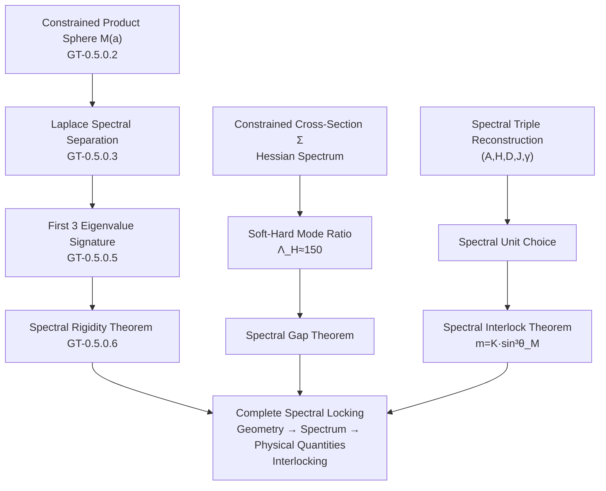
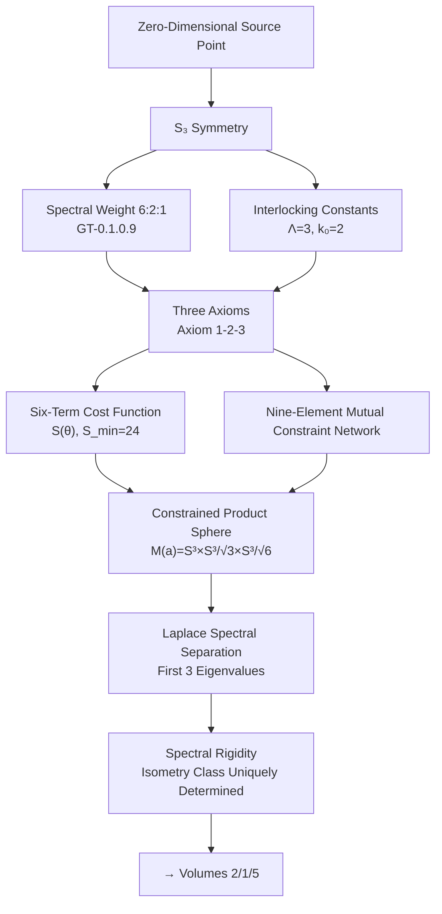

# 0.5 Product Sphere Spectral Rigidity

**Volume Roadmap:** Volume 0 started from the Zero-Dimensional Source Point, passed through $S_3$ group theory, the Three Axioms, and the Six-Term Cost Function, arriving at the central structure of Geometric Theory — the Constrained Product Sphere $M(a) = S^3(a) \times S^3(a/\sqrt{\Lambda}) \times S^3(a/\sqrt{\Lambda k_0})$.

This chapter addresses the final and most critical question: **Is this geometric structure uniquely determined?** The answer is affirmative — the first three Laplace eigenvalues completely determine the isometry class of the manifold. This is **spectral rigidity**.

---

## 0.5.0 Background

### "Can One Hear the Shape of a Drum?"

In 1966, Mark Kac posed a famous question: **"Can one hear the shape of a drum?"** Mathematically, this asks: does the spectrum of the Laplace operator uniquely determine the isometry class of a Riemannian manifold?

In 1992, Gordon, Webb, and Wolpert constructed a counterexample of isospectral non-isometric planar domains, proving that spectral rigidity does not hold in general. Two differently shaped drums can produce exactly the same sound spectrum.

But in Geometric Theory, our manifold is not a general manifold — it is a **highly constrained** class of product spheres. Within this special subclass, spectral rigidity holds, and its proof reveals the essential difference between constrained and general manifolds.

| Manifold Class | Moduli Space Dimension | Spectral Rigidity? | Reason |
|:---|:---:|:---:|:---|
| General manifolds | $\infty$-dim | ❌ Fails | Gordon-Webb-Wolpert counterexample: $d \leq k$ not satisfied |
| **Constrained Product Sphere class** | **$d=1$** | **✅ Holds** | **$d=1, k=3 \Rightarrow d \leq k$ satisfied** |

### Why Spectral Rigidity Matters for Geometric Theory

Spectral rigidity is not mere mathematical decoration — it guarantees:

1. **Uniqueness:** The geometry of the Constrained Cross-Section $\Sigma$ is completely determined by spectral data, with no hidden degrees of freedom;
2. **Testability:** The spectral signature $(1, 8/3, \Lambda)$ can serve as a criterion for identifying whether a manifold belongs to this class;
3. **Determinacy:** All subsequent physical predictions (fine-structure constant, mass spectrum, coupling constants) rest upon this uniquely determined geometry.

---

## 0.5.1 Definition of the Constrained Product Sphere

### From Spectral Weights to Geometric Realization

Chapters 0.1–0.2 derived from $S_3$ group theory the Spectral Weight $6:2:1$ and the Interlocking Constants $\Lambda=3$, $k_0=2$. Construction Hypothesis 0.1 realizes these weights as the radius ratios of three spheres:

$$
R_1 : R_2 : R_3 = 1 : \frac{1}{\sqrt{\Lambda}} : \frac{1}{\sqrt{\Lambda k_0}} = 1 : \frac{1}{\sqrt{3}} : \frac{1}{\sqrt{6}}.
$$

### Definition

**GT-0.5.0.2 (Constrained Product Sphere)** The 9-dimensional closed manifold

$$
M(a) = S^3(a) \times S^3(a/\sqrt{3}) \times S^3(a/\sqrt{6})
$$

equipped with the product metric $g = g_a \oplus g_{a/\sqrt{3}} \oplus g_{a/\sqrt{6}}$ is called a **Constrained Product Sphere** (CPS). Let

$$
b = \frac{a}{\sqrt{3}},\quad c = \frac{a}{\sqrt{6}},
$$

then $M(a) = S^3(a) \times S^3(b) \times S^3(c)$, with $a > b > c$.

### Moduli Space

**GT-0.5.0.1 (Parameterization of the Moduli Space)** The moduli space of the Constrained Product Sphere class $\{M(a)\}_{a>0}$ is homeomorphic to the open interval $(0, \infty)$, where $a$ is the sole continuous degree of freedom (the Global Scale Factor). Different values of $a$ correspond to distinct isometry classes.

*Proof.* The geometry of $M(a)$ is fully described by the three radii $(a, b, c)$, while $b$ and $c$ are locked by $a$ and the Interlocking Constants $\Lambda$, $k_0$. If $a \neq a'$, then the first factor $S^3(a)$ and $S^3(a')$ have different curvatures, hence $M(a)$ and $M(a')$ are not isometric. ∎

> **Here lies the core reason why spectral rigidity holds:** The moduli space dimension $d = 1$; only $k \geq 1$ eigenvalues are needed to satisfy the dimensional necessary condition $d \leq k$. Geometric Theory uses $k = 3$ eigenvalues, which not only satisfies the condition but also provides a self-consistency check.

---

## 0.5.2 Explicit Computation of Laplace Eigenvalues

Since the Laplace–Beltrami operator on a product manifold separates variables, eigenvalues can be computed exactly.

### Spectral Separation on Product Manifolds

**GT-0.5.0.3 (Spectral Separation)** For $M(a) = S^3(a) \times S^3(b) \times S^3(c)$, the full set of Laplace–Beltrami eigenvalues is

$$
\lambda^\Delta_{p,q,r} = \frac{p(p+2)}{a^2} + \frac{q(q+2)}{b^2} + \frac{r(r+2)}{c^2}, \qquad p,q,r \in \mathbb N_0,
$$

where $p=q=r=0$ corresponds to the zero eigenvalue (constant function), and non-zero eigenvalues begin at $p+q+r \geq 1$.

*Proof.* On a product manifold, the Laplace operator separates as $\Delta_g = \Delta_1 + \Delta_2 + \Delta_3$. It is known that on $S^3(R)$, the eigenvalue corresponding to the $p$-th spherical harmonic is $p(p+2)/R^2$, hence the total eigenvalue is the sum of the three. ∎

### The First Three Non-Zero Eigenvalues

**GT-0.5.0.4 (First Three Eigenvalues)** Under the Interlocking Constants $\Lambda=3$, $k_0=2$, the first three non-zero eigenvalues of $M(a)$ are:

- First eigenvalue (mode $(1,0,0)$): $\displaystyle \lambda_1^\Delta = \frac{3}{a^2}$;
- Second eigenvalue (mode $(2,0,0)$): $\displaystyle \lambda_2^\Delta = \frac{8}{a^2}$;
- Third eigenvalue (mode $(0,1,0)$): $\displaystyle \lambda_3^\Delta = \frac{3}{b^2} = \frac{3\Lambda}{a^2} = \frac{9}{a^2}$.

**Proof.** The eigenvalues of each candidate mode are computed as follows:

| Mode $(p,q,r)$ | Eigenvalue Expression | Ratio to $3/a^2$ |
|:---:|:---|:---:|
| $(1,0,0)$ | $3/a^2$ | $1$ |
| $(2,0,0)$ | $8/a^2$ | $8/3 \approx 2.667$ |
| $(0,1,0)$ | $3/b^2 = 3\Lambda/a^2 = 9/a^2$ | $\Lambda = 3$ |
| $(0,0,1)$ | $3/c^2 = 3\Lambda k_0/a^2 = 18/a^2$ | $\Lambda k_0 = 6$ |
| $(1,1,0)$ | $3/a^2 + 3/b^2 = 12/a^2$ | $\Lambda + 1 = 4$ |

Since $\Lambda = 3 > 8/3$, the $(0,1,0)$ mode is strictly larger than the $(2,0,0)$ mode. Since $k_0 = 2$, the $(0,0,1)$ and $(1,1,0)$ modes are also larger. Therefore, the first three non-zero eigenvalues are given exactly by the first three rows of the table. ∎

### Spectral Signature

**GT-0.5.0.5 (Characteristic Signature)** The ratios

$$
\frac{\lambda_2^\Delta}{\lambda_1^\Delta} = \frac{8}{3}, \qquad
\frac{\lambda_3^\Delta}{\lambda_1^\Delta} = \Lambda = 3
$$

are universal constants independent of $a$, and can serve as the **spectral signature** of the Constrained Product Sphere class. If the ratio of the first two non-zero eigenvalues of a product sphere is not $8/3$, it does not belong to this class.

---

## 0.5.3 Spectral Rigidity Theorem

### Theorem Statement

**GT-0.5.0.6 (Spectral Rigidity of the Constrained Product Sphere)** Let $M(a)$ and $M(a')$ be two Constrained Product Spheres with the same Interlocking Constants $(\Lambda=3, k_0=2)$. If their Laplace–Beltrami operators have identical first three non-zero eigenvalues, then $M(a)$ and $M(a')$ are isometric.

### Proof

**Step 1: One-dimensionality of the moduli space.** By GT-0.5.0.1, the moduli space of the Constrained Product Sphere class is parameterized by $a \in (0,\infty)$.

**Step 2: Spectral data determines the scale.** By GT-0.5.0.4, if the first three eigenvalues of $M(a)$ and $M(a')$ coincide, then

$$
\lambda_1^\Delta = \frac{3}{a^2} = \frac{3}{a'^2} \;\Longrightarrow\; a = a'.
$$

Consequently $b = a/\sqrt{3}$ and $c = a/\sqrt{6}$ are also identical. Thus all three radii are identical.

**Step 3: Topological uniqueness.** Both $M(a)$ and $M(a')$, as smooth manifolds, are diffeomorphic to $S^3 \times S^3 \times S^3$, independent of the scale parameter $a$.

**Step 4: Conclusion.** Identical radii and identical topology imply isometry. ∎

> **This proof is almost disappointingly simple — yet its simplicity is its strength.** General manifold classes require lengthy spectral analysis to extract partial information; the Constrained Product Sphere class requires only one ratio check and one division. This simplicity arises directly from Geometric Theory's Interlocking Constant structure — it compresses the "Can one hear the shape of a drum?" problem from "impossible" to "obvious."

### Compatibility with the Classical Counterexample

**GT-0.5.0.7 (Sunada's Method Is Not Applicable)** The fundamental group $\pi_1(M(a)) = 0$, hence Sunada-type isospectral non-isometric constructions do not apply.

*Proof.* $\pi_1(S^3) = 0$ ($S^3$ is simply connected). By the fundamental group formula for product spaces, $\pi_1(M(a)) = \pi_1(S^3) \times \pi_1(S^3) \times \pi_1(S^3) = 0$. ∎

---

## 0.5.4 The Complete Structure of the Spectral Rigidity System

Spectral rigidity is not a single isolated theorem. It is part of Geometric Theory's **spectral system**, which encompasses spectral constraints at multiple levels:

---

## 0.5.5 Volume 0 Summary: From Zero to Spectral Rigidity

The complete logical chain of Volume 0:

### Volume 0 Contributions at a Glance

| Chapter | Core Result | Nature |
|:---|:---|:---:|
| **0.1** | Zero-Dimensional Source Point carries $S_3$ symmetry | ⛳ Starting Point |
| **0.2** | Spectral Weight $6:2:1$, Interlocking Constants $\Lambda=3$, $k_0=2$ | ✅ Group-theoretic computation |
| **0.3** | Three Axioms: Tripartite Continuation, Product Sphere Geometry, Holographic Screen Constraint | ⛳ Axioms |
| **0.4** | Six-Term Cost Function $S(\theta)$, Nine-Element Mutual Constraint, $\Delta\Theta=5^\circ$ | ✅ Theorem + Construction |
| **0.5** | Constrained Product Sphere Spectral Rigidity | ✅ Theorem |

All five chapters of Volume 0 are now complete. Readers who have reached this point should possess all the pure mathematical foundations — group theory, differential geometry, spectral geometry — needed for the subsequent volumes of Geometric Theory, and should understand the complete logical chain from "existence" to "spectral rigidity."

---

## 0.5.6 Open Problems

1. **Structure of higher eigenvalues:** The first three non-zero eigenvalues already determine the isometry class. Do higher eigenvalues (fourth and beyond) exhibit other universal relations? Do they encode finer information about the Constrained Cross-Section $\Sigma$?

2. **Stability of spectral rigidity:** If small perturbations are introduced into the Constrained Product Sphere class (e.g., small deformations of the metric), does spectral rigidity still hold approximately? This relates to the status of "effective field theory" within the Geometric Theory framework.

3. **Relation between Spectral Triples and spectral rigidity:** Spectral rigidity guarantees that the Laplace spectrum uniquely determines the geometry. Are the additional structures required by the Spectral Triple $(\mathcal{A}, \mathcal{H}, D, J, \gamma)$ (the $\mathbb Z_2$-grading, the real structure $J$, etc.) also uniquely determined by spectral data? This is a deeper question that leads toward the Dimensional Bridge reconstruction of Volume 2.

---

## References

1. Kac, M. (1966). "Can One Hear the Shape of a Drum?" *Amer. Math. Monthly*, 73(4), 1-23.
2. Gordon, C., Webb, D., & Wolpert, S. (1992). "Isospectral plane domains and surfaces via Riemannian orbifolds." *Invent. Math.*, 110, 1-22.
3. Sunada, T. (1985). "Riemannian coverings and isospectral manifolds." *Ann. of Math.*, 121, 169-186.
