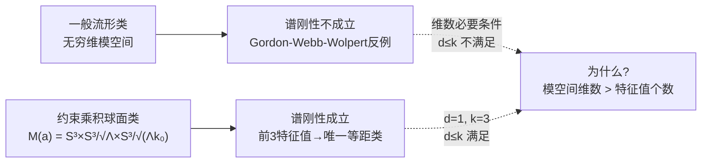
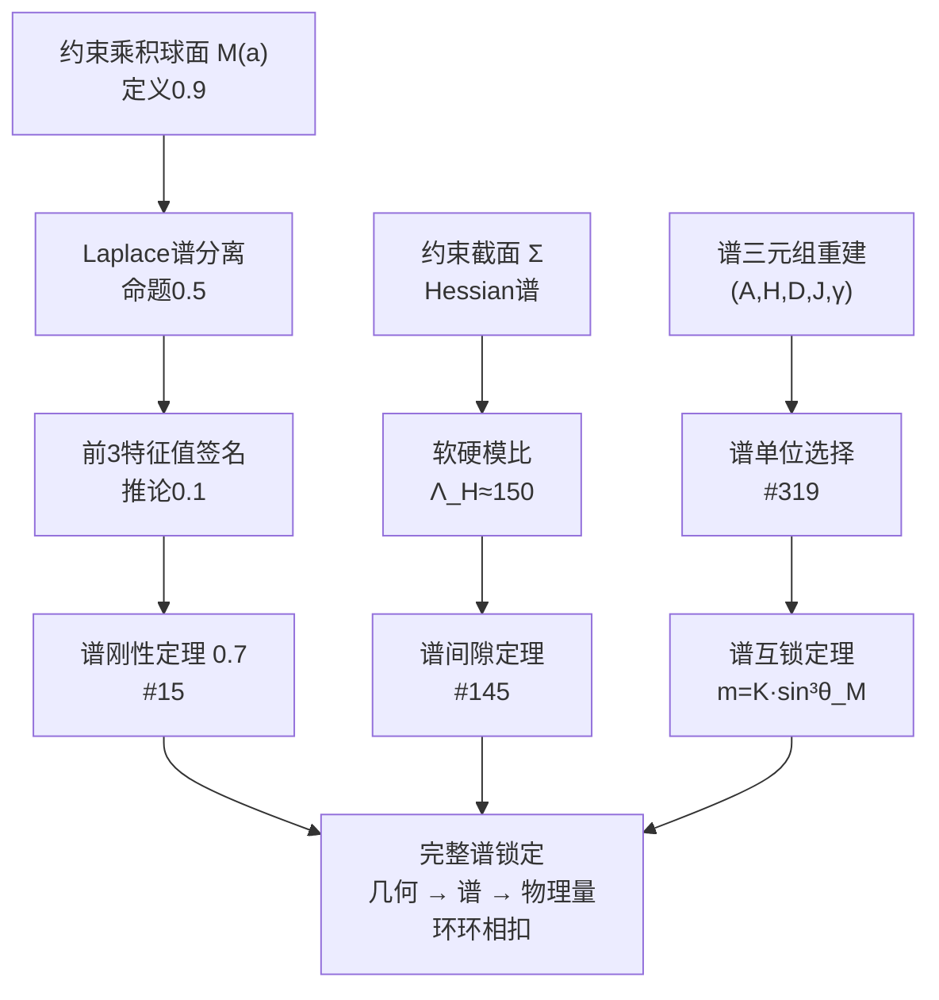
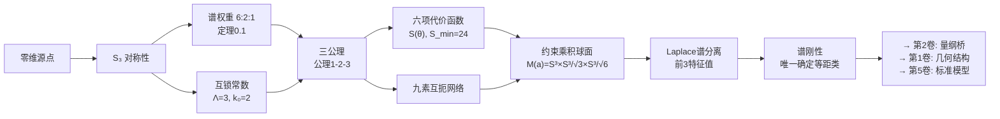

# 0.5 乘积球面谱刚性

> **本卷路线图：** 第0卷从零维源点出发，经过 $S_3$ 群论、三公理、六项代价函数，走到了几何论的核心结构——约束乘积球面 $M(a) = S^3(a) \times S^3(a/\sqrt{\Lambda}) \times S^3(a/\sqrt{\Lambda k_0})$。
>
> 本章解决最后一个、也是最关键的问题：**这个几何结构是唯一确定的吗？** 答案是肯定的——前三个Laplace特征值完全确定了流形的等距类。这就是**谱刚性**。

---

## 0.5.0 问题背景

### "听音辨形"问题

1966年，Mark Kac提出了一个著名的问题：**"Can one hear the shape of a drum?"**（能否听出鼓的形状？）数学上，这是问：Laplace算子的谱是否唯一确定黎曼流形的等距类？

1992年，Gordon、Webb与Wolpert构造了等谱非等距的平面区域反例，证明一般情形下谱刚性不成立。两个不同形状的鼓可以发出完全相同的音谱。

但在几何论中，我们的流形不是一般流形——它是**高度约束的**乘积球面类。在这种特殊子类中，谱刚性成立，并且其证明揭示了约束流形与一般流形之间的本质区别。

### 为什么谱刚性对几何论至关重要

谱刚性不是纯粹的数学装饰——它保证了：

1. **唯一性：** 约束截面 $\Sigma$ 的几何完全由谱数据确定，没有隐藏自由度；
2. **可检验性：** 谱特征签名 $(1, 8/3, \Lambda)$ 可以作为流形是否属于本类的鉴别标准；
3. **确定性：** 所有后续物理预言（精细结构常数、质量谱、耦合常数）都建立在这个唯一确定的几何之上。

---

## 0.5.1 约束乘积球面的定义

### 从谱权重到几何实现

第0.1-0.2章从 $S_3$ 群论导出了谱权重 $6:2:1$ 和互锁常数 $\Lambda=3$、$k_0=2$。构造假设0.1将这些权重实现为三个球面的半径比：

$$
R_1 : R_2 : R_3 = 1 : \frac{1}{\sqrt{\Lambda}} : \frac{1}{\sqrt{\Lambda k_0}} = 1 : \frac{1}{\sqrt{3}} : \frac{1}{\sqrt{6}}.
$$

### 定义

**定义 0.9（约束乘积球面）** 称九维闭流形

$$
M(a) = S^3(a) \times S^3(a/\sqrt{3}) \times S^3(a/\sqrt{6})
$$

在配备乘积度量 $g = g_a \oplus g_{a/\sqrt{3}} \oplus g_{a/\sqrt{6}}$ 时，构成一个**约束乘积球面**（Constrained Product Sphere, CPS）。记

$$
b = \frac{a}{\sqrt{3}},\quad c = \frac{a}{\sqrt{6}},
$$

则 $M(a) = S^3(a) \times S^3(b) \times S^3(c)$，且 $a > b > c$。

### 模空间

**定理 0.6（模空间的参数化）** 约束乘积球面类 $\{M(a)\}_{a>0}$ 的模空间与开区间 $(0, \infty)$ 同胚，其中 $a$ 是唯一的连续自由度（整体尺度因子）。不同 $a$ 对应不同的等距类。

*证明。* $M(a)$ 的几何完全由三个半径 $(a, b, c)$ 描述，而 $b$ 和 $c$ 被 $a$ 与互锁常数 $\Lambda$、$k_0$ 锁定。若 $a \neq a'$，则第一因子 $S^3(a)$ 与 $S^3(a')$ 的曲率不同，故 $M(a)$ 与 $M(a')$ 不等距。∎

> **谱刚性成立的核心原因在此：** 模空间维数 $d = 1$，仅需 $k \geq 1$ 个特征值即可满足维数必要条件 $d \leq k$。几何论使用 $k=3$ 个特征值，不仅满足条件，还提供了自洽性检验。

---

## 0.5.2 Laplace特征值的显式计算

由于乘积流形上的 Laplace–Beltrami 算子可以分离变量，特征值可以精确计算。

### 乘积流形谱分离

**命题 0.5（谱分离）** 对 $M(a) = S^3(a) \times S^3(b) \times S^3(c)$，Laplace–Beltrami 算子的特征值全体为

$$
\lambda^\Delta_{p,q,r} = \frac{p(p+2)}{a^2} + \frac{q(q+2)}{b^2} + \frac{r(r+2)}{c^2}, \qquad p,q,r \in \mathbb N_0,
$$

其中 $p=q=r=0$ 对应零特征值（常数函数），非零特征值从 $p+q+r \geq 1$ 开始。

*证明。* 在乘积流形上，Laplace算子可分离为 $\Delta_g = \Delta_1 + \Delta_2 + \Delta_3$。已知 $S^3(R)$ 上 $p$ 阶球面谐波对应的特征值为 $p(p+2)/R^2$，故总特征值为三者之和。∎

### 前三个非零特征值

**命题 0.6（前三个特征值）** 在互锁常数 $\Lambda=3$、$k_0=2$ 下，$M(a)$ 的前三个非零特征值为：

- 第一特征值（模式 $(1,0,0)$）：$\displaystyle \lambda_1^\Delta = \frac{3}{a^2}$；
- 第二特征值（模式 $(2,0,0)$）：$\displaystyle \lambda_2^\Delta = \frac{8}{a^2}$；
- 第三特征值（模式 $(0,1,0)$）：$\displaystyle \lambda_3^\Delta = \frac{3}{b^2} = \frac{3\Lambda}{a^2} = \frac{9}{a^2}$。

**证明。** 各候选模式的特征值计算如下：

| 模式 $(p,q,r)$ | 特征值表达式 | 与 $3/a^2$ 的比值 |
|:---:|:---|:---:|
| $(1,0,0)$ | $3/a^2$ | $1$ |
| $(2,0,0)$ | $8/a^2$ | $8/3 \approx 2.667$ |
| $(0,1,0)$ | $3/b^2 = 3\Lambda/a^2 = 9/a^2$ | $\Lambda = 3$ |
| $(0,0,1)$ | $3/c^2 = 3\Lambda k_0/a^2 = 18/a^2$ | $\Lambda k_0 = 6$ |
| $(1,1,0)$ | $3/a^2 + 3/b^2 = 12/a^2$ | $\Lambda + 1 = 4$ |

由于 $\Lambda = 3 > 8/3$，$(0,1,0)$ 模式严格大于 $(2,0,0)$ 模式。由于 $k_0 = 2$，$(0,0,1)$ 和 $(1,1,0)$ 模式更大。因此前三个非零特征值恰由表中前三行给出。∎

### 谱特征签名

**推论 0.1（特征签名）** 比值

$$
\frac{\lambda_2^\Delta}{\lambda_1^\Delta} = \frac{8}{3}, \qquad
\frac{\lambda_3^\Delta}{\lambda_1^\Delta} = \Lambda = 3
$$

是与 $a$ 无关的普适常数，可作为约束乘积球面类的**谱特征签名**（spectral signature）。若某乘积球面的前两个非零特征值比值不为 $8/3$，则它不属于本类。

---

## 0.5.3 谱刚性定理

### 定理陈述

**定理 0.7（约束乘积球面的谱刚性）** 设 $M(a)$ 与 $M(a')$ 为两个具有相同互锁常数 $(\Lambda=3, k_0=2)$ 的约束乘积球面。若它们的 Laplace–Beltrami 算子具有相同的前三个非零特征值，则 $M(a)$ 与 $M(a')$ 等距。

### 证明

**步骤1：模空间一维性。** 由定理0.6，约束乘积球面类的模空间由 $a \in (0,\infty)$ 参数化。

**步骤2：谱数据确定尺度。** 由命题0.6，如果 $M(a)$ 和 $M(a')$ 的前三个特征值相同，则

$$
\lambda_1^\Delta = \frac{3}{a^2} = \frac{3}{a'^2} \;\Longrightarrow\; a = a'.
$$

进而 $b = a/\sqrt{3}$ 和 $c = a/\sqrt{6}$ 也相同。因此三个半径完全相同。

**步骤3：拓扑唯一。** $M(a)$ 与 $M(a')$ 作为光滑流形均微分同胚于 $S^3 \times S^3 \times S^3$，与尺度参数 $a$ 无关。

**步骤4：结论。** 相同的半径和相同的拓扑意味着等距。∎

> **这个证明简洁到几乎令人失望——但它的简洁正是力量所在。** 一般流形类需要冗长的谱分析才能得到部分信息；约束乘积球面类仅需一个比例检验和一个除法运算。这种简洁性直接来自几何论的互锁常数结构——它把"听音辨形"问题从"不可能"压缩为"显然"。

### 与经典反例的兼容性

**定理 0.8（Sunada方法不适用）** $M(a)$ 的基本群 $\pi_1(M(a)) = 0$，故 Sunada 型等谱非等距构造不适用。

*证明。* $\pi_1(S^3) = 0$（$S^3$ 单连通）。由乘积空间基本群公式，$\pi_1(M(a)) = \pi_1(S^3) \times \pi_1(S^3) \times \pi_1(S^3) = 0$。∎

---

## 0.5.4 谱刚性体系的完整结构

谱刚性不是单一孤立定理。它是几何论**谱体系**的一部分，这个体系包含多个层面的谱约束：

---

## 0.5.5 第0卷总结：从零到谱刚性

第0卷的完整逻辑链：

### 第0卷贡献一览

| 章 | 核心结果 | 性质 |
|:---|:---|:---:|
| **0.1** | 零维源点携带 $S_3$ 对称性 | ⛳ 出发点 |
| **0.2** | 谱权重 $6:2:1$，互锁常数 $\Lambda=3$, $k_0=2$ | ✅ 群论计算 |
| **0.3** | 三公理：三分连续化、乘积球面几何、全息屏约束 | ⛳ 公理 |
| **0.4** | 六项代价函数 $S(\theta)$，九素互扼，$\Delta\Theta=5^\circ$ | ✅ 定理 + 构造 |
| **0.5** | 约束乘积球面谱刚性 | ✅ 定理 |

第0卷的全部五个章节已整理完成。读者若已读至此，应该具备了几何论后续卷所需的所有纯数学基础——群论、微分几何、谱几何——并且理解了从"存在"到"谱刚性"的完整逻辑链。

---

## 0.5.6 开放问题

1. **高阶特征值的结构：** 前三个非零特征值已经确定了等距类。高阶特征值（第四及更高）之间是否存在其他普适关系？它们是否编码了关于约束截面 $\Sigma$ 的更精细信息？

2. **谱刚性的稳定性：** 如果向约束乘积球面类引入微小的扰动（如度量的小变形），谱刚性是否仍近似成立？这关系到物理中"有效场论"在几何论框架内的地位。

3. **谱三元组与谱刚性的关系：** 谱刚性保证了Laplace谱唯一确定几何。谱三元组 $(A, H, D, J, \gamma)$ 所需的额外结构（$\mathbb Z_2$ 分次、实结构 $J$ 等）是否也由谱数据唯一确定？这是一个更为深刻的问题，将导向第2卷的量纲桥重建。

---

## 参考文献

1. Kac, M. (1966). "Can One Hear the Shape of a Drum?" *Amer. Math. Monthly*, 73(4), 1-23.
2. Gordon, C., Webb, D., & Wolpert, S. (1992). "Isospectral plane domains and surfaces via Riemannian orbifolds." *Invent. Math.*, 110, 1-22.
3. Sunada, T. (1985). "Riemannian coverings and isospectral manifolds." *Ann. of Math.*, 121, 169-186.

