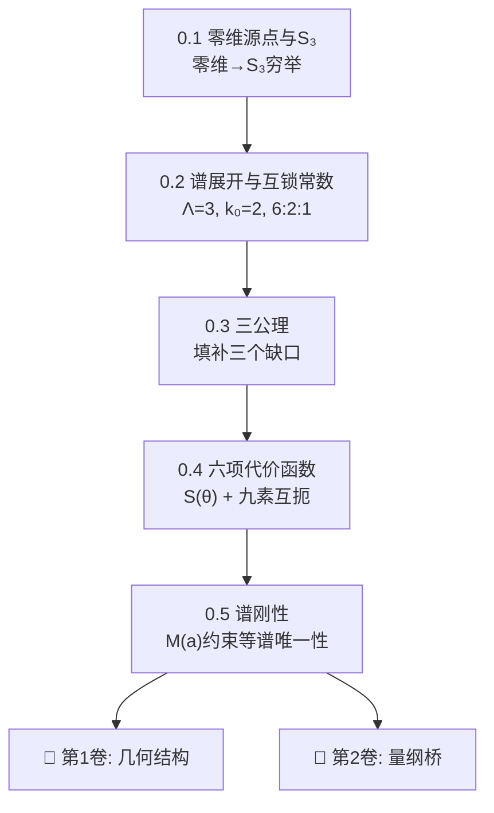

# 📘 第0卷：从零开始

> **纯数学入口——不需要任何物理知识。从零维源点到谱刚性，五章建立几何论的全部数学基础。**

---

## 本卷定位

第0卷是整部几何论的**公理基础层**（Axiom Layer）。其他七卷的全部推导最终追溯到本卷的五章。如果你只能读一卷，读这一卷。

**核心叙事弧**：零维源点 $\to$ $S_3$ 群论穷举 $\to$ 三公理填补三个缺口 $\to$ 六项作用量 $\to$ 乘积球面谱刚性

---

## 章节结构

| 章 | 标题 | 核心问题 | 主要成果 | 状态 |
|:---|:---|:---|:---|:---:|
| 0.1 | 零维源点与 $S_3$ | 为什么几何论的起点是零维？ | $S_3$ 对称性的穷举论证 | ✅ |
| 0.2 | 谱展开与互锁常数 | 离散对称性如何编码为连续谱？ | $\Lambda=3$, $k_0=2$, 谱权重 6:2:1 | ✅ |
| 0.3 | 三公理 | 从离散到连续缺什么？ | 三公理填补三个缺口 | ✅ |
| 0.4 | 六项代价函数与九素互扼 | 如何将公理转化为可计算的数学？ | $S(\theta) = \sum 1/\sin^2\theta_i + \sum_{i<j} 1/(\sin\theta_i\sin\theta_j)$ | ✅ |
| 0.5 | 乘积球面谱刚性 | 唯一性成立吗？ | 约束等谱刚性定理,M(a) 唯一性 | ✅ |

---

## 依赖关系图

---

## 阅读路径建议

| 读者背景 | 推荐路径 | 预计时间 |
|:---|:---|:---:|
| **数学物理学家**（关注严格性） | 0.1 $\to$ 0.2 $\to$ 0.3 $\to$ 0.4 $\to$ 0.5（顺序阅读） | 4-6 小时 |
| **理论物理学家**（想快速理解框架） | 0.1（跳读）$\to$ **0.3（精读）** $\to$ 0.4（公式）$\to$ 0.5（结论） | 2-3 小时 |
| **哲学家/好奇读者**（想理解思想） | 0.1（§1-§2）$\to$ 0.3（动机部分）$\to$ 0.5（§7 哲学意涵） | 1-2 小时 |
| **验证者**（想检查推导） | 0.3（公理陈述）$\to$ 0.4（六项作用量构造）$\to$ 0.5（谱刚性证明） | 3-5 小时 |

---

## 关键符号表

| 符号 | 含义 | 首次定义 |
|:---|:---|:---:|
| $p_0$ | 零维源点（真空基准） | 0.1 §1 |
| $S_3$ | 三元素置换群，扇区对称性 | 0.1 §2 |
| $\Lambda$ | 互锁常数 = 3 | 0.2 命题 2.0 |
| $k_0$ | 互锁常数 = 2 | 0.2 命题 2.0 |
| $\theta_M, \theta_C, \theta_I$ | 物质角、凝聚角、信息角 | 0.3 公理 3 |
| $90^\circ$ | 全息屏编码条件 $\theta_M+\theta_C+\theta_I=90^\circ$ | 0.3 公理 3 |
| $S(\theta)$ | 六项代价函数 | 0.4 定义 3.2 |
| $S_{\min}$ | 全局最小值 = 24 | 0.4 定理 4.4 |
| $S_e$ | 锁定作用量 = 137.035999084 | 0.4 导出项 |
| $M(a)$ | 约束单形族，谱刚性载体 | 0.5 §2 |
| $N_1$ | 激发态计数 = 6000 | 0.5 §5 |
| $\lambda_1^{\text{eff}}, \lambda_2^{\text{eff}}$ | Hessian 软硬模 | 0.5（过渡到第1卷） |

---

## 核心定理引用

| 编号 | 定理 | 说明 |
|:---:|:---|:---|
| #1 | $d^2=0$ | 外微分基础 |
| #3 | 三分切丛置换刚性 $G \cong S_3$ | 扇区对称性 |
| #4 | 互锁常数 $\Lambda=3$, $k_0=2$ | 整数基础 |
| #10 | 公理 3：$\theta_1+\theta_2+\theta_3=90^\circ$ | 全息屏编码 |
| #15 | $M(a)$ 约束等谱刚性 | 谱唯一性 |
| #145 | 乘积球面类上的刚性 | 全局唯一性 |
| #164 | 谱权重 6:2:1 | $S_3$ 谱结构 |

---

## 与其他卷的关系

| 目标卷 | 依赖关系 |
|:---|:---|
| **第1卷（几何结构）** | 需要本卷的三公理 + 六项作用量 → 构建三分切丛、全息屏、约束截面 |
| **第2卷（量纲桥）** | 需要本卷的谱刚性 → 谱三元组 → 物理常数 |
| **第3卷（三场动力学）** | 需要本卷的扇区划分 → 信息场/因果场/M场独立动力学 |
| **第5卷（标准模型）** | 需要本卷的 $S_e$, 三公理 → 耦合常数、质量谱 |

---

> 状态：✅ **全文完成！5章全部可读，可直接作为正式论文引用**

---

**✅ 已完成章节：** [[Vol-0_从零开始/0.1_零维源点与S₃_CN_260713.1]] · [[Vol-0_从零开始/0.2_谱展开与互锁常数_CN_260713.1]] · [[Vol-0_从零开始/0.3_三公理_CN_260713.1]] · [[Vol-0_从零开始/0.4_六项代价函数与九素互扼_CN_260713.1]] · [[Vol-0_从零开始/0.5_乘积球面谱刚性_CN_260713.1]]
