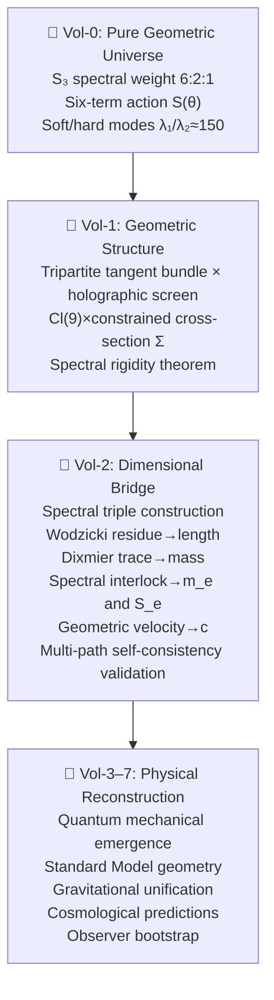

# 📘 Volume 2: Dimensional Bridge

**From Pure Geometry to Physical Constants — Spectral Triple and ℰ Mapping Functor**

---

## Foreword

This volume is the **most original and central contribution** of Geometric Theory. The preceding two volumes (Vol-0 Starting from Zero, Vol-1 Geometric Structure) established a pure geometric universe — one containing only dimensionless quantities: angles $\theta_X$, Hessian eigenvalues $\lambda_i$ (in units of rad⁻²), recursive hierarchy numbers $N_k$, geometric velocity $v_{\text{geo}}$, and action $S$. These quantities constitute a completely self-consistent mathematical universe, devoid of any trace of "meters," "seconds," or "kilograms."

But human physicists do not read dimensionless geometry — they read the electron mass $m_e = 510.99895\ \text{keV}$, the fine-structure constant $\alpha = 1/137.036$, and the speed of light $c = 299792458\ \text{m/s}$. The **Dimensional Bridge** is the formalized functor connecting these two worlds.

### Core Problem

$$
\text{Pure Geometric Quantities (dimensionless)} \xrightarrow{\text{Dimensional Bridge}} \text{Physical Constants (dimensionful)}
$$

This mapping is not an "artificial convention" — it is functorially uniquely determined by the spectral data $\{(\lambda_n,\psi_n)\}$ of the spectral triple $(\mathcal{A},\mathcal{H},D,J,\gamma)$. The system-of-units basis chosen by humans — "electron mass," "fine-structure constant," etc. — is, within the Geometric Theory framework, a natural readout of the spectral data.

### Volume Roadmap

### Dependencies

| Dependency | Content | Source |
|:---|:---|:---:|
| Vol-0 | Three axioms, six-term action, spectral rigidity | [Vol-0 Starting from Zero](../Vol-0_从零开始/MOC.md) |
| Vol-1 | Tripartite tangent bundle, holographic screen, constrained cross-section | [Vol-1 Geometric Structure](../Vol-1_几何结构/MOC.md) |
| Spectral triple construction | Spectral triple, Wodzicki residue, heat kernel coefficients, Dixmier trace | Constructed in this volume |

### Chapter Navigation

| Chapter | Content |
|:---|:---|
| §2.1 | Spectral Triple Construction |
| §2.2 | Length Scale Reconstruction |
| §2.3 | Time Scale Reconstruction |
| §2.4 | Mass Scale Reconstruction |
| §2.5 | Spectral Interlock Theorem |
| §2.6 | Geometric Velocity Algebra |
| §2.7 | Multi-Path Validation |

### Minimal Mapping Input Set Declaration (GT-2.0.0.1)

All physical constant reconstructions in this volume depend on the following **minimal mapping input set** (i.e., the single physical mapping input/identification from Vol-0):

| Symbol | Value | Role |
|:---:|:---|:---:|
| $S_e = 1/\alpha$ | 137.035999084 | Information–Matter sector coupling strength identification |
| $m_e$ | 510.99895 keV | Invert $\theta_M$ and $K$ via $m=K\sin^3\theta_M$ |
| $K$ | 839.758793 keV | Mass quantum |
| $N_1$ | 6000 | Seven-level recursion first cutoff |
| $v_p$ | 1117 | Strong interaction geometric charge |
| $\lambda_1^{\text{eff}}$ | 391.05 rad⁻² | Effective Hessian soft mode |
| $\lambda_2^{\text{eff}}$ | 59324.3 rad⁻² | Effective Hessian hard mode |

Wherever this volume uses expressions such as "uniquely determined by geometry" or "no external input," it means that **after the minimal mapping input set (GT-2.0.0.1) has been locked**, the remaining relations of the Dimensional Bridge admit no further free parameters.

---

**Subsequent chapters:** [2.1 Spectral Triple Construction](./2.1_谱三元组构造_CN_260713.1.md) → [2.2 Length Scale Reconstruction](./2.2_长度标度重建_CN_260713.1.md) → [2.3 Time Scale Reconstruction](./2.3_时间标度重建_CN_260713.1.md) → [2.4 Mass Scale Reconstruction](./2.4_质量标度重建_CN_260713.1.md) → [2.5 Spectral Interlock Theorem](./2.5_谱互锁定理_CN_260713.1.md) → [2.6 Geometric Velocity Algebra (forthcoming)](./2.6_几何速度代数_CN_260713.1.md) → [2.7 Multi-Path Validation](./2.7_多路径验证_CN_260713.1.md)
