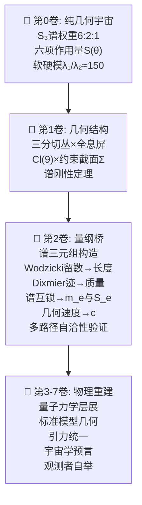

---
---

# 📘 第2卷：量纲桥

**从纯几何到物理常数——谱三元组与ℰ映射函子**

---

## 前言

本卷是几何论**最原创、最核心的贡献**。前五卷（第0卷从零开始、第1卷几何结构）建立了纯几何宇宙——其中只有无量纲量：角度 $\theta_X$、Hessian 本征值 $\lambda_i$（单位为 rad⁻²）、递推层级数 $N_k$、几何速度 $v_{\text{geo}}$、作用量 $S$。这些量构成一个完全自洽的数学宇宙，没有任何"米"、"秒"、"千克"的踪迹。

但人类物理学家读到的不是无量纲几何——他们读到的电子质量 $m_e = 510.99895\ \text{keV}$、精细结构常数 $\alpha = 1/137.036$、光速 $c = 299792458\ \text{m/s}$。**量纲桥**就是连接这两个世界的形式化函子。

### 核心问题

$$
\text{纯几何量（无量纲）} \xrightarrow{\text{量纲桥}} \text{物理常数（有量纲）}
$$

这个映射不是"人为约定"——它由谱三元组 $(\mathcal{A},\mathcal{H},D,J,\gamma)$ 的谱数据 $\{(\lambda_n,\psi_n)\}$ 函子性唯一确定。人类选择的"电子质量""精细结构常数"等单位制基底，在几何论框架内是谱数据的自然读出。

### 本卷路线图

### 依赖关系

| 依赖 | 内容 | 来源 |
|:---|:---|:---:|
| 第0卷 | 三公理、六项作用量、谱刚性 | [Vol-0 从零开始](../Vol-0_从零开始/MOC.md) |
| 第1卷 | 三分切丛、全息屏、约束截面 | [Vol-1 几何结构](../Vol-1_几何结构/MOC.md) |
| 谱三元组构造 | 谱三元组、Wodzicki留数、热核系数、Dixmier迹 | 本书构造 |

### 本卷章节导航

| 章节 | 内容 |
|:---|:---|
| §2.1 | 谱三元组构造 |
| §2.2 | 长度标度重建 |
| §2.3 | 时间标度重建 |
| §2.4 | 质量标度重建 |
| §2.5 | 谱互锁定理 |
| §2.6 | 几何速度代数 |
| §2.7 | 多路径验证 |

### 最小映射输入集声明（GT-2.0.0.1）

本卷所有的物理常数重建，依赖以下**最小映射输入集**（即Vol-0的单一物理映射输入/识别）：

| 符号 | 值 | 作用 |
|:---:|:---|:---:|
| $S_e = 1/\alpha$ | 137.035999084 | 信息界-物质界耦合强度识别 |
| $m_e$ | 510.99895 keV | 通过 $m=K\sin^3\theta_M$ 反解 $\theta_M$ 与 $K$ |
| $K$ | 839.758793 keV | 质量量子 |
| $N_1$ | 6000 | 七级递推第一截断 |
| $v_p$ | 1117 | 强相互作用几何荷 |
| $\lambda_1^{\text{eff}}$ | 391.05 rad⁻² | 有效Hessian软模 |
| $\lambda_2^{\text{eff}}$ | 59324.3 rad⁻² | 有效Hessian硬模 |

凡本卷出现"由几何唯一确定""无外部输入"等表述，均指**在最小映射输入集（GT-2.0.0.1）已锁定后**，量纲桥其余关系不再有额外自由参数。

---

**后续章节：** [2.1 谱三元组构造](./2.1_谱三元组构造.md) → [2.2 长度标度重建](./2.2_长度标度重建.md) → [2.3 时间标度重建](./2.3_时间标度重建.md) → [2.4 质量标度重建](./2.4_质量标度重建.md) → [2.5 谱互锁定理](./2.5_谱互锁定理.md) → [2.6 几何速度代数（待编写）](./2.6_几何速度代数.md) → [2.7 多路径验证](./2.7_多路径验证.md)
