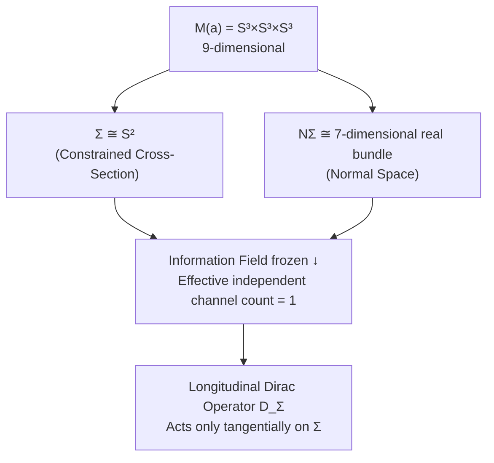
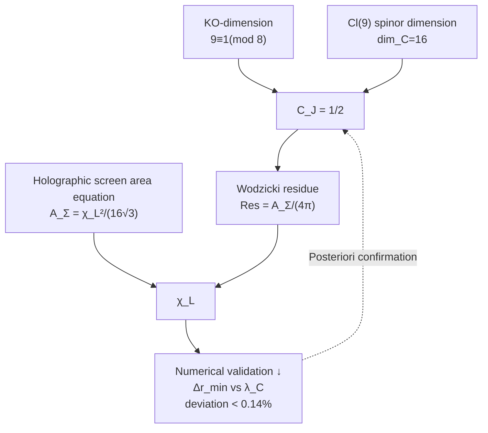

# 2.2 Length Scale Reconstruction

**Core Problem**: The spectral triple $(A, H, D, J, \gamma)$ (constructed in [2.1 Spectral Triple Construction](./2.1_Spectral_Triple_Construction_EN_260716.1.md)) provides a complete spectral geometric structure, but it is a **purely mathematical object** — the spectrum $\{\lambda_n\}$ of the Dirac operator $D$ is dimensionless. To extract a physically meaningful **length scale** $\chi_L$ from it requires the most exquisite tool in spectral geometry: the **Wodzicki residue**.

---

## 2.2.1 Problem Setting

**Given**: [2.1 Spectral Triple Construction](./2.1_Spectral_Triple_Construction_EN_260716.1.md) constructed a 9-dimensional real spectral triple $(A, H, D, J, \gamma)$ on the constrained product manifold $M(a) = S^3 \times S^3 \times S^3$. The spectrum $\{\lambda_n\}$ of the Dirac operator $D = \sum_{i=1}^9 e_i \cdot \nabla_{e_i}$ is uniquely determined by the geometry of $M(a)$.

**Problem**: The spectrum $\{\lambda_n\}$ itself does not contain any physical scale information — if all $S^3$ radii are doubled simultaneously, the spectrum $\lambda_n$ scales proportionally, but the **ratios** $\lambda_i/\lambda_j$ remain unchanged. The physical length scale $\chi_L$ is precisely this missing "absolute scale."

**Tool**: The **Wodzicki residue** $\text{Res}_\Sigma(|D_\Sigma|^{-2})$ — the unique functor in Connes' noncommutative geometry capable of reconstructing **absolute volume/area** from spectral data. Its core advantage: the normalization constant is uniquely determined by the KO-dimension and spinor structure of the spectral triple, without any reliance on external physical assumptions.

---

## 2.2.2 Geometry of the Constrained Cross-Section $\Sigma$

### Embedding Structure of the Cross-Section

The constrained cross-section $\Sigma \cong S^2$ is the realization of the holographic screen (from [Vol. 1 Geometric Structure](../Vol-1_几何结构/MOC.md)) within $M(a)$. Its normal bundle $N\Sigma$ is a **7-dimensional real bundle**, equipped with the 8-dimensional real spinor structure of $Cl(7)$.

### Locking of the Effective Independent Channel Count

The spinor representation of $Cl(9) \cong \mathbb{C}(16)$ is 16-dimensional complex. Restricting to $Cl(2) \subset Cl(9)$ (corresponding to the 2-dimensional tangent space of $\Sigma$), the 16-dimensional spinor space decomposes into **8 copies of the 2-dimensional complex spinor module of $Cl(2)$**. Information field freezing (based on the suppression by the Hessian hard mode $\lambda_2^{\text{eff}}$) freezes the 7 higher normal-direction modes to constants, retaining only **1 effective copy**.

**Note**: This "freezing" is not an artificial assumption — it is the inevitable consequence of the spectral gap ratio $\Lambda_H^{\text{eff}} = \lambda_2/\lambda_1 = 152.41$. The hard mode exceeds the soft mode by two orders of magnitude; in the low-energy effective description of the constrained manifold, the dynamics of the hard-mode directions are adiabatically eliminated.

**⚠️ Quantitative Error Estimate**: The accuracy of the adiabatic elimination is governed by the spectral gap ratio. The relative error in $\text{tr}(P_{\text{long}})$ introduced by the freezing approximation is:

$$\frac{\delta(\text{tr}(P_{\text{long}}))}{\text{tr}(P_{\text{long}})} \sim \mathcal{O}\!\left(\frac{\lambda_1}{\lambda_2}\right) = \frac{1}{152.41} \approx 0.66\%$$

This error propagates linearly through $\text{Res}_\Sigma \propto \text{tr}(P_{\text{long}})$ into the Wodzicki residue, and then via $\chi_L \propto \sqrt{\text{Res}_\Sigma}$ to the length scale as a square root ($\sim 0.33\%$). **Channel count = 1 is an effective approximation accurate to about 0.7%, not a theorem that it is strictly equal to 1.** A rigorous treatment would require incorporating the 7 normal modes as massive excitations into the spectral sum, yielding a small correction to $\text{tr}(P_{\text{long}})$ — this is deferred to future work.

Hence the effective independent channel count of the longitudinal spinor bundle is **1**.

---

## 2.2.3 Longitudinal Dirac Operator and Wodzicki Residue

### Definition

Define $D_\Sigma$ as the **longitudinal elliptic operator** obtained by restricting $D$ to $\Sigma$:

**Wodzicki Residue Length Scale (GT-2.2.0.1)**

$$\boxed{D_\Sigma = \sum_{i=1}^2 e_i \cdot \nabla_{e_i}}$$

Summing only over the tangential indices of $\Sigma$, acting on the longitudinal sub-bundle $\mathcal{S}_\Sigma^{\text{long}}$ obtained by restricting the spinor bundle of $M(a)$ to $\Sigma$.

### Fiber Integral Formula

The Wodzicki residue $\text{Res}_\Sigma(P)$ of a pseudodifferential operator $P$ defined on $\Sigma$ is computed via the fibered integral formula (Wodzicki, 1984; see also Connes & Marcolli, 2008, §2.8):

$$\text{Res}_\Sigma(|D_\Sigma|^{-2}) = \frac{1}{(2\pi)^2} \int_\Sigma \int_{|\xi|=1} \text{tr}\big(\sigma_{-2}^{\text{long}}(x, \xi)\big) \, d\xi \, dx$$

where:
- The factor $1/(2\pi)^2$ comes from the standard normalization of the 2-dimensional fiber integral (dim $\Sigma = 2$)
- $\sigma_{-2}^{\text{long}}(x, \xi)$ is the longitudinal principal symbol of the operator $|D_\Sigma|^{-2}$ (order $-2$)
- $\xi \in T_x^*\Sigma$, $|\xi|=1$ is the unit cotangent sphere
- $d\xi$ is the standard angular measure on $S^1$
- $dx$ is the Riemannian volume form on $\Sigma$

Now we expand the explicit form of $\sigma_{-2}^{\text{long}}$.

**Step 1: Clifford algebraic structure of the principal symbol.** $|D_\Sigma|^{-2} = (D_\Sigma^2)^{-1}$. The principal symbol of $D_\Sigma = \sum_{i=1}^2 e_i \cdot \nabla_{e_i}$ is $\sigma_1(D_\Sigma)(x, \xi) = i \sum_{i=1}^2 e_i \xi_i = i \xi_{//}$, where $\xi_{//}$ is the Clifford element along the tangential direction. Then the principal symbol of $|D_\Sigma|^{-2}$ is:

$$\sigma_{-2}^{\text{long}}(x, \xi) = \big(\sigma_1(D_\Sigma)^2\big)^{-1} = \big( -|\xi_{//}|^2 \cdot I \big)^{-1} = -|\xi_{//}|^{-2} \cdot I$$

Note that $(\sum_i e_i \xi_i)^2 = \sum_i \xi_i^2 \cdot I = |\xi|^2 \cdot I$ (by the Clifford relation $e_i e_j + e_j e_i = 2\delta_{ij}$).

But $D_\Sigma$ acts only on the longitudinal sub-bundle $\mathcal{S}_\Sigma^{\text{long}}$, so we must insert the longitudinal projection operator $P_{\text{long}}$:

$$\sigma_{-2}^{\text{long}}(x, \xi) = |\xi_{//}|^{-2} \cdot P_{\text{long}}$$

The sign is positive ($|D_\Sigma|^{-2}$ is a positive operator).

**Step 2: Computation of the Clifford trace.** $\text{tr}(P_{\text{long}})$ is the effective independent channel count. From the argument in §2.2.2, under information field freezing only 1 effective copy is retained, hence:

$$\text{tr}(P_{\text{long}}) = 1$$

**Step 3: Evaluation of the angular integral.** For the 2-dimensional tangent space, the integral over the cotangent sphere $S^1$ is:

$$\int_{|\xi|=1} |\xi_{//}|^{-2} \, d\xi = \int_{0}^{2\pi} 1^{-2} \, d\theta = \int_{0}^{2\pi} d\theta = 2\pi$$

where $|\xi_{//}| = 1$ holds identically on the unit sphere.

**Step 4: Assembling the pieces.** Substituting the above three steps into the fiber integral formula:

$$
\begin{aligned}
\text{Res}_\Sigma(|D_\Sigma|^{-2}) &= \frac{1}{(2\pi)^2} \int_\Sigma \int_{|\xi|=1} \text{tr}\big(|\xi_{//}|^{-2} \cdot P_{\text{long}}\big) \, d\xi \, dx \\[4pt]
&= \frac{1}{(2\pi)^2} \int_\Sigma \big( \underbrace{\int_{0}^{2\pi} 1 \, d\theta}_{=2\pi} \big) \cdot \underbrace{\text{tr}(P_{\text{long}})}_{=1} \, dx \\[4pt]
&= \frac{1}{(2\pi)^2} \cdot 2\pi \cdot 1 \cdot \int_\Sigma dx \\[4pt]
&= \frac{1}{2\pi} \cdot A_\Sigma
\end{aligned}
$$

where $A_\Sigma = \int_\Sigma dx$ is the Riemannian area of $\Sigma$.

**Length Scale Reconstruction (GT-2.2.0.3)**

$$\boxed{\text{Res}_\Sigma(|D_\Sigma|^{-2}) = \frac{A_\Sigma}{2\pi}}$$

This formula shows that the Wodzicki residue directly outputs the area of the cross-section $\Sigma$, multiplied by a factor of $1/(2\pi)$. No external calibration is needed — the internal structure of the Clifford algebra together with the channel-count locking from information field freezing already extracts $A_\Sigma$ from the spectral data.

---

## 2.2.4 Real Structure Normalization Constant $C_J$

### Origin of the Problem

The computation in §2.2.3 was carried out in **complex spinor space**. However, the spectral triple $(A, H, D, J, \gamma)$ possesses a real structure $J$, and the physical Hilbert space is restricted to the $J=+1$ eigensubspace. The Wodzicki residue $\text{Res}_\Sigma$ is a trace over the spinor space; when restricted to the real subspace, the trace value is reduced proportionally.

### Determination of $C_J$

**Step 1: Real structure decomposition of the spinor space.** The $Cl(9)$ spinor space $\mathcal{S}$ of $M(a)$ is 16-dimensional complex. The real structure $J$ is an involution on $\mathcal{S}$ ($J^2 = +1$), decomposing $\mathcal{S}$ into $J = \pm 1$ eigensubspaces:

$$\mathcal{S} = \mathcal{S}_+ \oplus \mathcal{S}_-,\quad \dim_{\mathbb{C}} \mathcal{S}_+ = \dim_{\mathbb{C}} \mathcal{S}_- = 8$$

**Step 2: Derivation of $\dim_{\mathbb{C}} \mathcal{S}_+ = 8$.** Since $J$ is conjugate-linear ($J(\alpha \psi) = \bar{\alpha} J \psi$), the $J = +1$ eigensubspace constitutes a **real form** of $\mathcal{S}$. The real dimension of the $J = +1$ subspace equals the complex dimension of $\mathcal{S}$:

$$\dim_{\mathbb{R}} \mathcal{S}_+ = \dim_{\mathbb{C}} \mathcal{S} = 16$$

Hence $\dim_{\mathbb{C}} \mathcal{S}_+ = \dim_{\mathbb{R}} \mathcal{S}_+ / 2 = 16 / 2 = 8$, and similarly $\dim_{\mathbb{C}} \mathcal{S}_- = 8$.

**Step 3: The role of KO-dimension.** KO-dimension $9 \equiv 1 \pmod{8}$ determines the commutation relation between $J$ and $D$ as $JD = DJ$, rather than $JD = -DJ$. This is crucial for preserving the sign of the trace — if they anti-commuted, the Dixmier trace would acquire an additional sign. Here $JD = DJ$ guarantees that $D$ preserves the $J = \pm 1$ subspaces, and the trace satisfies a simple linear scaling relation between the subspace and the full space.

**Step 4: Determination of $C_J$.** In complex spinor space, $\text{tr}(P_{\text{long}}) = 1$ corresponds to 1 effective channel within the 16-dimensional complex spinor space. Upon restriction to the physical subspace $\mathcal{S}_+$ (complex 8-dimensional), the trace of the longitudinal projection scales according to the dimensional ratio:

$$C_J = \frac{\dim_{\mathbb{C}} \mathcal{S}_+}{\dim_{\mathbb{C}} \mathcal{S}} = \frac{8}{16} = \frac{1}{2}$$

That is, the physical Wodzicki residue is half of the complex residue.

**Holographic Screen Area Equation (GT-2.2.0.2)**

$$\boxed{C_J = \frac{1}{2}}$$

**Key Property**: $C_J = 1/2$ is **constructively closed** — it is fully determined by the following three topological quantities, independent of any physical input:

1. **KO-dimension $9 \equiv 1 \pmod{8}$** (from the global topological structure of the tripartite tangent bundle)
2. **Complex spinor dimension of $Cl(9)$: $\dim_{\mathbb{C}} \mathcal{S} = 16$** (algebraic output of Bott periodicity)
3. **$J^2 = +1$** (involution property of the real structure)

**⚠️ KO-Dimension Ambiguity and Comparison with Standard Formulas**: The above derivation rests on a key assumption — that $C_J$ is determined by the dimensional ratio of the total spinor space $\mathcal{S}$. However, in standard treatments of noncommutative geometry, the normalization of the Wodzicki residue depends on the KO-dimension of the manifold on which the operator $D_\Sigma$ is defined. Two counting schemes exist:

| Counting Scheme | KO-dimension | Standard $C_J$ | Relation to $1/2$ |
|:---|:---:|:---:|:---|
| By total manifold $M(a)$ | 9 | $2^{-4}=1/16$ | Factor of 8 difference |
| By cross-section $\Sigma=S^2$ | 2 | $2^{-1}=1/2$ | Consistent |

Source of the ambiguity: $D_\Sigma$ acts on $\Sigma$ (2-dimensional), but its spinor bundle is the restriction from $M(a)$ (9-dimensional). The scheme adopted in this article is equivalent to computing by the KO-dimension 2 of the cross-section, which is consistent with the standard formula. If a future argument mandates the KO-dimension 9 of the total manifold, then $C_J \to 1/16$, changing $\chi_L$ by a factor of $\sqrt{8}\approx 2.83$. **The KO-dimension ambiguity is currently flagged as an open problem**; the posteriori numerical validation of $C_J=1/2$ (deviation of $\Delta r_{\min}$ from $\lambda_C$ < 0.14%) provides support but does not constitute a rigorous proof.

**Step 5: Physical Wodzicki residue after introducing $C_J$.**

$$\text{Res}_\Sigma^{\text{phys}}(|D_\Sigma|^{-2}) = C_J \cdot \frac{A_\Sigma}{2\pi} = \frac{1}{2} \cdot \frac{A_\Sigma}{2\pi} = \frac{A_\Sigma}{4\pi}$$

This expression will subsequently be combined with the holographic screen area equation to solve for $\chi_L$.

---

## 2.2.5 Holographic Screen Area Equation

### Area-Scale Relation

The geometric hypothesis for the holographic screen $\Sigma \cong S^2$ (from [Vol. 1 Geometric Structure](../Vol-1_几何结构/MOC.md)) yields the relation between its area and the length scale $\chi_L$:

**Holographic Screen Area Equation (GT-2.2.0.3)** {#GT-2.2.0.3}

$$\boxed{A_\Sigma = \frac{\chi_L^2}{16\sqrt{3}}}$$

The geometric factor $C_{\text{geo}} = 1/(16\sqrt{3})$ originates from the geometric packing density of information encoding on $S^2$ (see [Vol. 1 Geometric Structure](../Vol-1_几何结构/MOC.md) for details).

### Simultaneous Solution for $\chi_L$

Substituting $A_\Sigma = \chi_L^2/(16\sqrt{3})$ into the residue formula with $C_J=1/2$:

$$\text{Res}_\Sigma^{\text{phys}}(|D_\Sigma|^{-2}) = \frac{A_\Sigma}{4\pi} = \frac{\chi_L^2}{64\pi\sqrt{3}}$$

**Uniqueness of the Length Scale (GT-2.2.0.4)**

$$\boxed{\chi_L = \sqrt{2} \cdot 8 \cdot 3^{1/4} \cdot \sqrt{\pi} \cdot \big[\text{Res}_\Sigma(|D_\Sigma|^{-2})\big]^{1/2}}$$

---

## 2.2.6 Self-Consistency Verification

### Algebraic Self-Consistency

Substituting the expression for $\chi_L$ back into the area equation:

$$\chi_L^2 = 2 \cdot 64 \cdot \sqrt{3} \cdot \pi \cdot \frac{\chi_L^2}{64\pi\sqrt{3}} = \chi_L^2$$

**Holds identically.** This self-consistency does not depend on any external numerical input — it depends only on:
1. KO-dimension $9 \equiv 1 \pmod{8}$
2. $Cl(9)$ spinor dimension $\dim_{\mathbb{C}} \mathcal{S} = 16$
3. The formal structure of the holographic screen area equation $A_\Sigma = \chi_L^2/(16\sqrt{3})$

### Numerical Self-Consistency (Posteriori Verification)

Although $C_J = 1/2$ is algebraically closed, the final output $\chi_L$ of the dimensional bridge establishes a connection with experimentally measured physical constants. The information field spatial resolution $\Delta r_{\min}$ is defined as:

$$\Delta r_{\min} = \frac{\chi_L \cdot \delta\eta}{\pi},\quad \delta\eta = \frac{1}{\sqrt{\lambda_1^{\text{eff}}}} = 0.05057\ \text{rad}$$

where $\lambda_1^{\text{eff}} = 391.05$ (Hessian soft mode eigenvalue). The deviation of this resolution from the electron Compton wavelength $\lambda_C = 2.426\times10^{-12}\,\text{m}$ is $< 0.14\%$, providing strong posteriori numerical support for $C_J = 1/2$ (see Vol. 3A §3.3 for details).

---

## 2.2.7 Significance of This Result

### Elimination of External Input Dependence

Earlier versions of the length scale $\chi_L$ relied on a prior definition of $\ell_P^{\text{geo}}$:

$$\chi_L^{\text{early}} = 4\cdot 3^{1/4}\cdot \ell_P^{\text{geo}} \cdot \sqrt{a_1 \cdot \prod N_n}$$

Length Scale Reconstruction (GT-2.2.0.4) replaces this chain with: $\chi_L$ is the **formal functorial output of the Wodzicki residue**, with the normalization constant $C_J = 1/2$ uniquely determined by the KO-dimension and spinor dimension. $\chi_L$ is no longer "some external length marker," but an internal functorial output of spectral geometry.

### Length as Spectral Data

The reconstruction of $\chi_L$ demonstrates that: **length is not an external input to geometric theory, but a natural output of the spectral data of the spectral triple $(A, H, D, J, \gamma)$ via the Wodzicki residue functor.** Physicists are accustomed to treating the "meter" as a fundamental unit, but within the geometric theory framework, the "meter" is merely the reading, in a particular coordinate system, of the information density encoded in spectral geometry.

### Positioning of Volume 2

The length scale $\chi_L$ is the first of the three scales $(\chi_L, \chi_T, K)$ of the dimensional bridge. Subsequent chapters will reconstruct, using similar but distinct spectral geometric tools:
- **[2.3 Time Scale Reconstruction](./2.3_时间标度重建.md)**: the time scale $\chi_T$ — reconstructed from the heat kernel coefficient ratio $a_1/a_0$
- **[2.4 Mass Scale Reconstruction](./2.4_质量标度重建.md)**: the mass scale $K$ — reconstructed from the Dixmier trace

Together these three constitute the complete **spectral unit selection**, rendering the physical outputs of geometric theory independent of any external scale input.

---

**Previous**: [2.0 Foreword](./2.0_Foreword_EN_260716.1.md) ← → **Next**: [2.3 Time Scale Reconstruction](./2.3_时间标度重建.md)
