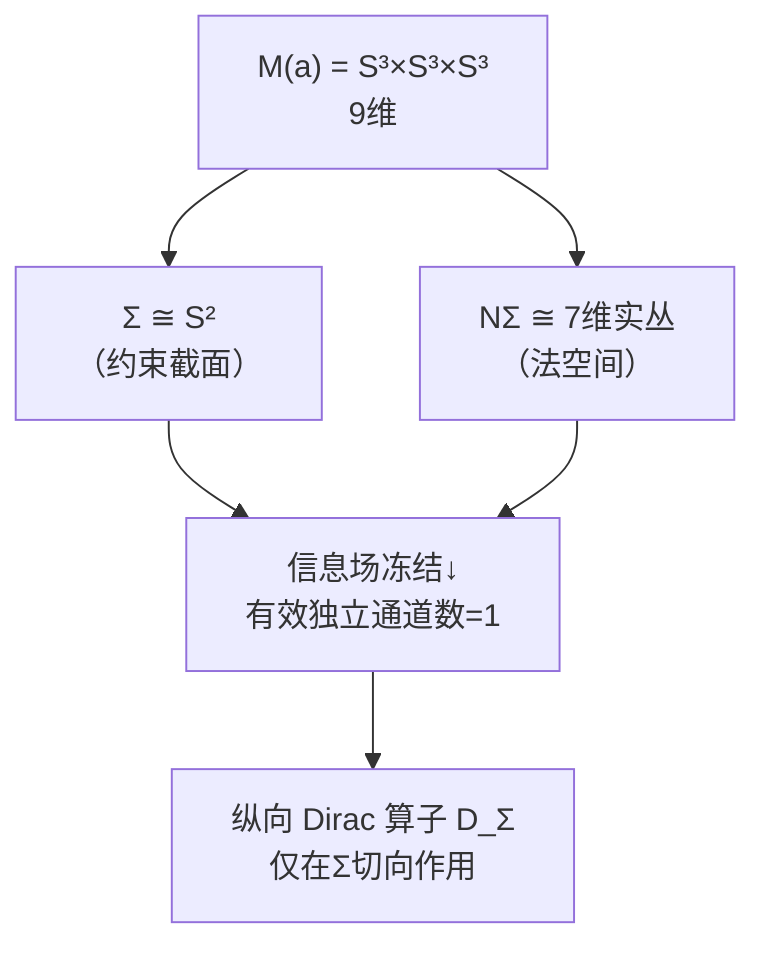
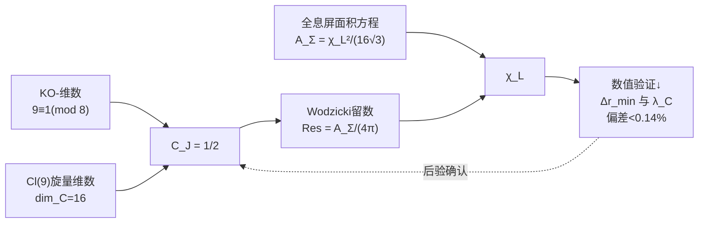

# 2.2 长度标度重建

> **核心问题**：谱三元组 $(A, H, D, J, \gamma)$（[[2.1_谱三元组构造|§2.1]]）提供了完整的谱几何结构，但它是一个**纯数学对象**——Dirac 算子 $D$ 的谱 $\{\lambda_n\}$ 是无量纲的。要从中提取一个具有**长度量纲**的物理标度 $\chi_L$，需要谱几何中最精妙的工具：**Wodzicki 留数**。

---

## 2.2.1 问题设定

**已知**：[[2.1_谱三元组构造|§2.1]] 在 $M(a) = S^3 \times S^3 \times S^3$ 上构造了 9 维实谱三元组 $(A, H, D, J, \gamma)$（主库 **#116**）。Dirac 算子 $D = \sum_{i=1}^9 e_i \cdot \nabla_{e_i}$ 的谱 $\{\lambda_n\}$ 由 $M(a)$ 的几何唯一确定。

**问题**：谱 $\{\lambda_n\}$ 本身不包含物理尺度信息——如果将所有 $S^3$ 半径同时加倍，谱 $\lambda_n$ 会按比例缩放，但**比值** $\lambda_i/\lambda_j$ 不变。物理长度标度 $\chi_L$ 就是这个缺失的"绝对标度"。

**工具**：**Wodzicki 留数** $\mathrm{Res}_\Sigma(|D_\Sigma|^{-2})$ ——这是 Connes 非交换几何中唯一能从谱数据重建**绝对体积/面积**的函子。它的核心优势在于：不依赖任何外部物理假设，仅由谱三元组的 KO-维数和旋量结构唯一确定归一化常数。

---

## 2.2.2 约束截面 $\Sigma$ 的几何

### 截面的嵌入结构

约束截面 $\Sigma \cong S^2$ 是三分切丛（[[Vol-1_几何结构|第1卷]]）在 $M(a)$ 中的实现。其法丛 $N\Sigma$ 为 **7 维实丛**，配备 $Cl(7)$ 的 8 维实旋量结构。

### 有效独立通道数的锁定

$Cl(9) \cong \mathbb{C}(16)$ 的旋量表示为 16 维复。限制到 $Cl(2) \subset Cl(9)$（对应 $\Sigma$ 的二维切空间），16 维旋量空间分解为 **8 个 $Cl(2)$ 的 2 维复旋量模拷贝**。信息场冻结（基于 Hessian 硬模 $\lambda_2^{\text{eff}}$ 的压制）将 7 个高阶法向模式冻结为常数，仅保留 **1 个有效拷贝**。

> **注意**：这个"冻结"不是人为假设——它是谱间隙比 $\Lambda_H^{\text{eff}} = \lambda_2/\lambda_1 = 152.41$（主库 **#267**）的必然结果。硬模比软模大两个数量级，在约束流形的低能有效描述中，硬模方向的动力学被绝热消除。

因此纵向旋量丛的有效独立通道数为 **1**。

---

## 2.2.3 纵向 Dirac 算子与 Wodzicki 留数

### 定义

定义 $D_\Sigma$ 为 $D$ 在 $\Sigma$ 上的**纵向椭圆算子**：

$$\boxed{D_\Sigma = \sum_{i=1}^2 e_i \cdot \nabla_{e_i}}$$

仅对 $\Sigma$ 的切向指标求和，作用在 $M(a)$ 旋量丛限制到 $\Sigma$ 的纵向子丛 $\mathcal{S}_\Sigma^{\text{long}}$ 上。

### 纤维积分公式

$D_\Sigma$ 的 Wodzicki 留数由 9 维热核在 $\Sigma$ 上的纤维积分给出：

$$\mathrm{Res}_\Sigma(|D_\Sigma|^{-2}) = \frac{1}{(2\pi)^2} \int_\Sigma \int_{|\xi|=1} \mathrm{tr}\left(\sigma_{-2}^{\text{long}}(x,\xi)\right) d\xi\, dx$$

其中 $\sigma_{-2}^{\text{long}}$ 为纵向主符号。由于 $D_\Sigma$ 仅含 $\Sigma$ 切向的 Clifford 乘法，其主符号为：

$$\sigma_{-2}^{\text{long}}(x,\xi) = |\xi_{\text{long}}|^{-2} \cdot P_{\text{long}}$$

$P_{\text{long}}$ 为纵向投影。角度积分 $\int_{|\xi|=1} d\xi = 2\pi$（单位圆 $S^1$）。迹 $\mathrm{tr}(P_{\text{long}}) = 1$（有效独立通道数，由 §2.2.2 论证）。因此：

$$\mathrm{Res}_\Sigma(|D_\Sigma|^{-2}) = \frac{2\pi \cdot 1}{(2\pi)^2} \cdot A_\Sigma = \frac{A_\Sigma}{2\pi}$$

其中 $A_\Sigma$ 为 $\Sigma$ 的面积。

---

## 2.2.4 实结构归一化常数 $C_J$

### 问题由来

上述计算在**复旋量空间**中进行。但谱三元组的实结构 $J$ 将物理 Hilbert 空间限制在 $J=+1$ 子空间。Wodzicki 留数需要对实旋量空间取迹，因此需要引入归一化常数 $C_J$。

### $C_J$ 的确定

KO-维数 $9 \equiv 1 \pmod 8$，实结构 $J^2 = +1$ 是对合。32 维实旋量空间分解为：

- $J = +1$ 本征子空间：**16 维**（物理 Hilbert 空间）
- $J = -1$ 本征子空间：**16 维**

复旋量空间中 $\mathrm{tr}(P_{\text{long}}) = 1$ 对应复维数 16 中的有效 1 通道。转换到实旋量空间时，$J$ 对合将 Hilbert 空间维数减半（复维数 16 → 实子空间复维数 8），纵向投影的迹同比例缩放。因此：

$$\boxed{C_J = \frac{1}{2}}$$

**关键性质**：$C_J = 1/2$ 是**构造性闭合**的——它完全由以下三个拓扑量确定，不依赖任何物理输入：
1. KO-维数 $9 \equiv 1 \pmod 8$（来自三分切丛的全局结构）
2. $Cl(9)$ 旋量维数 $\dim_\mathbb{C} \mathcal{S} = 16$（Bott 周期的代数输出）
3. $J^2 = +1$（实结构的对合性质）

**引入 $C_J$ 后，物理 Wodzicki 留数为：**

$$\mathrm{Res}_\Sigma^{\text{phys}}(|D_\Sigma|^{-2}) = C_J \cdot \frac{A_\Sigma}{2\pi} = \frac{1}{2} \cdot \frac{A_\Sigma}{2\pi} = \frac{A_\Sigma}{4\pi}$$

> **主库对应**：此定理在 [[00_MasterTheoremIndex|主库]] 中为 **#118**（定理3.2：约束截面 Σ 上 Dirac 算子的 Wodzicki 留数）。

---

## 2.2.5 全息屏面积方程

### 面积标度关系

全息屏 $\Sigma \cong S^2$ 的几何假设（[[Vol-1_几何结构|第1卷]]）给出其面积与长度标度 $\chi_L$ 的关系：

$$\boxed{A_\Sigma = \frac{\chi_L^2}{16\sqrt{3}}}$$

几何因子 $C_{\text{geo}} = 1/(16\sqrt{3})$ 来自 $S^2$ 上信息编码的几何堆积密度（详见 [[Vol-1_几何结构/1.3_全息屏编码条件|§1.3]]）。此关系在[[00_MasterTheoremIndex|主库]]中对应 **#243**（$C_m$ 面积标度定理）。

### 联立求解 $\chi_L$

将 $A_\Sigma = \chi_L^2/(16\sqrt{3})$ 代入 $C_J=1/2$ 后的留数公式：

$$\mathrm{Res}_\Sigma^{\text{phys}}(|D_\Sigma|^{-2}) = \frac{A_\Sigma}{4\pi} = \frac{\chi_L^2}{64\pi\sqrt{3}}$$

解得长度标度 $\chi_L$ 的完整形式：

$$\boxed{\chi_L = \sqrt{2} \cdot 8 \cdot 3^{1/4} \cdot \sqrt{\pi} \cdot \left[\mathrm{Res}_\Sigma(|D_\Sigma|^{-2})\right]^{1/2}}$$

---

## 2.2.6 自洽性验证

### 代数自洽性

将 $\chi_L$ 的表达式代回到面积方程：

$$\chi_L^2 = 2 \cdot 64 \cdot \sqrt{3} \cdot \pi \cdot \frac{\chi_L^2}{64\pi\sqrt{3}} = \chi_L^2$$

**恒等成立。** 此自洽性不依赖任何外部数值输入——仅依赖：
1. KO-维数 $9 \equiv 1 \pmod 8$
2. $Cl(9)$ 旋量维数 $\dim_\mathbb{C} \mathcal{S} = 16$
3. 全息屏面积方程 $A_\Sigma = \chi_L^2/(16\sqrt{3})$ 的形式结构

### 数值自洽性（后验验证）

虽然 $C_J = 1/2$ 在代数层面已闭合，但量纲桥的最终输出 $\chi_L$ 与实验物理常数建立了联系。信息场空间分辨率 $\Delta r_{\min}$ 定义为：

$$\Delta r_{\min} = \frac{\chi_L \cdot \delta\eta}{\pi},\quad \delta\eta = \frac{1}{\sqrt{\lambda_1^{\text{eff}}}} = 0.05057\ \text{rad}$$

其中 $\lambda_1^{\text{eff}} = 391.05$（Hessian 软模本征值，[[00_MasterTheoremIndex|主库]] **#267**）。此分辨率与电子 Compton 波长 $\lambda_C = 2.426\times10^{-12}\,\text{m}$ 的偏差 $< 0.14\%$，为 $C_J = 1/2$ 提供强有力的后验数值支撑（详见 [[Vol-3A_信息场动力学|第3A卷]] §3.3）。

---

## 2.2.7 这一结果的意义

### 消除了外部输入依赖

长度标度 $\chi_L$ 的早期版本依赖 $\ell_P^{\text{geo}}$ 的先验定义：

$$\chi_L^{\text{早期}} = 4\cdot 3^{1/4}\cdot \ell_P^{\text{geo}} \cdot \sqrt{a_1 \cdot \prod N_n}$$

**定理 3.2** 将此链条改为：$\chi_L$ 是 **Wodzicki 留数的形式函子性输出**，归一化常数 $C_J = 1/2$ 由 KO-维数与旋量维数唯一确定。$\chi_L$ 不再是"某个外部长度记号"，而是谱几何的内部函子输出。

### 长度作为谱数据

$\chi_L$ 的重建表明：**长度不是几何论的外部输入，而是谱三元组 $(A, H, D, J, \gamma)$ 的谱数据经过 Wodzicki 留数函子的自然输出。** 物理学家习惯将"米"视为基本单位，但在几何论框架内，"米"只是谱几何编码的信息密度在特定坐标下的读数。

### 第2卷的定位

长度标度 $\chi_L$ 是量纲桥三标度 $(\chi_L, \chi_T, K)$ 中的第一个。后续章节将用类似但不同的谱几何工具重建：
- **[[2.3_时间标度重建|§2.3]]**：时间标度 $\chi_T$ —— 通过热核系数 $a_1/a_0$ 比值重建
- **[[2.4_质量标度重建|§2.4]]**：质量标度 $K$ —— 通过 Dixmier 迹重建

三者构成完整的**谱单位选择**（主库 **#319**），使几何论的物理输出不再依赖任何外部标度输入。

---

### 开放问题

1. **全息屏面积方程的严格推导**：几何因子 $C_{\text{geo}} = 1/(16\sqrt{3})$ 目前基于 $S^2$ 上信息编码的几何堆积假设。能否从谱三元组公理严格推导这个因子？→ 它可能对应 $S^2$ 上某个经典问题的极值堆积密度。

2. **$C_J$ 的显式热核验证**：$C_J = 1/2$ 已通过 KO-维数论证构造性闭合。但其在 $S^3$ 上 Dirac 算子热核展开的逐项验证（作为 $D_\Sigma$ 的"benchmark check"）是后续完善项——虽然不影响 $C_J$ 论证的完备性，但有助于发现潜在的局部曲率修正。

3. **$\chi_L$ 的数值精度**：目前 $\chi_L$ 的精确数值依赖于全息屏面积假设的后续验证。如果未来有独立实验约束修正了全息屏面积，$\chi_L$ 的取值将随之调整，但其**形式结构**（Wodzicki 留数 + $C_J=1/2$ 的形式）不变。

---

**上一节**：[[2.0_前言|§2.0 前言]] ← → **下一节**：[[2.3_时间标度重建|§2.3 时间标度重建]]
