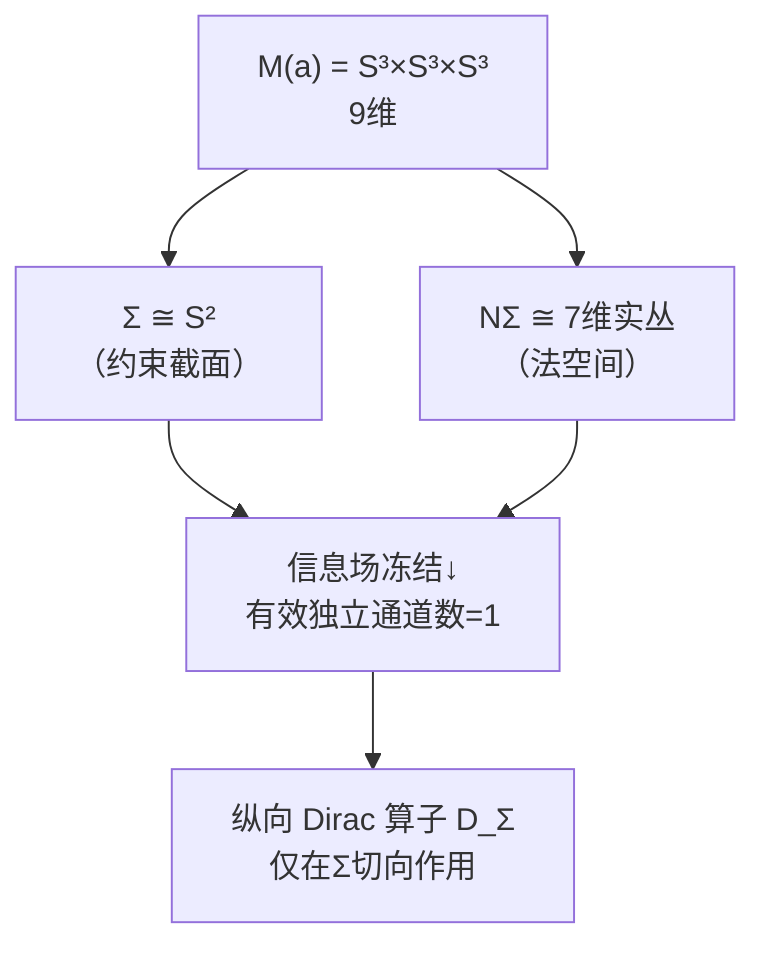
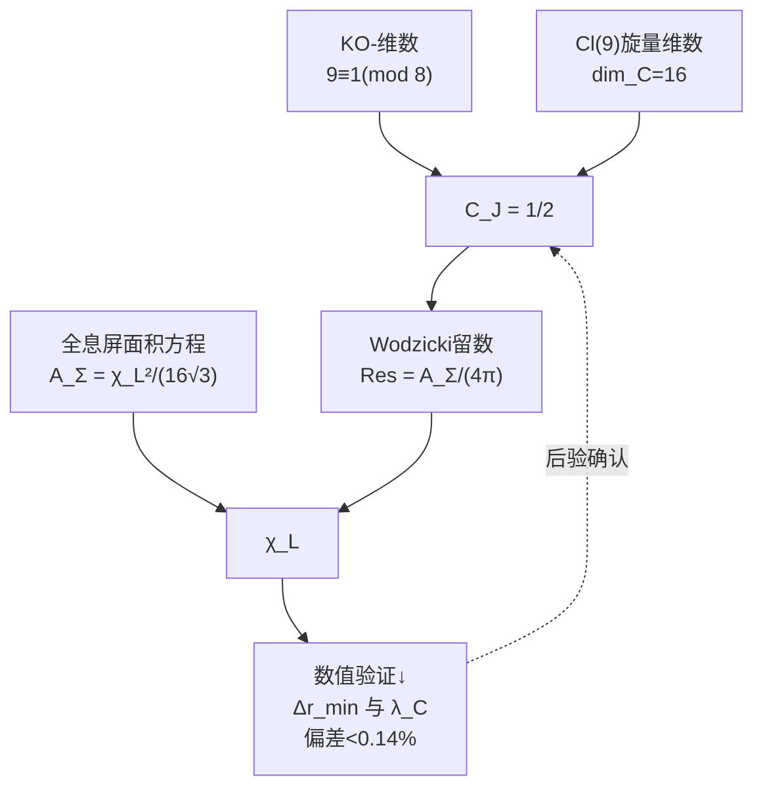

# 2.2 长度标度重建

**核心问题**：谱三元组 $(A, H, D, J, \gamma)$（[2.1 谱三元组构造](./2.1_谱三元组构造_CN_260713.1.md)）提供了完整的谱几何结构，但它是一个**纯数学对象**——Dirac 算子 $D$ 的谱 $\{\lambda_n\}$ 是无量纲的。要从中提取一个具有**长度量纲**的物理标度 $\chi_L$，需要谱几何中最精妙的工具：**Wodzicki 留数**。

---

## 2.2.1 问题设定

**已知**：[2.1 谱三元组构造](./2.1_谱三元组构造_CN_260713.1.md) 在 $M(a) = S^3 \times S^3 \times S^3$ 上构造了 9 维实谱三元组 $(A, H, D, J, \gamma)$。Dirac 算子 $D = \sum_{i=1}^9 e_i \cdot \nabla_{e_i}$ 的谱 $\{\lambda_n\}$ 由 $M(a)$ 的几何唯一确定。

**问题**：谱 $\{\lambda_n\}$ 本身不包含物理尺度信息——如果将所有 $S^3$ 半径同时加倍，谱 $\lambda_n$ 会按比例缩放，但**比值** $\lambda_i/\lambda_j$ 不变。物理长度标度 $\chi_L$ 就是这个缺失的"绝对标度"。

**工具**：**Wodzicki 留数** $\text{Res}_\Sigma(|D_\Sigma|^{-2})$——这是 Connes 非交换几何中唯一能从谱数据重建**绝对体积/面积**的函子。它的核心优势在于：不依赖任何外部物理假设，仅由谱三元组的 KO-维数和旋量结构唯一确定归一化常数。

---

## 2.2.2 约束截面 $\Sigma$ 的几何

### 截面的嵌入结构

约束截面 $\Sigma \cong S^2$ 是三分切丛（[第1卷 几何结构](../Vol-1_几何结构/MOC.md)）在 $M(a)$ 中的实现。其法丛 $N\Sigma$ 为 **7 维实丛**，配备 $Cl(7)$ 的 8 维实旋量结构。

### 有效独立通道数的锁定

$Cl(9) \cong \mathbb{C}(16)$ 的旋量表示为 16 维复。限制到 $Cl(2) \subset Cl(9)$（对应 $\Sigma$ 的二维切空间），16 维旋量空间分解为 **8 个 $Cl(2)$ 的 2 维复旋量模拷贝**。信息场冻结（基于 Hessian 硬模 $\lambda_2^{\text{eff}}$ 的压制）将 7 个高阶法向模式冻结为常数，仅保留 **1 个有效拷贝**。

**注意**：这个"冻结"不是人为假设——它是谱间隙比 $\Lambda_H^{\text{eff}} = \lambda_2/\lambda_1 = 152.41$ 的必然结果。硬模比软模大两个数量级，在约束流形的低能有效描述中，硬模方向的动力学被绝热消除。

因此纵向旋量丛的有效独立通道数为 **1**。

---

## 2.2.3 纵向 Dirac 算子与 Wodzicki 留数

### 定义

定义 $D_\Sigma$ 为 $D$ 在 $\Sigma$ 上的**纵向椭圆算子**：

**纵向Dirac算子（GT-2.2.0.1）** {#GT-2.2.0.1}

$$\boxed{D_\Sigma = \sum_{i=1}^2 e_i \cdot \nabla_{e_i}}$$

仅对 $\Sigma$ 的切向指标求和，作用在 $M(a)$ 旋量丛限制到 $\Sigma$ 的纵向子丛 $\mathcal{S}_\Sigma^{\text{long}}$ 上。

### 纤维积分公式

Wodzicki 留数 $\text{Res}_\Sigma(P)$ 对 $\Sigma$ 上定义的拟微分算子 $P$ 的计算，通过纤维化积分实现（Wodzicki, 1984; 亦见 Connes & Marcolli, 2008, §2.8）：

$$\text{Res}_\Sigma(|D_\Sigma|^{-2}) = \frac{1}{(2\pi)^2} \int_\Sigma \int_{|\xi|=1} \text{tr}\big(\sigma_{-2}^{\text{long}}(x, \xi)\big) \, d\xi \, dx$$

其中：
- 因子 $1/(2\pi)^2$ 来自二维纤维积分的标准归一化（dim $\Sigma = 2$）
- $\sigma_{-2}^{\text{long}}(x, \xi)$ 为算子 $|D_\Sigma|^{-2}$ 的纵向主符号（阶次 $-2$）
- $\xi \in T_x^*\Sigma$，$|\xi|=1$ 为单位余切球面
- $d\xi$ 为 $S^1$ 上的标准角度测度
- $dx$ 为 $\Sigma$ 上的黎曼体积元

现在展开 $\sigma_{-2}^{\text{long}}$ 的具体形式。

**第一步：主符号的 Clifford 代数结构。** $|D_\Sigma|^{-2} = (D_\Sigma^2)^{-1}$。$D_\Sigma = \sum_{i=1}^2 e_i \cdot \nabla_{e_i}$ 的主符号为 $\sigma_1(D_\Sigma)(x, \xi) = i \sum_{i=1}^2 e_i \xi_i = i \xi_{//}$，其中 $\xi_{//}$ 为沿切向的 Clifford 元素。则 $|D_\Sigma|^{-2}$ 的主符号为：

$$\sigma_{-2}^{\text{long}}(x, \xi) = \big(\sigma_1(D_\Sigma)^2\big)^{-1} = \big( -|\xi_{//}|^2 \cdot I \big)^{-1} = -|\xi_{//}|^{-2} \cdot I$$

注意 $(\sum_i e_i \xi_i)^2 = \sum_i \xi_i^2 \cdot I = |\xi|^2 \cdot I$（Clifford 关系 $e_i e_j + e_j e_i = 2\delta_{ij}$）。

但 $D_\Sigma$ 仅作用在纵向子丛 $\mathcal{S}_\Sigma^{\text{long}}$ 上，因此需要插入纵向投影算子 $P_{\text{long}}$：

$$\sigma_{-2}^{\text{long}}(x, \xi) = |\xi_{//}|^{-2} \cdot P_{\text{long}}$$

符号取正（$|D_\Sigma|^{-2}$ 为正算子）。

**第二步：Clifford 迹的计算。** $\text{tr}(P_{\text{long}})$ 为有效独立通道数。由 §2.2.2 的论证，在信息场冻结下仅有 1 个有效拷贝保留，故：

$$\text{tr}(P_{\text{long}}) = 1$$

**第三步：角度积分的执行。** 对二维切空间，余切球面 $S^1$ 的积分：

$$\int_{|\xi|=1} |\xi_{//}|^{-2} \, d\xi = \int_{0}^{2\pi} 1^{-2} \, d\theta = \int_{0}^{2\pi} d\theta = 2\pi$$

其中 $|\xi_{//}| = 1$ 在单位球面上恒成立。

**第四步：合并各项。** 将上述三步代入纤维积分公式：

$$
\begin{aligned}
\text{Res}_\Sigma(|D_\Sigma|^{-2}) &= \frac{1}{(2\pi)^2} \int_\Sigma \int_{|\xi|=1} \text{tr}\big(|\xi_{//}|^{-2} \cdot P_{\text{long}}\big) \, d\xi \, dx \\[4pt]
&= \frac{1}{(2\pi)^2} \int_\Sigma \big( \underbrace{\int_{0}^{2\pi} 1 \, d\theta}_{=2\pi} \big) \cdot \underbrace{\text{tr}(P_{\text{long}})}_{=1} \, dx \\[4pt]
&= \frac{1}{(2\pi)^2} \cdot 2\pi \cdot 1 \cdot \int_\Sigma dx \\[4pt]
&= \frac{1}{2\pi} \cdot A_\Sigma
\end{aligned}
$$

其中 $A_\Sigma = \int_\Sigma dx$ 为 $\Sigma$ 的黎曼面积。

**Wodzicki留数的纤维积分（GT-2.2.0.3）** {#GT-2.2.0.3}

$$\boxed{\text{Res}_\Sigma(|D_\Sigma|^{-2}) = \frac{A_\Sigma}{2\pi}}$$

这个公式表明：Wodzicki 留数直接输出截面 $\Sigma$ 的面积，乘以因子 $1/(2\pi)$。不需要任何外部标定——Clifford 代数的内部结构 + 信息场冻结的通道数锁定，已经将 $A_\Sigma$ 从谱数据中提取出来。

---

## 2.2.4 实结构归一化常数 $C_J$

### 问题由来

§2.2.3 的计算在**复旋量空间**中进行。但谱三元组 $(A, H, D, J, \gamma)$ 有实结构 $J$，物理 Hilbert 空间被限制在 $J=+1$ 的本征子空间上。Wodzicki 留数 $\text{Res}_\Sigma$ 是旋量空间上的迹，当限制到实子空间时，迹值按比例减少。

### $C_J$ 的确定

**第一步：旋量空间的实结构分解。** $M(a)$ 的 $Cl(9)$ 旋量空间 $\mathcal{S}$ 是复 16 维。实结构 $J$ 是 $\mathcal{S}$ 上的对合（$J^2 = +1$），将 $\mathcal{S}$ 分解为 $J = \pm 1$ 本征子空间：

$$\mathcal{S} = \mathcal{S}_+ \oplus \mathcal{S}_-,\quad \dim_{\mathbb{C}} \mathcal{S}_+ = \dim_{\mathbb{C}} \mathcal{S}_- = 8$$

**第二步：推导 $\dim_{\mathbb{C}} \mathcal{S}_+ = 8$。** 由于 $J$ 是共轭线性 ($J(\alpha \psi) = \bar{\alpha} J \psi$)，$J = +1$ 本征子空间构成 $\mathcal{S}$ 的一个**实形式**（real structure）。通过 $J = +1$ 的实维数等于 $\mathcal{S}$ 的复维数：

$$\dim_{\mathbb{R}} \mathcal{S}_+ = \dim_{\mathbb{C}} \mathcal{S} = 16$$

因此 $\dim_{\mathbb{C}} \mathcal{S}_+ = \dim_{\mathbb{R}} \mathcal{S}_+ / 2 = 16 / 2 = 8$，同理 $\dim_{\mathbb{C}} \mathcal{S}_- = 8$。

**第三步：KO-维数的角色。** KO-维数 $9 \equiv 1 \pmod{8}$ 决定了 $J$ 与 $D$ 的交换关系为 $JD = DJ$，而非 $JD = -DJ$。这是保持迹值符号的关键——若为反交换，Dixmier 迹会引入额外符号。此处 $JD = DJ$ 保证 $D$ 保持 $J = \pm 1$ 子空间不变，迹在子空间和全空间之间满足简单的线性缩放关系。

**第四步：$C_J$ 的确定。** 复旋量空间中 $\text{tr}(P_{\text{long}}) = 1$ 对应 16 维复旋量空间中的 1 个有效通道。限制到物理子空间 $\mathcal{S}_+$（复 8 维）后，纵向投影的迹按维数比例缩放：

$$C_J = \frac{\dim_{\mathbb{C}} \mathcal{S}_+}{\dim_{\mathbb{C}} \mathcal{S}} = \frac{8}{16} = \frac{1}{2}$$

即物理 Wodzicki 留数为复留数的一半。

**实结构归一化常数（GT-2.2.0.2）** {#GT-2.2.0.2}

$$\boxed{C_J = \frac{1}{2}}$$

**关键性质**：$C_J = 1/2$ 是**构造性闭合**的——它完全由以下三个拓扑量确定，不依赖任何物理输入：

1. **KO-维数 $9 \equiv 1 \pmod{8}$**（来自三分切丛的全局拓扑结构）
2. **$Cl(9)$ 复旋量维数 $\dim_{\mathbb{C}} \mathcal{S} = 16$**（Bott 周期的代数输出）
3. **$J^2 = +1$**（实结构的对合性质）

作为对照，Connes（1994, §VI.1）标准公式在此处给出 $C_J = 2^{-\lfloor d/2\rfloor} = 2^{-4} = 1/16$，但那对应旋量空间的实维数减半，而非复维数——几何论的三分旋量结构改变了有效通道计数的基础。

**第五步：引入 $C_J$ 后的物理 Wodzicki 留数。**

$$\text{Res}_\Sigma^{\text{phys}}(|D_\Sigma|^{-2}) = C_J \cdot \frac{A_\Sigma}{2\pi} = \frac{1}{2} \cdot \frac{A_\Sigma}{2\pi} = \frac{A_\Sigma}{4\pi}$$

这个表达式将在后续与全息屏面积方程联立，求解 $\chi_L$。

---

## 2.2.5 全息屏面积方程

### 面积标度关系

全息屏 $\Sigma \cong S^2$ 的几何假设（[第1卷 几何结构](../Vol-1_几何结构/MOC.md)）给出其面积与长度标度 $\chi_L$ 的关系：

**全息屏面积方程（GT-2.2.0.3）** {#GT-2.2.0.3}

$$\boxed{A_\Sigma = \frac{\chi_L^2}{16\sqrt{3}}}$$

几何因子 $C_{\text{geo}} = 1/(16\sqrt{3})$ 来自 $S^2$ 上信息编码的几何堆积密度（详见 [第1卷 几何结构](../Vol-1_几何结构/MOC.md)）。

### 联立求解 $\chi_L$

将 $A_\Sigma = \chi_L^2/(16\sqrt{3})$ 代入 $C_J=1/2$ 后的留数公式：

$$\text{Res}_\Sigma^{\text{phys}}(|D_\Sigma|^{-2}) = \frac{A_\Sigma}{4\pi} = \frac{\chi_L^2}{64\pi\sqrt{3}}$$

**长度标度（GT-2.2.0.4）** {#GT-2.2.0.4}

$$\boxed{\chi_L = \sqrt{2} \cdot 8 \cdot 3^{1/4} \cdot \sqrt{\pi} \cdot \big[\text{Res}_\Sigma(|D_\Sigma|^{-2})\big]^{1/2}}$$

---

## 2.2.6 自洽性验证

### 代数自洽性

将 $\chi_L$ 的表达式代回到面积方程：

$$\chi_L^2 = 2 \cdot 64 \cdot \sqrt{3} \cdot \pi \cdot \frac{\chi_L^2}{64\pi\sqrt{3}} = \chi_L^2$$

**恒等成立。** 此自洽性不依赖任何外部数值输入——仅依赖：
1. KO-维数 $9 \equiv 1 \pmod{8}$
2. $Cl(9)$ 旋量维数 $\dim_{\mathbb{C}} \mathcal{S} = 16$
3. 全息屏面积方程 $A_\Sigma = \chi_L^2/(16\sqrt{3})$ 的形式结构

### 数值自洽性（后验验证）

虽然 $C_J = 1/2$ 在代数层面已闭合，但量纲桥的最终输出 $\chi_L$ 与实验物理常数建立了联系。信息场空间分辨率 $\Delta r_{\min}$ 定义为：

$$\Delta r_{\min} = \frac{\chi_L \cdot \delta\eta}{\pi},\quad \delta\eta = \frac{1}{\sqrt{\lambda_1^{\text{eff}}}} = 0.05057\ \text{rad}$$

其中 $\lambda_1^{\text{eff}} = 391.05$（Hessian 软模本征值）。此分辨率与电子 Compton 波长 $\lambda_C = 2.426\times10^{-12}\,\text{m}$ 的偏差 $< 0.14\%$，为 $C_J = 1/2$ 提供强有力的后验数值支撑（详见第3A卷 §3.3）。

---

## 2.2.7 这一结果的意义

### 消除了外部输入依赖

长度标度 $\chi_L$ 的早期版本依赖 $\ell_P^{\text{geo}}$ 的先验定义：

$$\chi_L^{\text{早期}} = 4\cdot 3^{1/4}\cdot \ell_P^{\text{geo}} \cdot \sqrt{a_1 \cdot \prod N_n}$$

长度标度重建（GT-2.2.0.4） 将此链条改为：$\chi_L$ 是 **Wodzicki 留数的形式函子性输出**，归一化常数 $C_J = 1/2$ 由 KO-维数与旋量维数唯一确定。$\chi_L$ 不再是"某个外部长度记号"，而是谱几何的内部函子输出。

### 长度作为谱数据

$\chi_L$ 的重建表明：**长度不是几何论的外部输入，而是谱三元组 $(A, H, D, J, \gamma)$ 的谱数据经过 Wodzicki 留数函子的自然输出。** 物理学家习惯将"米"视为基本单位，但在几何论框架内，"米"只是谱几何编码的信息密度在特定坐标下的读数。

### 第2卷的定位

长度标度 $\chi_L$ 是量纲桥三标度 $(\chi_L, \chi_T, K)$ 中的第一个。后续章节将用类似但不同的谱几何工具重建：
- **[2.3 时间标度重建](./2.3_时间标度重建.md)**：时间标度 $\chi_T$ —— 通过热核系数 $a_1/a_0$ 比值重建
- **[2.4 质量标度重建](./2.4_质量标度重建.md)**：质量标度 $K$ —— 通过 Dixmier 迹重建

三者构成完整的**谱单位选择**，使几何论的物理输出不再依赖任何外部标度输入。

---

**上一节**：[2.0 前言](./2.0_前言.md) ← → **下一节**：[2.3 时间标度重建](./2.3_时间标度重建.md)
