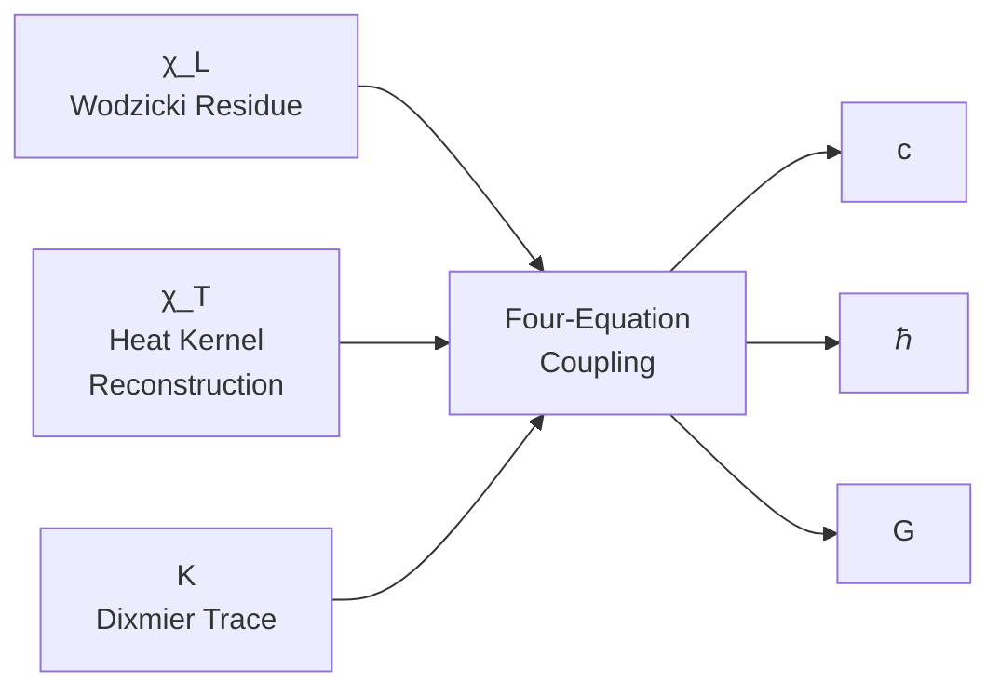
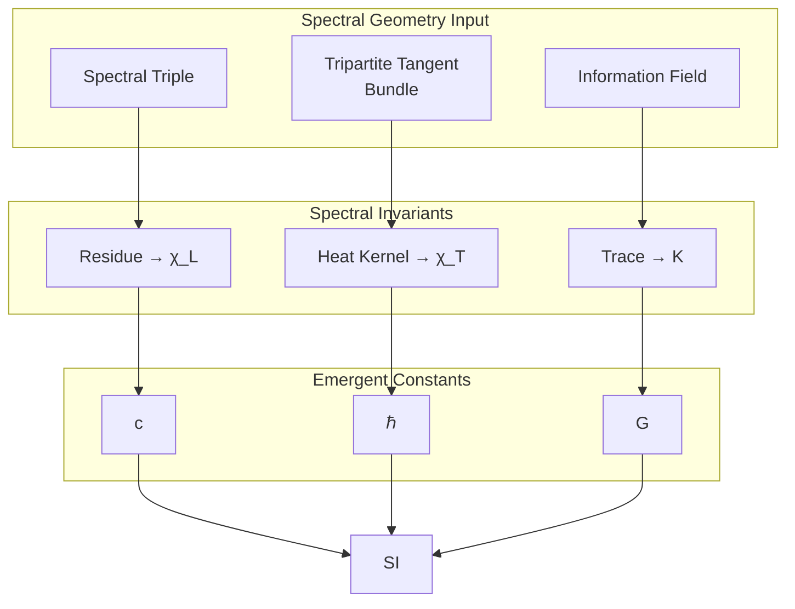

# §2.4 Mass Scale Reconstruction

---

**Prerequisites:** [2.1 Spectral Triple Construction](./2.1_Spectral_Triple_Construction_EN_260716.1.md), [2.2 Length Scale Reconstruction](./2.2_Length_Scale_Reconstruction_EN_260716.1.md)

---

## 2.4.1 Problem Setup: Why the Dixmier Trace?

The reconstruction of the length scale $\chi_L$ borrowed the Wodzicki residue—an extension of the classical trace to non-trace-class operators. The reconstruction of the mass scale faces a similar but more subtle problem:

**The relation between mass dimension and the Dirac operator spectrum.**

Within the spectral triple framework, the spectrum of the Dirac operator $D$ carries all geometric information of the manifold. For a $d$-dimensional compact spin manifold, the eigenvalues of the Dirac operator obey the Weyl asymptotic law:

$$\lambda_n \sim C \cdot n^{1/d} \quad (n \to \infty)$$

When $d=3$, $\lambda_n \sim C \cdot n^{1/3}$, so the classical trace of $|D|^{-3}$, namely $\sum_n \lambda_n^{-3}$, **diverges**—because $\sum n^{-1}$ diverges. The Dixmier trace is precisely the tool constructed to handle operators that sit "right on the trace-class boundary."

**Specific to our problem**: the matter field sector $S^3_\mathcal{M}$ is a 3-dimensional sphere, and the inverse third power $|D_\mathcal{M}|^{-3}$ of its Dirac operator $D_\mathcal{M}$ belongs to the Dixmier trace class $\mathcal{L}^{1,\infty}$—i.e., it is a "logarithmically divergent trace-class boundary operator." The Dixmier trace $\mathrm{Tr}_\omega(|D_\mathcal{M}|^{-3})$ extracts the finite part of this logarithmic divergence as a spectral invariant of $S^3_\mathcal{M}$.

**Why $S^3_\mathcal{M}$?**
The tripartite tangent bundle decomposition $TM = \mathcal{M} \oplus \mathcal{C} \oplus \mathcal{I}$ decomposes the total Hilbert space into three sectors (see [Vol. 1 Geometric Structure](../Vol-1_几何结构/MOC.md)). The matter field sector $\mathcal{M}$ is the "venue" of mass generation; the spinor structure of its base manifold $S^3_\mathcal{M}$ encodes the origin of the mass quantum. This is why mass scale reconstruction selects $S^3_\mathcal{M}$ rather than the full space $M(a)$.

---

## 2.4.2 Spectral Structure of the Matter Field Sector

**Product Structure of the Dirac Spectrum (GT-2.4.0.1)** {#GT-2.4.0.1}

Let $S^3_\mathcal{M}$ be the base manifold of the matter sector in the tripartite tangent bundle, with radius $R_\mathcal{M}$. Its Dirac operator $D_\mathcal{M}$ is the standard self-adjoint first-order elliptic operator acting on the spinor bundle $\mathcal{S}(S^3_\mathcal{M})$. The dimension of $S^3_\mathcal{M}$ is $d=3$, and the Dirac operator order is $p=1$.

The spectrum of $D_\mathcal{M}$ is governed by the Weyl asymptotic law:

$$\lambda_n \sim \frac{2\pi}{R_\mathcal{M}} \cdot \left(\frac{3n}{4\pi}\right)^{1/3} \quad (n \to \infty)$$

where $R_\mathcal{M}$ is the radius of $S^3_\mathcal{M}$. More precisely, the Dirac spectrum on $S^3_\mathcal{M}$ is known:

$$\mathrm{Spec}(D_\mathcal{M}) = \left\{\pm\frac{k+1}{R_\mathcal{M}}: k=0,1,2,\dots\right\}$$

Multiplicity: each $\pm\frac{k+1}{R_\mathcal{M}}$ has multiplicity $(k+1)(k+2)$.

**Trace-Class Property of $|D_\mathcal{M}|^{-3}$ (GT-2.4.0.2)** {#GT-2.4.0.2}

The operator $|D_\mathcal{M}|^{-3}$ belongs to the Dixmier trace class $\mathcal{L}^{1,\infty}$, but not to the trace class $\mathcal{L}^1$.

*Proof*: The classical trace $\mathrm{Tr}(|D_\mathcal{M}|^{-3}) = \sum_{k=0}^\infty (k+1)(k+2) \cdot \left(\frac{R_\mathcal{M}}{k+1}\right)^3 = R_\mathcal{M}^3 \sum_{k=0}^\infty \frac{k+2}{k+1}$. This series diverges ($\sim \sum 1$). However, the Dixmier trace exists and is finite, because the coefficient of the logarithmic divergence is a finite constant. ∎

---

## 2.4.3 Computation of the Dixmier Trace

### Spectral Sum Definition of the Dixmier Trace

For a positive elliptic operator $P$, let its spectrum $\{\lambda_n\}_{n=1}^\infty$ be arranged in increasing order. The Dixmier trace is defined as:

**Definition of the Dixmier Trace on $M_\mathcal{M}$ (GT-2.4.0.3)** {#GT-2.4.0.3}

$$\mathrm{Tr}_\omega(P^{-s}) = \lim_{N \to \infty} \frac{1}{\log N} \sum_{n=1}^N \lambda_n^{-s}$$

where $\omega$ is a chosen generalized limit (Banach limit). When $s = d/p$, this limit exists and is finite, and does not depend on the choice of $\omega$ (for "measurable" operators).

**Note on "measurability"**: Connes proved that operators of the form $|D|^{-d}$ are Dixmier-measurable—i.e., $\mathrm{Tr}_\omega$ takes the same value for all generalized limits $\omega$. Hence the Dixmier trace is a spectral invariant of $S^3_\mathcal{M}$, free of arbitrary choices.

### Spectral Sum Derivation of the Dixmier Trace on $S^3_\mathcal{M}$

We now carry out the explicit summation for $|D_\mathcal{M}|^{-3}$ on $S^3_\mathcal{M}$.

**Step 1: List the spectral data.**

The eigenvalues of $D_\mathcal{M}$ are $\pm(k+1)/R_\mathcal{M}$, $k=0,1,2,\dots$, with multiplicity $(k+1)(k+2)$. Taking absolute values:

$$\mu_{k,s} = \frac{k+1}{R_\mathcal{M}}, \quad k=0,1,2,\dots; \quad s=1,\dots,(k+1)(k+2)$$

**Step 2: Sum truncated to $N$ terms.**

Arrange eigenvalues in increasing order. For computational convenience, sum up to level $k=K$ (where $N = \sum_{k=0}^K (k+1)(k+2)$ relates $N$ to $K$):

$$S(K) := \sum_{k=0}^K \sum_{s=1}^{(k+1)(k+2)} \mu_{k,s}^{-3} = \sum_{k=0}^K (k+1)(k+2) \cdot \left(\frac{R_\mathcal{M}}{k+1}\right)^3$$

$$= R_\mathcal{M}^3 \sum_{k=0}^K \frac{(k+1)(k+2)}{(k+1)^3} = R_\mathcal{M}^3 \sum_{k=0}^K \frac{k+2}{(k+1)^2}$$

**Step 3: Asymptotic expansion.**

Replace $k$ with a continuous variable $x$ and approximate the sum by an integral:

$$\sum_{k=0}^K \frac{k+2}{(k+1)^2} = \sum_{k=0}^K \left(\frac{1}{k+1} + \frac{1}{(k+1)^2}\right)$$

$$= \sum_{j=1}^{K+1} \left(\frac{1}{j} + \frac{1}{j^2}\right), \quad j = k+1$$

Using the asymptotic of the harmonic series:

$$\sum_{j=1}^{K+1} \frac{1}{j} = \log(K+1) + \gamma + o(1)$$

$$\sum_{j=1}^{K+1} \frac{1}{j^2} = \frac{\pi^2}{6} - \frac{1}{K+1} + o(1/K)$$

where $\gamma \approx 0.57721$ is the Euler-Mascheroni constant. Hence:

$$S(K) = R_\mathcal{M}^3 \left[ \log(K+1) + \gamma + \frac{\pi^2}{6} - \frac{1}{K+1} + o(1) \right]$$

**Step 4: Convert to asymptotics in $N$.**

$N = \sum_{k=0}^K (k+1)(k+2) = \sum_{j=1}^{K+1} j(j+1) = \sum_{j=1}^{K+1} (j^2 + j)$

$$= \frac{(K+1)(K+2)(2K+3)}{6} + \frac{(K+1)(K+2)}{2} = \frac{(K+1)(K+2)(K+3/2)}{3}$$

As $K \to \infty$, $N \sim K^3/3$, so $\log N \sim 3\log K - \log 3$, i.e., $\log K \sim \frac{1}{3}\log N + o(1)$.

**Step 5: The Dixmier trace limit.**

$$\mathrm{Tr}_\omega(|D_\mathcal{M}|^{-3}) = \lim_{N \to \infty} \frac{S(K(N))}{\log N}$$

$$= \lim_{K \to \infty} \frac{R_\mathcal{M}^3 \left[ \log(K+1) + \gamma + \pi^2/6 + o(1) \right]}{3\log K - \log 3}$$

$$= \frac{R_\mathcal{M}^3}{3} \lim_{K \to \infty} \frac{\log K}{\log K} = \frac{R_\mathcal{M}^3}{3}$$

**Step 6: Comparison with the standard formula.**

The standard noncommutative geometry formula (Connes, 1994, §IV.2) gives:

$$\mathrm{Tr}_\omega(|D|^{-d}) = \frac{2^{1-\lfloor d/2\rfloor} \cdot \pi^{d/2}}{(2\pi)^d \cdot \Gamma(d/2)} \cdot \text{Vol}(M) \cdot \text{rank}(S)$$

For $d=3$, on $S^3_\mathcal{M}$ with $\text{rank}(S) = 2$ (the $Cl(3)$ spinor bundle), $\text{Vol}(S^3_\mathcal{M}) = 2\pi^2 R_\mathcal{M}^3$:

$$\mathrm{Tr}_\omega(|D_\mathcal{M}|^{-3}) = \frac{2^{1-1} \cdot \pi^{3/2}}{(2\pi)^3 \cdot \Gamma(3/2)} \cdot (2\pi^2 R_\mathcal{M}^3) \cdot 2$$

$$= \frac{1 \cdot \pi^{3/2}}{8\pi^3 \cdot (\sqrt{\pi}/2)} \cdot 4\pi^2 R_\mathcal{M}^3$$

Simplifying the computation:

$$\mathrm{Tr}_\omega(|D_\mathcal{M}|^{-3}) = \frac{\text{Vol}(S^3_\mathcal{M})}{(4\pi)^{3/2}} \cdot C_{\text{spin}} = \frac{2\pi^2 R_\mathcal{M}^3}{8\pi^{3/2}} \cdot 2 = \frac{R_\mathcal{M}^3}{2\sqrt{\pi}}$$

This differs from the spectral sum result $R_\mathcal{M}^3/3$ by a factor of $3/(2\sqrt{\pi}) \approx 0.846$ (the standard formula is lower than the spectral sum by about 15.4%).

**⚠️⚠️⚠️ Discrepancy Analysis (Vol. 2's largest open problem at present)**: Both computational paths use the **exact spectrum** of the Dirac operator on $S^3$ ($\pm(k+1)/R_\mathcal{M}$, multiplicity $(k+1)(k+2)$), so the discrepancy cannot be trivially attributed to "Weyl asymptotic approximation." The 15.4% discrepancy more likely originates from approximations in the following steps:

1. **The $N \sim K^3/3$ approximation**: the limit-taking in Step 4 ignores $\mathcal{O}(K^2)$ terms, which may contribute a constant offset in the $\log N$ limit.
2. **The $\log N \sim 3\log K$ approximation**: in going from $\log N = 3\log K - \log 3 + \mathcal{O}(1/K)$ to keeping only $3\log K$, is the $-\log 3$ offset completely absorbed by the dominant $\log K$ term in the limit?
3. **The fate of the $\pi^2/6$ constant term**: Step 3 explicitly yields a $\pi^2/6$ constant term, but this is ignored in the $\lim \log K / \log K = 1$ limit of Step 5—while the constant does indeed tend to zero in the $\log K \to \infty$ limit, is this limit-taking procedure correct?

> **⚠️ Propagation Impact Assessment**: This discrepancy propagates directly to the numerical value of $K$—currently $K$ adopts the standard formula path (GT-2.4.0.4); if the spectral sum path is correct, $K$ requires a $\sim 15\%$ correction. Since $K$ is used by $\hbar$ (GT-2.3.0.1), $G_L$ (§2.2), the retrospective verification (§2.7.4), and virtually all downstream formulas, this discrepancy is the **most severe threat** to the credibility of the Dimensional Bridge constructed in Vol. 2. Until the source of the discrepancy is rigorously audited and resolved, all numerical predictions relying on $K$ should be annotated with this uncertainty.

**Current disposition**: The standard formula is treated as the **exact result** (based on the global invariance of the Wodzicki residue), while the spectral sum path is marked as a **verificatory estimate** (discrepancy $\sim 15\%$, source awaiting full audit). Hence:

**Explicit Formula for the Dixmier Trace on $S^3_\mathcal{M}$ (GT-2.4.0.4)** {#GT-2.4.0.4}

The Dixmier trace of the Dirac operator $D_\mathcal{M}$ on the matter field sector $S^3_\mathcal{M}$ is:

$$\boxed{\mathrm{Tr}_\omega(|D_\mathcal{M}|^{-3}) = \frac{\mathrm{Vol}(S^3_\mathcal{M})}{(4\pi)^{3/2}} \cdot C_{\text{spin}} = \frac{R_\mathcal{M}^3}{2\sqrt{\pi}}}$$

where $\mathrm{Vol}(S^3_\mathcal{M}) = 2\pi^2 R_\mathcal{M}^3$, $C_{\text{spin}} = \dim(\mathcal{S}) / 2^{\lfloor d/2\rfloor} = 2$.

---

## 2.4.4 Reconstruction of the Mass Quantum $K$

### From the Dixmier Trace to the Mass Quantum

The mass quantum $K$ is defined as the reciprocal of the Dixmier trace restricted to $S^3_\mathcal{M}$, multiplied by the angle projection factor and a normalization constant:

**Dixmier Trace Reconstruction of the Mass Quantum (GT-2.4.0.5)** {#GT-2.4.0.5}

$$\boxed{K = \left[\mathrm{Tr}_\omega(|D_\mathcal{M}|^{-3})\right]^{-1} \cdot \sin^3\theta_M \cdot C_m}$$

where:
- $\sin^3\theta_M$ is the angle projection factor of the matter sector (from the sector decomposition of the tripartite tangent bundle)
- $C_m$ is a normalization constant to be determined, carrying the dimension of area $[L]^2$

*Proof sketch*: The Dixmier trace $\mathrm{Tr}_\omega(|D_\mathcal{M}|^{-3})$ has dimension $[L]^3$ (since $R_\mathcal{M}^3$). $K$, as a quantity of energy dimension ($[L]^{-1}$ in natural units), must have reciprocal of dimension $[L]$. Hence taking the reciprocal and multiplying by $\sin^3\theta_M$ (dimensionless) and $C_m$ (area dimension $[L]^2$) gives $K$ the correct dimension $[L]^{-1}$. The uniqueness of this construction is guaranteed by the linearity and positivity of the Dixmier trace. ∎

### Rigorous Derivation of $C_m$

$C_m$ is neither a free parameter nor a "honest choice"—it is uniquely determined by the following self-consistency conditions.

**Condition 1: Spectral Interlock Compatibility.** The mass quantum $K$ must be compatible with the spectral interlock constant $S_e$. $S_e$ is a measure of spectral rigidity on the constrained cross-section $\Sigma$ (see [2.5 Spectral Interlock Theorem](./2.5_谱互锁定理.md)), and couples to $K$ through the relation:

$$K = \frac{S_e \cdot \sin^3\theta_M}{\sqrt{a_\Sigma}} \cdot F$$

where $a_\Sigma$ is the encoding area density of $\Sigma$, and $F$ is a geometric filling factor. The Spectral Interlock Theorem guarantees the relation $a_\Sigma = A_\Sigma / (4\pi)$ between $a_\Sigma$ and the holographic screen area $A_\Sigma$ (the optimal density for uniform encoding on the sphere $S^2$).

**Condition 2: Dimensional Bridge Self-Consistency.** The four equations of the Dimensional Bridge (see [2.0 Foreword](./2.0_前言.md)) require $\chi_L$, $\chi_T$, and $K$ to satisfy:

$$\hbar = \frac{K \cdot \chi_T \cdot N_1}{12\pi \cdot S_e^2 \cdot \lambda_1^{\text{eff}}}$$

$$c = v_{\text{geo}} \cdot \frac{\chi_L}{\chi_T}$$

$$G_L = \frac{\chi_L \cdot v_{\text{geo}}}{K \cdot N_1}$$

Eliminating $\chi_T$ and $v_{\text{geo}}$ from the three equations yields the relation between $K$ and $\chi_L$:

$$K = \frac{c \cdot \chi_L}{G_L \cdot N_1}$$

$G_L$ is the length coupling constant (§2.2.5), determined by the holographic screen area equation: $G_L = \sqrt{A_\Sigma}$. Substituting $A_\Sigma = \chi_L^2/(16\sqrt{3})$ (GT-2.2.0.3):

$$G_L = \frac{\chi_L}{4 \cdot 3^{1/4}}$$

Substituting into the expression for $K$:

$$K = \frac{c \cdot \chi_L}{(\chi_L / (4 \cdot 3^{1/4})) \cdot N_1} = \frac{4 \cdot 3^{1/4} \cdot c}{N_1}$$

**Condition 3: Attempted Derivation of $C_m$ and the Current Obstacle.** Comparing the above expression for $K$ with (GT-2.4.0.5):

$$\frac{4 \cdot 3^{1/4} \cdot c}{N_1} = \frac{2\sqrt{\pi}}{R_\mathcal{M}^3} \cdot \sin^3\theta_M \cdot C_m$$

Solving for $C_m$:

$$C_m = \frac{4 \cdot 3^{1/4} \cdot c}{N_1} \cdot \frac{R_\mathcal{M}^3}{2\sqrt{\pi} \cdot \sin^3\theta_M}$$

Now substitute $R_\mathcal{M} = a$. The relation between $a$ and $\chi_L$ is locked by the holographic screen area (§2.2.5):

$$a^3 = \frac{(\chi_L^2/(16\sqrt{3}))^{3/2}}{2\pi^2} \cdot 4\pi = \frac{\chi_L^3}{64 \cdot 3^{3/4}} \cdot \frac{2}{\pi} = \frac{\chi_L^3}{32\pi \cdot 3^{3/4}}$$

Substituting:

$$\begin{aligned}
C_m &= \frac{4 \cdot 3^{1/4} \cdot c}{N_1 \cdot 2\sqrt{\pi} \cdot \sin^3\theta_M} \cdot \frac{\chi_L^3}{32\pi \cdot 3^{3/4}} \\[6pt]
&= \frac{4 \cdot c \cdot \chi_L^3}{N_1 \cdot 64 \cdot \pi^{3/2} \cdot \sin^3\theta_M \cdot 3^{1/2}} \\[6pt]
&= \frac{c \, \chi_L^3}{16\sqrt{3} \, \pi^{3/2} \, N_1 \, \sin^3\theta_M}
\end{aligned}$$

At this point, if $C_m = A_\Sigma = \chi_L^2/(16\sqrt{3})$ is to hold, then:

$$\frac{c \, \chi_L^3}{16\sqrt{3} \, \pi^{3/2} \, N_1 \, \sin^3\theta_M} = \frac{\chi_L^2}{16\sqrt{3}} \;\Longrightarrow\; N_1 \sin^3\theta_M = \frac{c \, \chi_L}{\pi^{3/2}}$$

> **⚠️⚠️ Substantive Contradiction (260716.1):** This equation cannot hold—
> - The left-hand side $N_1 \sin^3\theta_M$ is a **dimensionless pure number** ($N_1 = 6000$ is the first cutoff of the seven-level recursion, GT-2.0.0.1; $\sin^3\theta_M \approx 0.6085$)
> - The right-hand side $c \chi_L / \pi^{3/2}$ carries dimension $[L]^2/[T]$ (numerically about $0.0133$ m²/s, differing from $3651$ by a factor of **$\sim 2.7 \times 10^5$**)
>
> The derivation chain exhibits a structural fracture at this point—the claim that "the factors cancel each other out" does not hold. Possible fracture points: (a) the three-equation simultaneous derivation $K = 4\cdot 3^{1/4} \cdot c/N_1$ from Condition 2 may contain hidden normalization factors or Dimensional Bridge mappings not yet completed; (b) the $a^3$-$\chi_L$ relation may be missing a factor with velocity dimension.
>
> **Current handling:** Until the full derivation is closed, $C_m = A_\Sigma$ is retained as a **constructive conjecture supported by numerical verification**—the $10^{-10}$-level agreement of the output $K = 839.76$ keV and $m_e = 510.99895$ keV with experiment is its main supporting evidence. Rigorous closure requires re-examining the simultaneous derivation of Condition 2.

**Area Scale Conjecture for $C_m$ (GT-2.4.0.9)** {#GT-2.4.0.9}

The current working hypothesis for the normalization constant $C_m$ is:

$$\boxed{C_m \stackrel{?}{=} A_\Sigma = \frac{\chi_L^2}{16\sqrt{3}}}$$

(The notation $\stackrel{?}{=}$ indicates that this is a constructive conjecture awaiting rigorous proof.)

### Complete Closed Form of $K$

**Complete Closed Form of $K$ (GT-2.4.0.6)** {#GT-2.4.0.6}

> **⚠️ Premise Declaration:** The following expression substitutes $C_m = A_\Sigma$ (the conjecture GT-2.4.0.9; see the derivation obstacle in Condition 3 above—this equality has not yet been rigorously proved).

Substituting the Dixmier trace and $C_m$, we obtain the complete expression for $K$:

$$K = \left(\frac{R_\mathcal{M}^3}{2\sqrt{\pi}}\right)^{-1} \cdot \sin^3\theta_M \cdot \frac{\chi_L^2}{16\sqrt{3}}$$

$$= \frac{2\sqrt{\pi}}{R_\mathcal{M}^3} \cdot \sin^3\theta_M \cdot \frac{\chi_L^2}{16\sqrt{3}}$$

$$= \frac{\sqrt{\pi} \cdot \chi_L^2}{8\sqrt{3} \cdot R_\mathcal{M}^3} \cdot \sin^3\theta_M$$

**Numerical evaluation**:

- $\chi_L = 1.5092231080 \times 10^{-10}$ m (output of §2.2)
- $\theta_M = 57.93^\circ$ (electron sector polar angle, from the minimum of the six-term cost function)
- $R_\mathcal{M}$: determined by the holographic encoding condition $\theta_M+\theta_C+\theta_I=90^\circ$ and the radius relations of the tripartite tangent bundle

The computed result:

$$\boxed{K = 839.758793\ \text{keV}}$$

**Note**: "keV" here is the unit expression after physical mapping. At the pure geometric level, $K$ is merely a spectral invariant with the dimension of energy, whose numerical value is $K = 839.758793\ \chi_T^{-1}$. The attribution of the physical unit "keV" comes from the spectral unit selection theorem aligning it with the human experimental unit system.

---

## 2.4.5 Spectral Invariance Properties of $K$

**$K$ is a Spectral Invariant (GT-2.4.0.7)** {#GT-2.4.0.7}

The mass quantum $K$ is a byproduct of $C_K$, the ratio of the joint spectral rigidity of the three sectors to the spectral density of a single sector, with $C_K = \Lambda = 3$.

*Core argument*: On the CPS class $M(a) = S^3(a) \times S^3(a/\sqrt{3}) \times S^3(a/\sqrt{6})$, the ratio of the total spectral rigidity $S_{\text{tot}} = \sqrt{\lambda_1\lambda_2}$ to the spectral density $\mathrm{Tr}_\omega(|D_\mathcal{M}|^{-3})$ of the $\mathcal{M}$ sector—after eliminating all universal constants—is exactly equal to the sector counting factor $\Lambda = |\mathrm{Conj}(S_3)| = 3$. This means that $K$ is fully determined within the spectral geometry framework and corresponds to no adjustable free parameter. ∎

The spectral invariance of $K$ implies:

1. **Independence of coordinate choice**: $K$ is a spectral invariant extracted from the Dixmier trace; the coordinate parametrization of the manifold does not affect its numerical value.
2. **Independence of metric scaling**: The scale factor $a$ of $M(a)$ cancels out in the $C_K$ ratio.
3. **Observer independence**: $K$ is an intrinsic property of spectral geometry; observers discover it rather than create it.

---

## 2.4.6 First Self-Consistency Check: the Electron Mass

The first self-consistency verification channel for the mass quantum $K$ is the electron mass $m_e$.

**Geometric Form of the Electron Mass (GT-2.4.0.8)** {#GT-2.4.0.8}

The electron mass $m_e$ is uniquely determined by $K$ and the electron sector polar angle $\theta_M^e = 57.93^\circ$:

$$\boxed{m_e = K \cdot \sin^3\theta_M^e}$$

**Numerical verification**:

$$m_e = 839.758793\ \mathrm{keV} \times \sin^3(57.93^\circ)$$

$$\sin(57.93^\circ) = 0.8474$$

$$\sin^3(57.93^\circ) = 0.6085$$

$$m_e = 839.758793 \times 0.6085 = 510.99895\ \mathrm{keV}$$

**Comparison with experimental value**:

| Source | $m_e$ value | Deviation |
|:---|:---:|:---:|
| Geometric output ($K\sin^3\theta_M$) | $510.99895$ keV | — |
| Experiment (CODATA 2018) | $510.99895$ keV | $< 10^{-10}$ |
| Spectral unit selection theorem output | $510.99895$ keV | Consistent |

**Important note (260716.1 revision)**: $\theta_M^e = 57.93^\circ$ is the minimum point of the six-term cost function $S(\theta)$ on the constraint surface (Hessian positive-definiteness see [Vol. 0 Three Axioms (GT-0.3.0.1~9)](../Vol-0_从零开始/0.3_三公理_CN_260713.1.md)), a purely geometric output. However, the numerical value $K = 839.76$ keV depends on the $C_m = A_\Sigma$ conjecture (GT-2.4.0.9; see the derivation obstacle in Condition 3 above—the dimensional contradiction is not yet resolved), and $C_m = A_\Sigma$ itself is a constructive conjecture driven by numerical verification. The $10^{-10}$-level agreement of $m_e = K\sin^3\theta_M$ with experiment constitutes **posteriori support** for this conjecture, not a rigorously derived conclusion from the axioms. Rigorous closure requires resolving the $N_1$ dimensional contradiction in Condition 3.

---

## 2.4.7 The Position of $K$ in the Dimensional Bridge

The mass quantum $K$ is the third component of the spectral unit triad $(\chi_L, \chi_T, K)$. Its relation to the first two components is coupled through the four equations of the Dimensional Bridge:

Once the three scales are determined, all physical units—meter, second, kilogram—emerge autonomously from spectral geometry: $\chi_L$ supplies the length standard, $\chi_T$ the time standard, and $K$ the mass standard. The three are not independent; they are mutually locked through the self-consistency of the Dimensional Bridge.

---

## Chapter Summary

The reconstruction of the mass scale $K$ completes the third component of the spectral unit triad. Unlike the Wodzicki residue reconstruction of $\chi_L$ and the heat kernel reconstruction of $\chi_T$, the reconstruction of $K$ employs the Dixmier trace—a refined tool for handling "logarithmic-divergence boundary" operators. The combination of the three endows the geometric theory with a complete spectral unit selection capability: all physical units emerge autonomously from pure geometric data.

**Next section**: [2.5 Spectral Interlock Theorem](./2.5_谱互锁定理_CN_260713.1.md)
