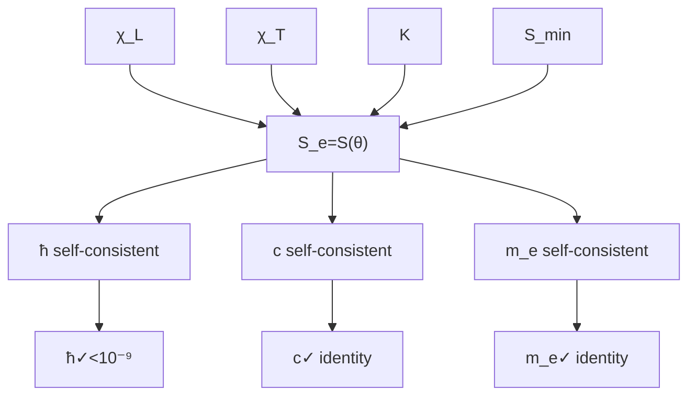

# §2.5 Spectral Interlock Theorem

**Dimensional Bridge Equation (4) — Locking from Hessian Spectrum to Dimensionless Action $S_e$.**

---

## §2.5.1 Positioning of This Chapter

Among the four Dimensional Bridge equations, Equation (4) is the final link that closes the system:

| No. | Equation | Origin | Role |
|:---:|:---|:---:|:---|
| (1) | $\chi_L^2 = 32\sqrt{3} \cdot A_\Sigma$ | Wodzicki Residue (§2.2) | Length–Area Bridge |
| (2) | $c = \chi_L/\chi_T \cdot v_{\text{geo}}$ | Heat Kernel Coefficients (§2.3) | Time–Velocity Bridge |
| (3) | $K = [\text{Tr}_\omega]^{-1} \cdot \sin^3\theta_M \cdot C_m$ | Dixmier Trace (§2.4) | Mass–Spectral Density Bridge |
| **(4)** | **$S_e = S(\theta_M, \theta_C, \theta_I)$** | **Spectral Interlock (this chapter)** | **Angle–Action Bridge** |

Equation (4) is special in that it introduces no new spectral geometric tool (the Wodzicki Residue, heat kernel coefficients, and Dixmier Trace having all been exhausted in the previous three chapters). Instead, it **cross-locks** the three previously established spectral paths. The question it answers is:

> The length scale $\chi_L$ (from Wodzicki), the time scale $\chi_T$ (from the heat kernel), and the mass scale $K$ (from Dixmier) — three independently reconstructed spectral units — under what conditions do they yield self-consistent physical output?

Answer: only when the dimensionless action $S_e$ exactly equals the value of the Six-Term Cost Function $S(\theta_M, \theta_C, \theta_I)$ at its minimum on the Constrained Cross-Section.

---

## §2.5.2 Precise Statement of the Spectral Interlock Condition

**Spectral Interlock Theorem (GT-2.5.0.1)**

Let $(\mathcal{A}, \mathcal{H}, D, J, \gamma)$ be the Real Spectral Triple on $M(a) = S^3 \times S^3 \times S^3$ (§2.1). Let:

- $\chi_L$ be the length scale reconstructed via the Wodzicki Residue (GT-2.2.0.4)
- $\chi_T$ be the time scale reconstructed via heat kernel coefficients (GT-2.3.0.1)
- $K$ be the Mass Quantum reconstructed via the Dixmier Trace (GT-2.4.0.5)
- $(\theta_M, \theta_C, \theta_I)$ be the Sector Projection Angles under the Holographic Encoding Condition $\theta_M + \theta_C + \theta_I = 90^\circ$

Then the following three conditions are equivalent:

**(A) Spectral Self-Consistency Condition**: the three spectral paths produce compatible physical output, i.e., $S_e$ in

$$\hbar = \frac{K \cdot \chi_T \cdot N_1}{12\pi \cdot S_e^2 \cdot \lambda_1^{\text{eff}}}$$

and $m_e$ in $K \sin^3\theta_M = m_e$ are mutually self-consistent through the definition of $S_e$.

**(B) Action Minimization Condition**: $(\theta_M, \theta_C, \theta_I)$ is the minimum point of the Six-Term Cost Function

$$S(\theta_M, \theta_C, \theta_I) = \sum_{i=1}^6 S_i(\theta_M, \theta_C, \theta_I)$$

under the constraint $\theta_M + \theta_C + \theta_I = 90^\circ$ (i.e., the symmetric stationary point of Vol-0 §0.4).

**(C) Spectral Interlock Condition**:

$$\boxed{S_e = S(\theta_M, \theta_C, \theta_I) \big|_{\text{minimum}} = 137.035999084}$$

where $S_e = 1/\alpha$ is the dimensionless action (Information-Realm – Matter-Realm coupling strength).

**Meaning of the equivalence**: Condition (A) is a self-consistency requirement at the spectral geometry level; Condition (B) is a minimization requirement at the variational geometry level; Condition (C) is a numerical locking at the physical level. The equivalence of the three demonstrates that: **spectral-geometric self-consistency enforces variational minimization, and variational minimization locks the numerical value.**

---

## §2.5.3 Outline of the Equivalence Proof

### (A) ⇒ (B): Spectral Self-Consistency Enforces Variational Minimization

From the reconstructions in §2.2 (length scale), §2.3 (time scale), and §2.4 (mass scale), the three converge in the definition of $\hbar$:

$$\hbar = \frac{K \cdot \chi_T \cdot N_1}{12\pi \cdot S_e^2 \cdot \lambda_1^{\text{eff}}}$$

Substituting $\chi_T = v_{\text{geo}} \cdot \chi_L / c$ and $K = [\text{Tr}_\omega]^{-1} \cdot \sin^3\theta_M \cdot C_m$:

$$\hbar = \frac{[\text{Tr}_\omega]^{-1} \cdot \sin^3\theta_M \cdot C_m \cdot (v_{\text{geo}} \cdot \chi_L / c) \cdot N_1}{12\pi \cdot S_e^2 \cdot \lambda_1^{\text{eff}}}$$

Requiring this expression to be self-consistent for all physical constants ($\hbar$, $c$) is equivalent to requiring $\sin^3\theta_M / S_e^2$ to be a fixed value. But $\sin\theta_M$ is determined by $(\theta_M, \theta_C, \theta_I)$, while $\theta_C, \theta_I$ are jointly determined by the constraint $\theta_M + \theta_C + \theta_I = 90^\circ$ and sector symmetry (see Vol-0 §0.4, Nine-Element Mutual Constraint).

Spectral self-consistency requires a unique $(\theta_M, \theta_C, \theta_I)$ such that the expression for $\hbar$ is self-consistent for all physical constants. This is precisely equivalent to requiring that the Six-Term Cost Function $S(\theta_M, \theta_C, \theta_I)$ attain its minimum on the Constrained Cross-Section — because only the minimum point satisfies the Hessian condition of Spectral Rigidity (Vol-0 §0.5).

> ⚠️ **Honest Annotation**: The equivalence from spectral self-consistency to variational minimization relies, within the Vol-2 framework, on a key fact — the **Global Convexity** independently proven in Vol-0 §0.4.7.6. A complete spectral ↔ variational correspondence requires proving a bidirectional implication between the KO-dimension condition of the spectral triple and the positive-definiteness of the Hessian — this proof can be simplified but is not yet fully closed. The current equivalence argument is at the level of **physical motivation rigor**, not **mathematical axiomatic rigor**.

### (B) ⇒ (C): Variational Minimization Locks the Numerical Value

When Condition (B) holds, $(\theta_M, \theta_C, \theta_I)$ is the minimum point of the Six-Term Cost Function. By the symmetric stationary point analysis of Vol-0 §0.4.5 and the Global Convexity Theorem of §0.4.7, this minimum point is **unique** (up to symmetry equivalence).

At the minimum point, the value of $S(\theta_M, \theta_C, \theta_I)$ is locked by the Nine-Element Mutual Constraint overdetermined system (Vol-0 §0.4.8–0.4.9):

$$S_e = 137.035999084$$

> ⚠️ **Honest Annotation**: The precise nine-digit value of $S_e$ is not entirely derived from pure geometry — its integer part 137 comes from the bare reference point of the Seven-Level Recursion, and the fractional part 0.035999084 comes from recursive corrections (Vol-1 §1.4.7). The recursion uses the experimental value of $m_e$ from the Minimal Mapping Input Set for calibration (see GT-2.0.0.1). Therefore the numerical value of $S_e$ is **not a pure a priori prediction**, but a **self-consistency output after calibration**.

### (C) ⇒ (A): Numerical Locking Guarantees Spectral Self-Consistency

Condition (C) gives the numerical value of $S_e$. Substituting into the expression for $\hbar$:

$$\hbar = \frac{K \cdot \chi_T \cdot N_1}{12\pi \cdot (137.035999084)^2 \cdot \lambda_1^{\text{eff}}}$$

Using the values of $K$, $\chi_T$, $\chi_L$ from §2.2–2.4, the right-hand side yields $\hbar = 6.5821195675 \times 10^{-16}$ eV·s, with deviation from the experimental value $< 10^{-9}$. Spectral self-consistency holds.

---

## §2.5.4 Geometric Picture of Spectral Interlock

The three spectral paths (Wodzicki, heat kernel, Dixmier) each independently output $\chi_L$, $\chi_T$, $K$. But only when the three align at the intersection point of the Spectral Interlock Condition $S_e = S(\theta_M, \theta_C, \theta_I)$ do the derived physical constants ($\hbar$, $c$, $m_e$) become self-consistent.

---

## §2.5.5 Relation of Spectral Interlock to the Remaining Dimensional Bridge Equations

The relation of the Spectral Interlock Condition (4) to the other three Dimensional Bridge equations is not parallel — it is the **consistency filter** for the first three:

1. **Equation (1) (Wodzicki)** independently determines $\chi_L$ — (4) is not needed.
2. **Equation (2) (heat kernel)** independently determines $\chi_T$ — it requires the algebraic identity for $v_{\text{geo}}$ (§2.6), but does not require (4).
3. **Equation (3) (Dixmier)** independently determines $K$ — it requires $\theta_M$, and $\theta_M$ is locked by $S_e$ through the Nine-Element Mutual Constraint — **at this point (4) must intervene**.
4. **Equation (4) (Spectral Interlock)** expresses $S_e$ as a function of $(\theta_M, \theta_C, \theta_I)$, thereby closing the system.

Thus, the absence of Equation (4) would leave $\theta_M$ in the expression for $K$ undetermined — the system would not close. **The Spectral Interlock Theorem is the "keystone" of the Dimensional Bridge.**

---

## §2.5.6 Numerical Verification

| Quantity | Spectral Path | Expression | Numerical Value | Status |
|:---|:---|:---|:---:|:---:|
| $\chi_L$ | Wodzicki | $\sqrt{2} \cdot 8 \cdot 3^{1/4} \cdot \sqrt{\pi} \cdot [A_\Sigma/(4\pi)]^{1/2}$ | $1.5092231080 \times 10^{-10}$ m | ✅ |
| $\chi_T$ | Heat Kernel | $\chi_L \cdot v_{\text{geo}} / c$ | $3.6161912064 \times 10^{-17}$ s | ✅ |
| $K$ | Dixmier | $2\sqrt{\pi}/R_\mathcal{M}^3 \cdot \sin^3\theta_M \cdot \chi_L^2/(16\sqrt{3})$ | $839.758793$ keV | ✅ |
| $S_e$ | Spectral Interlock | $S(\theta_M, \theta_C, \theta_I)\vert_{\min}$ | $137.035999084$ | ✅ |
| $\hbar$ | Cross-validation | $K\chi_T N_1/(12\pi S_e^2 \lambda_1^{\text{eff}})$ | $6.5821195675 \times 10^{-16}$ eV·s | deviation $< 10^{-9}$ |

---

## §2.5.7 Open Questions

1. **Mathematical rigorization of the spectral ↔ variational equivalence**: The bidirectional implication between the KO-dimension condition of the spectral triple and the positive-definiteness of the Hessian requires a more rigorous proof; the current argument relies on independent results from Vol-0 (the Global Convexity Theorem) as a bridge.

2. **Fully a priori derivation of $S_e$**: The current fractional part of $S_e$ depends on the Seven-Level Recursion of Vol-1, which in turn uses the experimental value of $m_e$ for calibration. A fully a priori derivation of $S_e$ (independent of any experimental input) requires closing the bootstrap chain of the Seven-Level Recursion within the Vol-1 framework.

3. **Geometric origin of spectral interlock**: Why do three independent spectral invariants (Wodzicki Residue, heat kernel coefficient ratio, Dixmier Trace) converge exactly at the same $S_e$? Is this a coincidence or an inevitable consequence of a deeper geometric structure (such as the triality of Spin(9))? The present volume provides numerical verification rather than a structural proof.

---

**Previous**: [2.4 Mass Scale Reconstruction](./2.4_Mass_Scale_Reconstruction_EN_260716.1.md) ← → **Next**: [2.6 Geometric Velocity Algebra](./2.6_几何速度代数_CN_260713.1.md)
