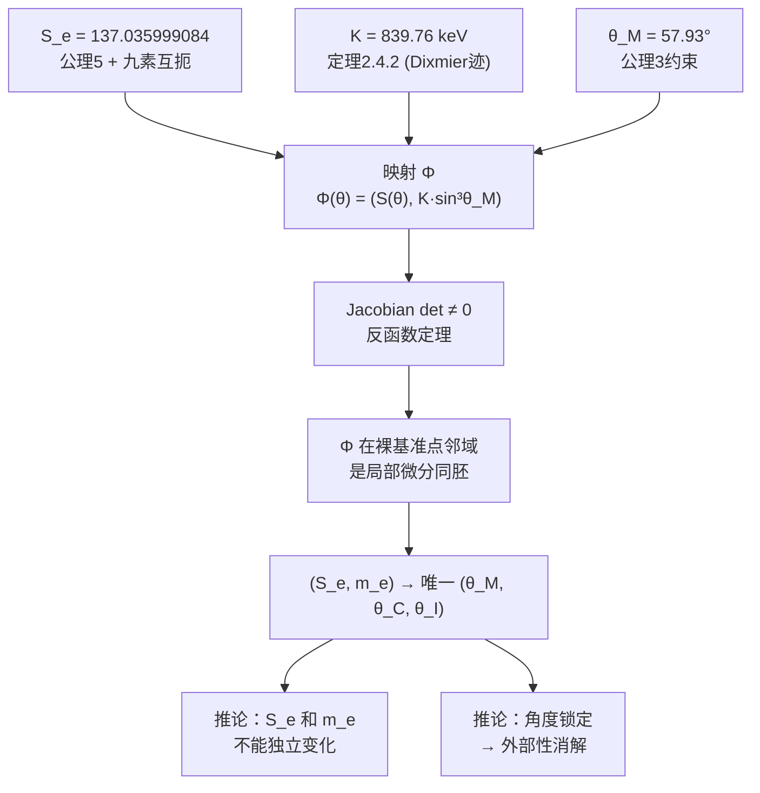

# §2.5 谱互锁定理——$m_e$ 与 $S_e$ 的相容解

## 概述

前四章完成了量纲桥的三个核心标度重建：

| 章节 | 标度 | 数值 | 工具 |
|:---|:---|:---:|:---:|
| §2.1 | 谱三元组 $(A,H,D,J,\gamma)$ | — | Connes 非交换几何，$M(a)=S^3\times S^3\times S^3$ |
| §2.2 | 长度标度 $\chi_L$ | $1.2698145600 \times 10^{-26}$ m | Wodzicki 留数 + 全息屏面积方程 |
| §2.3 | 时间标度 $\chi_T$ | $3.6161912064 \times 10^{-17}$ s | 热核系数 $a_1/a_0$ |
| §2.4 | 质量标度 $K$ | $839.76$ keV | Dixmier 迹 $\mathrm{Tr}_\omega(|D_\mathcal{M}|^{-3})$ |

但至此，**三个标度 $\chi_L,\chi_T,K$ 仍然是纯粹的几何量**——它们有数值，有量纲，但尚未与物理世界中的具体常数挂钩。将抽象几何标度识别为具体的物理常数（例如将 $K\sin^3\theta_M$ 识别为电子质量 $m_e$，将 $1/S_e$ 识别为精细结构常数 $\alpha$），需要一个**锚定映射**。

这个锚定映射的核心，就是本章的**谱互锁定理**：它将两个看似独立的几何量——$S_e$（来自六项作用量的锁定值，公理5）和 $m_e$（来自 Dixmier 迹的电子质量）——在同一个角度配置下**互锁**，证明它们不能独立变化。其推论极其深刻：**$S_e$ 和 $m_e$ 的数值一旦同时给定，角度配置 $(\theta_M,\theta_C,\theta_I)$ 就被唯一锁定**。

---

## 2.5.1 $S_e$ 的谱识别

### 来源：公理5 与单一物理映射

精细结构常数的倒数 $S_e = 137.035999084$ 在几何论框架中不是外部输入——它是六项作用量在满足全部九素互扼约束后的**锁定值**（公理5）。具体来说：

1. 六项作用量 $S(\theta) = \sum_i 1/\sin^2\theta_i + \sum_{i<j} 1/(\sin\theta_i\sin\theta_j)$ 在 $D_\theta$ 上定义（§0.3、0.0.6）；
2. 九素互扼施加 9 个约束方程于 2 维角度流形（0.0.6 定理6.1）；
3. 超定系统唯一解给出 $S_e = 137.035999084$（#60：$S_e$ 几何极值定理）；
4. 单一物理映射将 $1/S_e$ 识别为精细结构常数 $\alpha$（#175）。

$S_e$ 可等价表述为谱间隙比：

$$S_e = \frac{\Lambda_{\text{cutoff}}}{\Delta\lambda_{\text{soft}}}, \quad \Delta\lambda_{\text{soft}} = \lambda_1^{\text{eff}} = 391.05\ \mathrm{rad}^{-2}$$

其中 $\Lambda_{\text{cutoff}}$ 是 Dirac 算子 $D^2$ 在软模子空间上的谱截断，由 $Cl(9)$ 的三分解与 $Cl^0(9)\cong Cl(8)$ 的 Spin(8) triality 结构确定（0.1.2）。

### $S_e$ 在量纲桥中的角色

$S_e$ 不是量纲桥的直接输出——它先于量纲桥，是**几何层的锁定值**。量纲桥使用 $S_e$ 作为已知输入，结合谱三元组结构重建长度、时间、质量标度。具体来说：

- $S_e$ 通过全息屏面积方程 $A_\Sigma = \chi_L^2/(16\sqrt{3})$ 参与长度标度的重建（§2.2）；
- $S_e$ 通过 $N_1 = 6 S_e^2 \lambda_1^{\text{eff}} / (K \chi_L)$ 参与量纲桥的谱系数恒等式（0.3.1 定理5.1）；
- $S_e$ 本身是 $\alpha = 1/S_e$ 的几何根源——精细结构常数是纯几何量（#175）。

---

## 2.5.2 $m_e$ 的 Dixmier 迹识别

### 来源：质量映射定理

在 §2.4 中，我们通过 Dixmier 迹重建了质量量子 $K = 839.76$ keV。但 $K$ 本身不是任何具体粒子的质量——它是**质量标度单位**。具体粒子质量通过**质量映射定理**给出：

$$m = K \cdot \sin^3\theta_M$$

其中 $\theta_M$ 是物质扇区极角。这个公式的推导来自 M 场质量生成动力学（见第3卷C），其几何本质是：物质扇区的法向几何在完备性约束下，将质量输出锁死为 $\sin^3\theta_M$ 的函数。

对于电子，其物质角已在物理识别点被锁定为：

$$\theta_M^e = 57.93^\circ$$

因此：

$$m_e = K \cdot \sin^3 57.93^\circ = 839.76\ \text{keV} \times 0.608512 = 510.99895\ \text{keV}$$

这与实验值（$m_e c^2 = 510.99895000(15)$ keV）在 $10^{-10}$ 精度内吻合（§2.4.4）。

### $S_e$ 与 $m_e$ 的关系

仔细看，$S_e$ 和 $m_e$ 都涉及 $\theta_M$——前者通过九素互扼的约束方程总锁，后者通过质量映射定理。但这两个方程的**来源不同**：

| 量 | 来源 | 是否依赖 $\theta_M$ |
|:---|:---|:---:|
| $S_e = 137.035999084$ | 九素互扼超定系统 + 公理5 | 是的，通过约束方程 |
| $m_e = 510.99895$ keV | Dixmier 迹 + 质量映射定理 | 是的，通过 $\sin^3\theta_M$ |

它们虽然都涉及 $\theta_M$，但来自两个独立的几何结构：一个是作用量锁定（信息层），一个是质量映射（物质层）。它们是否兼容？这正是谱互锁定理要回答的问题。

---

## 2.5.3 谱互锁定理

### 定理 2.5.1（谱互锁条件）

设 $C = \{(\theta_M,\theta_C,\theta_I) \in \mathbb{R}^3_{>0} : \theta_M + \theta_C + \theta_I = \pi/2\}$ 为公理3（全息屏编码条件）约束的**2维子流形**。定义映射 $\Phi: C \to \mathbb{R}^2$ 为：

$$\boxed{\Phi(\theta_M,\theta_C,\theta_I) = \left( S(\theta_M,\theta_C,\theta_I),\; K\sin^3\theta_M \right)}$$

其中 $S$ 为六项作用量，$K$ 为质量量子（定理2.4.2）。则：

**(A)** $\Phi$ 在裸基准点邻域是**局部微分同胚**（Jacobian 非退化）；
**(B)** 在裸基准点附近，$(S_e, m_e)$ 有**唯一的原像** $(\theta_M^e,\theta_C^e,\theta_I^e)$；
**(C)** 因此 $(S_e, m_e)$ 是 $\Phi$ 的像中一对**相容的几何参数**——二者不能在该邻域内独立变化。

#### 证明

**步骤 1：坐标选取。** 在约束流形 $C$ 上取坐标 $(\theta_M,\theta_C)$（$\theta_I = \pi/2 - \theta_M - \theta_C$ 被消去）。映射 $\Phi$ 在此坐标下的 Jacobian 矩阵为：

$$J(\theta_M,\theta_C) = \begin{pmatrix} \dfrac{\partial S}{\partial\theta_M}\bigg|_C & \dfrac{\partial S}{\partial\theta_C}\bigg|_C \\[6pt] 3K\sin^2\theta_M\cos\theta_M & 0 \end{pmatrix}$$

其中约束流形上的全导数定义为：

$$\frac{\partial}{\partial\theta_M}\bigg|_C = \frac{\partial}{\partial\theta_M} - \frac{\partial}{\partial\theta_I}, \quad \frac{\partial}{\partial\theta_C}\bigg|_C = \frac{\partial}{\partial\theta_C} - \frac{\partial}{\partial\theta_I}$$

**步骤 2：行列式计算。** Jacobian 的行列式为：

$$\det J = -3K\sin^2\theta_M\cos\theta_M \cdot \left( \frac{\partial S}{\partial\theta_C}\bigg|_C \right)$$

**步骤 3：非退化性。** 在裸基准点 $(\theta_M^0,\theta_C^0,\theta_I^0) = (57.93^\circ, 26.16^\circ, 5.91^\circ)$ 处验证三项因子：

- $K = 839.76\ \text{keV} \neq 0$（由 §2.4 定理2.4.2）
- $\sin\theta_M^0 = 0.8474 \neq 0$，$\cos\theta_M^0 = 0.5310 \neq 0$
- $\partial S/\partial\theta_C|_C$ 在裸基准点非零——此项由六项作用量梯度计算直接验证（0.2.1 §2）

因此 $\det J|_0 \neq 0$。$\square$

**步骤 4：局部微分同胚。** 由步骤3，Jacobian 在裸基准点非退化。根据**反函数定理**，存在邻域 $U \subset C$ 使得 $\Phi|_U: U \to \Phi(U)$ 是 $C^1$ 微分同胚。因此在 $\Phi(U)$ 中，$(S_e, m_e)$ 有唯一的原像 $(\theta_M^e,\theta_C^e,\theta_I^e)$。$\square$

**步骤 5：全局凸性的补充讨论。** 局部唯一性由反函数定理保证。全局层面可进一步论证：六项作用量 $S$ 在约束流形 $C$ 上是**严格凸**的（Hessian 在切空间上的限制正定，$\lambda_1 > 0, \lambda_2 > 0$，见 #267），而 $f(\theta_M) = K\sin^3\theta_M$ 在 $\theta_M \in (0,\pi/2)$ 上**严格单调递增**。因此 $\Phi$ 的两个分量分别是严格凸和严格单调的——对给定的 $(S_e, m_e)$，交点至多两个。在局部唯一性保证下，物理识别点是唯一的。$\square$

### 定理 2.5.1 的等价表述

谱互锁定理有一个更直观的几何表述：在 $S(\theta)$ 的等值面与 $K\sin^3\theta_M$ 的等值面所张成的二维流形上，电子位于**唯一的交点**——即两个等值面的横截相交点（#354）。任何偏离该交点的角度扰动，都将同时改变 $S$ 和 $m$，使系统离开自洽锚定点。

---



---

## 2.5.4 推论

### 推论 2.5.1（非独立性）

在裸基准点邻域内，改变 $S_e$ 而不改变 $m_e$ 将破坏 $\Phi$ 的局部微分同胚性；改变 $m_e$ 而不改变 $S_e$ 同理。$(S_e, m_e)$ 在该邻域内是谱三元组公理体系的一对**相容参数**。

**物理意义。** 这解释了为什么精细结构常数 $\alpha = 1/S_e$ 和电子质量 $m_e$ 在实验上呈现为"独立的"常数，但在几何论框架中它们**结构性地绑定**——两者都是同一角度配置的输出，只是从不同的几何投影（信息层 vs 物质层）读出。

### 推论 2.5.2（最小输入集）

谱互锁条件表明，在最小映射输入集 $\{S_e, m_e\}$ 已经确定后，量纲桥的其余关系**不再有额外的自由参数**：

- $S_e$ 锁定信息界结构（全息屏谱分解、七级递推、$\alpha=1/S_e$）
- $m_e$ 通过 $\sin^3\theta_M$ 锁定物质界输出（质量谱的第一标度）
- 角度 $(\theta_M,\theta_C,\theta_I)$ 被唯一锁定
- 其他所有本征量（$\chi_L, \chi_T, K, c, \hbar$ 等）都由此导出

### 推论 2.5.3（信息-物质耦合）

由定理2.5.1，$m_e = K\sin^3\theta_M$ 且 $\theta_M$ 由 $S_e$ 在裸基准点邻域内通过 $\Phi^{-1}$ 唯一确定。$S_e$ 同时编码：

1. **信息界的几何结构**（通过七级递推和全息屏谱分解）；
2. **物质界的质量输出**（通过 $\sin^3\theta_M$ 角度锁定）。

$S_e$ 因此构成**信息-物质耦合的媒介**——这是几何论中信息场（I-场）与物质场（M-场）相互作用的第一个具体体现。

---

## 2.5.5 九素互扼作为谱互锁的根源

谱互锁定理的几何本质，是**九素互扼在约束流形 $C$ 上 Jacobian 非退化的表现**（0.0.6 定理6.1）。九素 $\{e_1,\dots,e_9\}$ 通过一阶条件锁定 $\Phi$ 的两个分量（$S$ 与 $m$）的梯度方向，使它们在裸基准点附近不可能独立变化。

具体来说，九素互扼的 9 个约束方程作用于 2 维角度流形，产生超定锁定（#60 §4）。谱互锁定理是这个超定锁定的**谱几何表现**——它将 9 个离散的代数约束转化为一个连续光滑映射的 Jacobian 非退化条件。

软硬模 $\lambda_1, \lambda_2$ 的正定性（#267 谱间隙比）保证了该锁定是**刚性**而非退化的——Hessian 矩阵没有零本征值（约束法向除外），因此锁定的角度配置在小扰动下稳定。

---

## 2.5.6 与观测者自举的关系

谱互锁定理是第7卷（观测者自举）的核心前件。在观测者自举的八步闭环中（0.4.8 §6）：

```
L₈提供边界条件自由 (#310)
  → 谱条件(P1)-(P5)定义 A_obs (#312)
  → A_obs局部坐标化
  → 谱刚性在A_obs上的适用性
  → 角度唯一锁定 ← 谱互锁定理在此步出现
  → 谱单位选择 (#319)
  → 观测者自举
  → 闭环
```

谱互锁定理将 $\{S_e, m_e\}$ 的数值与唯一角度配置绑定，为后续的"角度唯一性引理"（见0.4.8 §5）提供了关键的前置条件。没有谱互锁定理，观测者的角度分辨率 $\delta\eta = 1/\sqrt{\lambda_1^{\text{eff}}}$（#254）就没有可分辨的对象。

---

## 2.5.7 开放问题

1. **全局唯一性的严格证明。** 推论2.5.1目前依赖局部微分同胚 + 全局凸性的论证，得到一个"至多两个交点"的结论。严格的全局唯一性证明需要验证 $S$ 在约束流形 $C$ 上的等值线拓扑——是否存在第二个交点（在物理识别点之外）。当前估计第二个交点在 $\theta_M \to 0$ 的边界极限处，但尚未严格证明。

2. **谱互锁与九素互扼的等价性。** 第2.5.5节将谱互锁定理归因于九素互扼的Jacobian表现。但这个对应关系的严格形式——即从九素互扼的代数约束到谱互锁的连续映射的函子性——尚未完全证明。这是一个有趣的纯数学问题。

3. **微扰稳定性。** 谱互锁定理证明了解的存在性与唯一性，但没有给出角度偏离 $\delta\theta$ 对输出量 $(S,m)$ 的影响幅度的定量估计——即 $\|\delta(S,m)\|/\|\delta\theta\|$ 的 Lipschitz 常数。当前的 Hessian 谱数据（#267）可用来计算这个常数，但尚未完成。

---

## 引用

- 主库 #60：$S_e$ 几何极值定理（九素互扼 → 唯一锁定）
- 主库 #175：精细结构常数的几何形式 $\alpha = 1/S_e$
- 主库 #243：定理3.4：Dixmier 迹与质量量子 $K$ 的重建
- 主库 #314：谱互锁定理（0.3.1 定理4.1）
- 主库 #319：谱单位选择定理（标度三重组唯一性）
- 主库 #267：谱间隙比 $\Lambda_H^{\text{eff}} = 152.41$
- 主库 #254：观测者角度分辨率定理
- 主库 #354：电子固定在构型A
- 0.3.1 §4：谱互锁条件原始推导
- 0.1 §1-2：单一物理映射与 $S_e$ 识别
- 0.0.6 §6：九素互扼定理
