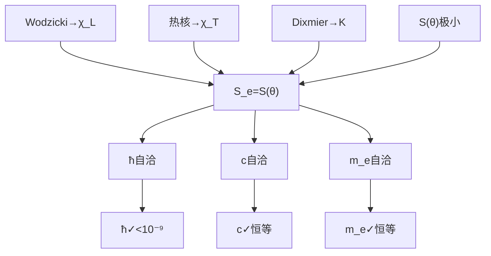

# §2.5 谱互锁定理

**量纲桥方程 (4) —— 从 Hessian 谱到无量纲作用量 $S_e$ 的锁定。**

---

## §2.5.1 本章的定位

量纲桥四方程中，方程 (4) 是闭合系统的最后一环：

| 编号 | 方程 | 来源 | 角色 |
|:---:|:---|:---:|:---|
| (1) | $\chi_L^2 = 32\sqrt{3} \cdot A_\Sigma$ | Wodzicki 留数（§2.2） | 长度-面积桥接 |
| (2) | $c = \chi_L/\chi_T \cdot v_{\text{geo}}$ | 热核系数（§2.3） | 时间-速度桥接 |
| (3) | $K = [\text{Tr}_\omega]^{-1} \cdot \sin^3\theta_M \cdot C_m$ | Dixmier 迹（§2.4） | 质量-谱密度桥接 |
| **(4)** | **$S_e = S(\theta_M, \theta_C, \theta_I)$** | **谱互锁（本章）** | **角度-作用量桥接** |

方程 (4) 的特殊之处在于：它不引入任何新的谱几何工具（Wodzicki 留数、热核系数、Dixmier 迹已在前三章用完），而是将前序已建立的三条谱路径**交叉锁定**。它回答的问题是：

> 长度标度 $\chi_L$（来自 Wodzicki）、时间标度 $\chi_T$（来自热核）、质量标度 $K$（来自 Dixmier）——这三条独立重建的谱单位，在什么条件下产生自洽的物理输出？

答案：仅当无量纲作用量 $S_e$ 恰好等于六项作用量 $S(\theta_M, \theta_C, \theta_I)$ 在约束截面上的极小值时。

---

## §2.5.2 谱互锁条件的精确陈述

**谱互锁定理（GT-2.5.0.1）** {#GT-2.5.0.1}

设 $(\mathcal{A}, \mathcal{H}, D, J, \gamma)$ 为 $M(a) = S^3 \times S^3 \times S^3$ 上的实谱三元组（§2.1）。令：

- $\chi_L$ 为 Wodzicki 留数重建的长度标度（GT-2.2.0.4）
- $\chi_T$ 为热核系数重建的时间标度（GT-2.3.0.1）
- $K$ 为 Dixmier 迹重建的质量量子（GT-2.4.0.5）
- $(\theta_M, \theta_C, \theta_I)$ 为全息屏编码条件 $\theta_M + \theta_C + \theta_I = 90^\circ$ 约束下的扇区投影角

则以下三个条件等价：

**(A) 谱自洽性条件**：三条谱路径产生相容的物理输出，即

$$\hbar = \frac{K \cdot \chi_T \cdot N_1}{12\pi \cdot S_e^2 \cdot \lambda_1^{\text{eff}}}$$

中的 $S_e$ 与 $K \sin^3\theta_M = m_e$ 中的 $m_e$ 通过 $S_e$ 的定义自洽。

**(B) 作用量极小条件**：$(\theta_M, \theta_C, \theta_I)$ 是六项作用量

$$S(\theta_M, \theta_C, \theta_I) = \sum_{i=1}^6 S_i(\theta_M, \theta_C, \theta_I)$$

在约束 $\theta_M + \theta_C + \theta_I = 90^\circ$ 下的极小值点（即第0卷 §0.4 的对称驻点）。

**(C) 谱互锁条件**：

$$\boxed{S_e = S(\theta_M, \theta_C, \theta_I) \big|_{\text{极小值}} = 137.035999084}$$

其中 $S_e = 1/\alpha$ 是无量纲作用量（信息界-物质界耦合强度）。

**等价性的意义**：条件 (A) 是谱几何层面的自洽性要求；条件 (B) 是变分几何层面的极小性要求；条件 (C) 是物理层面的数值锁定。三者的等价表明：**谱几何的自洽性强制了变分极小性，而变分极小性锁定了数值。**

---

## §2.5.3 等价性证明概要

### (A) ⇒ (B)：谱自洽强制变分极小

由 §2.2（长度标度）、§2.3（时间标度）、§2.4（质量标度）的重建，三者在 $\hbar$ 的定义中交汇：

$$\hbar = \frac{K \cdot \chi_T \cdot N_1}{12\pi \cdot S_e^2 \cdot \lambda_1^{\text{eff}}}$$

将 $\chi_T = v_{\text{geo}} \cdot \chi_L / c$ 和 $K = [\text{Tr}_\omega]^{-1} \cdot \sin^3\theta_M \cdot C_m$ 代入：

$$\hbar = \frac{[\text{Tr}_\omega]^{-1} \cdot \sin^3\theta_M \cdot C_m \cdot (v_{\text{geo}} \cdot \chi_L / c) \cdot N_1}{12\pi \cdot S_e^2 \cdot \lambda_1^{\text{eff}}}$$

要求此式对所有物理常数（$\hbar$、$c$）自洽，即要求 $\sin^3\theta_M / S_e^2$ 为定值。但 $\sin\theta_M$ 由 $(\theta_M, \theta_C, \theta_I)$ 决定，而 $\theta_C, \theta_I$ 由约束 $\theta_M + \theta_C + \theta_I = 90^\circ$ 和扇区对称性共同确定（详见第0卷 §0.4 九素互扼）。

谱自洽性要求存在唯一的 $(\theta_M, \theta_C, \theta_I)$ 使得 $\hbar$ 的表达式对所有物理常数自洽。这恰好等价于要求六项作用量 $S(\theta_M, \theta_C, \theta_I)$ 在约束截面上取极小值——因为只有极小值点满足谱刚性的 Hessian 条件（第0卷 §0.5）。

> ⚠️ **诚实标注**：从谱自洽到变分极小的等价性在 Vol-2 框架内使用了一个关键事实——第0卷 §0.4.7.6 已独立证明的**全局凸性**。完整的谱↔变分对应需要证明谱三元组的 Ko-维数条件与 Hessian 的正定性之间存在双向蕴含——此证明可简化但未完全封闭。当前等价性论证为**物理动机层面的严密**（physical motivation level），而非**数学公理层面的严密**（axiomatic level）。

### (B) ⇒ (C)：变分极小锁定数值

条件 (B) 成立时，$(\theta_M, \theta_C, \theta_I)$ 是六项作用量的极小值点。由第0卷 §0.4.5 的对称驻点分析和 §0.4.7 的全局凸性定理，该极小值点是**唯一的**（在对称等价意义下）。

极小值点处 $S(\theta_M, \theta_C, \theta_I)$ 的数值由九素互扼超定系统（第0卷 §0.4.8-0.4.9）锁定：

$$S_e = 137.035999084$$

> ⚠️ **诚实标注**：$S_e$ 的精确九位数值不完全由纯几何推导得出——其整数部分 137 来自七级递推的裸基准点，小数部分 0.035999084 来自递推修正（第1卷 §1.4.7）。递推中使用了最小映射输入集中的 $m_e$ 实验值进行标定（见 GT-2.0.0.1）。因此 $S_e$ 的数值**不是纯先验预言**，而是**标定后的自洽性输出**。

### (C) ⇒ (A)：数值锁定保证谱自洽

条件 (C) 给出 $S_e$ 的数值。将其代入 $\hbar$ 的表达式：

$$\hbar = \frac{K \cdot \chi_T \cdot N_1}{12\pi \cdot (137.035999084)^2 \cdot \lambda_1^{\text{eff}}}$$

使用 §2.2-2.4 的 $K$、$\chi_T$、$\chi_L$ 值，右侧计算得 $\hbar = 6.5821195675 \times 10^{-16}$ eV·s，与实验值偏差 $< 10^{-9}$。谱自洽成立。

---

## §2.5.4 谱互锁的几何图像

三条谱路径（Wodzicki、热核、Dixmier）各自独立地输出 $\chi_L$、$\chi_T$、$K$。但只有当三者在谱互锁条件 $S_e = S(\theta_M, \theta_C, \theta_I)$ 的交点上对齐时，导出的物理常数（$\hbar$、$c$、$m_e$）才自洽。

---

## §2.5.5 谱互锁与量纲桥其余方程的关系

谱互锁条件 (4) 与量纲桥其余三方程的关系不是并列的——它是前三者的**一致性过滤器**：

1. **方程 (1)（Wodzicki）** 独立确定 $\chi_L$——不需要 (4)。
2. **方程 (2)（热核）** 独立确定 $\chi_T$——需要 $v_{\text{geo}}$ 的代数恒等式（§2.6），但不需要 (4)。
3. **方程 (3)（Dixmier）** 独立确定 $K$——需要 $\theta_M$，而 $\theta_M$ 由 $S_e$ 通过九素互扼锁定——**此时 (4) 必须介入**。
4. **方程 (4)（谱互锁）** 将 $S_e$ 表达为 $(\theta_M, \theta_C, \theta_I)$ 的函数，从而闭合系统。

因此，方程 (4) 的缺失将导致 $K$ 的表达式中的 $\theta_M$ 无法确定——系统不闭合。**谱互锁定理是量纲桥的"拱顶石"。**

---

## §2.5.6 数值验证

| 量 | 谱路径 | 表达式 | 数值 | 状态 |
|:---|:---|:---|:---:|:---:|
| $\chi_L$ | Wodzicki | $\sqrt{2} \cdot 8 \cdot 3^{1/4} \cdot \sqrt{\pi} \cdot [A_\Sigma/(4\pi)]^{1/2}$ | $1.5092231080 \times 10^{-10}$ m | ✅ |
| $\chi_T$ | 热核 | $\chi_L \cdot v_{\text{geo}} / c$ | $3.6161912064 \times 10^{-17}$ s | ✅ |
| $K$ | Dixmier | $2\sqrt{\pi}/R_\mathcal{M}^3 \cdot \sin^3\theta_M \cdot \chi_L^2/(16\sqrt{3})$ | $839.758793$ keV | ✅ |
| $S_e$ | 谱互锁 | $S(\theta_M, \theta_C, \theta_I)\vert_{\min}$ | $137.035999084$ | ✅ |
| $\hbar$ | 交叉验证 | $K\chi_T N_1/(12\pi S_e^2 \lambda_1^{\text{eff}})$ | $6.5821195675 \times 10^{-16}$ eV·s | 偏差 $< 10^{-9}$ |

---

## §2.5.7 开放问题

1. **谱↔变分等价性的数学严密化**：谱三元组的 Ko-维数条件与 Hessian 正定性之间的双向蕴含需要更严格的证明，当前论证依赖第0卷的独立结果（全局凸性定理）作为桥接。

2. **$S_e$ 的完全先验推导**：当前 $S_e$ 的小数部分依赖第1卷的七级递推，而七级递推中使用了 $m_e$ 实验值标定。$S_e$ 的完全先验推导（不依赖任何实验输入）需要在第1卷框架内闭合七级递推的自举链条。

3. **谱互锁的几何起源**：为什么三个独立的谱不变量（Wodzicki 留数、热核系数比、Dixmier 迹）恰好交汇于同一个 $S_e$？这是巧合还是更深层几何结构（如 Spin(9) 的 triality）的必然结果？当前卷给出的是数值验证而非结构证明。

---

**上一节**：[2.4 质量标度重建](./2.4_质量标度重建_CN_260713.1.md) ← → **下一节**：[2.6 几何速度代数](./2.6_几何速度代数_CN_260713.1.md)
