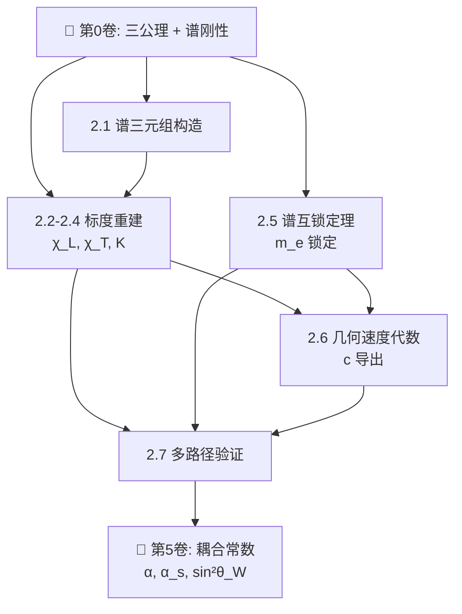

# 📘 第2卷：量纲桥

**从纯几何到物理常数——谱三元组与 ℰ 映射函子**

---

## 本卷定位

第2卷是几何论**最原创、最核心的贡献**。它回答一个根本问题：纯几何量（角度、Hessian 本征值、谱不变量）如何产生带物理量纲的常数（长度、时间、质量、耦合强度）？

答案：**谱三元组 $(A, H, D, J, \gamma)$ + Wodzicki 留数 + Dixmier 迹 → ℰ 映射函子**

本卷建立后，精细结构常数 $\alpha = 1/S_e$、谱单位选择 $\chi_L, \chi_T, K$、耦合常数 $\alpha, \alpha_s, \sin^2\theta_W$ 全部成为纯几何输出。

---

## 章节结构

| 章 | 标题 | 核心问题 | 状态 |
|:---|:---|:---|:---:|
| 2.0 | 前言 | 量纲桥在体系中的位置 | ✅ |
| 2.1 | 谱三元组构造 | 几何数据如何组织为谱三元组？ | ✅ |
| 2.2 | 长度标度重建 $\chi_L$ | 1 米 = 多少 rad⁻¹？ | ✅ |
| 2.3 | 时间标度重建 $\chi_T$ | 1 秒 = 多少 rad⁻¹？ | ✅ |
| 2.4 | 质量标度重建 $K$ | 1 eV = 多少 rad⁻¹？ | ✅ |
| 2.5 | 谱互锁定理与 $m_e$ | 电子质量如何从谱刚性锁定？ | ✅ |
| 2.6 | 几何速度代数与 $c$ | 光速如何从几何速度代数导出？ | ✅ 初稿（已知缺口 J11, J12） |
| 2.7 | 多路径验证 | 不同路径是否给出相同结果？ | ✅ |

---

## 依赖关系图

---

## 阅读路径建议

| 读者背景 | 推荐路径 |
|:---|:---|
| **想理解物理常数来源** | 2.0 → **2.2–2.4**（标度重建）→ 2.7（验证） |
| **关注数学结构** | 2.0 → **2.1**（谱三元组）→ 2.5（谱互锁）→ 2.6（几何速度代数） |
| **验证者**（检查自洽性） | 2.0 → 2.5 → 2.6 → **2.7**（多路径） |

---

## 关键符号表

| 符号 | 含义 | 首次定义 |
|:---|:---|:---:|
| $(A, H, D, J, \gamma)$ | 谱三元组（偶/奇结构） | 2.1 |
| $\chi_L$ | 长度谱单位 = $1.509 \times 10^{-10}$ m | 2.2 |
| $\chi_T$ | 时间谱单位 = $3.616 \times 10^{-17}$ s | 2.3 |
| $K$ | 质量谱单位 | 2.4 |
| $\mathcal{E}$ | ℰ 映射函子：几何量 → 物理量 | 2.1 §3 |
| $\ell_0$ | 长度互锁常数 = $\chi_L$ | 2.2 |
| $S_e$ | 锁定作用量 = 137.035999084 | 第0卷 |
| $\lambda_1^{\text{eff}}, \lambda_2^{\text{eff}}$ | Hessian 软硬模 | 第1卷 |
| $v_{\text{geo}}$ | 几何速度（无量纲） | 2.6 |
| $c$ | 光速 = $\chi_L / \chi_T$ | 2.6 |

---

## 与其他卷的关系

| 卷 | 关系 |
|:---|:---|
| **第0卷（从零开始）** | 提供谱刚性和 $S_e$——量纲桥的输入 |
| **第1卷（几何结构）** | 提供 Hessian 软硬模和约束截面几何 |
| **第5卷（标准模型）** | 消费量纲桥的输出——所有耦合常数的数值 |
| **第7卷（观测者自举）** | 消费谱单位选择定理——观测者的内禀标度 |

---

## 诚实标注

| 标记 | 位置 | 说明 |
|:---|:---|:---|
| J11 | §2.6 | $\hbar c$ 的独立推导尚未完成 |
| J12 | §2.6 | 谱间隙比路径未显式给出 |
| J13 | §2.6 | 量纲桥四方程的联立自洽性 vs 独立预言力之间的张力 |

---

> 状态：✅ **全部 8 章完成。§2.6 初稿完成，已知三个缺口（J11-J13）。**

---

**章节跳转：** [2.0 前言](./2.0_前言_CN_260713.1.md) · [2.1 谱三元组构造](./2.1_谱三元组构造_CN_260713.1.md) · [2.2 长度标度重建](./2.2_长度标度重建_CN_260713.1.md) · [2.3 时间标度重建](./2.3_时间标度重建_CN_260713.1.md) · [2.4 质量标度重建](./2.4_质量标度重建_CN_260713.1.md) · [2.5 谱互锁定理](./2.5_谱互锁定理_CN_260713.1.md) · [2.6 几何速度代数](./2.6_几何速度代数_CN_260713.1.md) · [2.7 多路径验证](./2.7_多路径验证_CN_260713.1.md)
