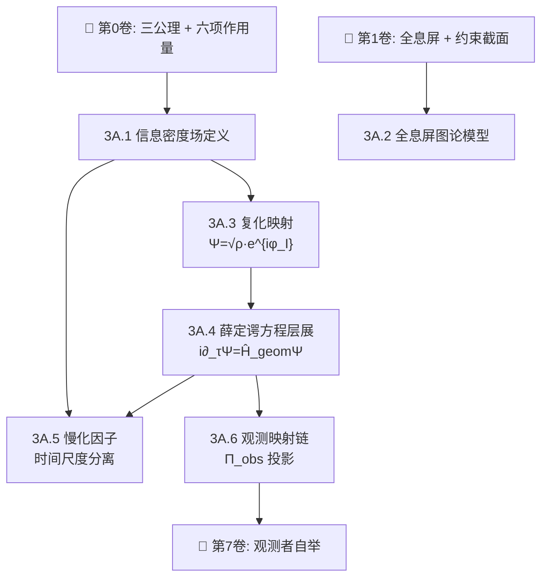

# 📘 第3卷A：信息场动力学

> **扩散 → 复化 → 薛定谔方程层展。量子力学不是基本公理，而是信息扩散方程的导出品。**

---

## 本卷定位

信息场（$\mathcal{I}$-场）是几何论三场中**时间尺度最慢**的场——与因果场（$\mathcal{C}$-场）之比约 $10^{21}$。它负责编码观测者的信息获取过程，其动力学从纯扩散出发，经复化映射 $\Psi = \sqrt{\rho} \cdot e^{i\varphi_I}$ 层展出薛定谔方程。

**核心主张**：量子力学的全部数学结构（波函数、薛定谔方程、观测投影）是信息场在约束截面上的低能有效理论，不是基本公理。

---

## 章节结构

| 章 | 标题 | 核心问题 | 来源文章 | 状态 |
|:---|:---|:---|:---:|:---:|
| 3A.1 | 信息密度场定义 | $\rho(\theta, \tau)$ 如何从扇区约束中定义？ | [[0.4]], [[0.4.1]] | 待整理 |
| 3A.2 | 全息屏图论模型 | 全息屏上的信息编码如何离散化？ | [[0.4]] §3-4 | 待整理 |
| 3A.3 | 复化映射 | $\Psi = \sqrt{\rho} \cdot e^{i\varphi_I}$ 从何而来？ | [[0.4.2]] | 待整理 |
| 3A.4 | 薛定谔方程层展 | $i\partial_\tau\Psi = \hat{H}_{\text{geom}}\Psi$ 的推导 | [[0.4.2]] | 待整理 |
| 3A.5 | 慢化因子与时间尺度分离 | $\tau_C : \tau_M : \tau_I = 1 : 152 : 10^{21}$ | [[0.4.2]] | 待整理 |
| 3A.6 | 观测映射链 | $\Pi_{\text{obs}}$ 投影算子与测量理论 | [[0.4.5]] | 待整理 |

---

## 依赖关系图

---

## 核心定理引用

| 编号 | 定理 | 说明 |
|:---:|:---|:---|
| #150 | 信息密度场定义 | $\rho: \Sigma \times [0,\infty) \to \mathbb{R}^+$ |
| #231 | 三层动力学框架 | 扩散 → 响应 → 稳态 |
| #237 | 三层投影算子结构 | $\Pi_{\text{obs}}$ |
| #246 | 三场时间尺度分离 | $1 : 152 : 10^{21}$ |
| #268 | 信息场复化 | $\Psi = \sqrt{\rho} \cdot e^{i\varphi_I}$ |
| #270 | 复化 → 薛定谔方程 | $i\partial_\tau\Psi = \hat{H}_{\text{geom}}\Psi$ |

---

## 与其他卷的关系

| 卷 | 关系 |
|:---|:---|
| **第0卷（从零开始）** | 提供 $\mathcal{I}$ 扇区定义和公理基础 |
| **第1卷（几何结构）** | 提供全息屏和约束截面的几何 |
| **第3B卷（因果场）** | 因果场提供时间方向性，信息场在此背景上演化 |
| **第3C卷（M场）** | M场提供质量谱，信息场编码观测者的质量感知 |
| **第7卷（观测者自举）** | 消费信息场的观测映射链——观测者自举的直接输入 |

---

## 来源文章

[[0.4]] · [[0.4.1]] · [[0.4.2]] · [[0.4.3]] · [[0.4.4]] · [[0.4.5]] · [[0.4.6]]

---

> 状态：⏳ **大纲完成，6章待逐章整理为正式论文**
