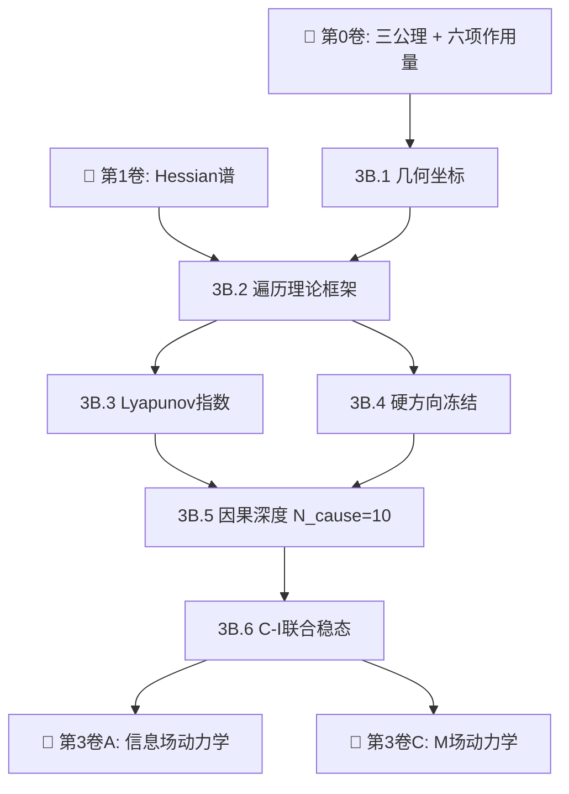

# 📘 第3卷B：因果场动力学

> **遍历理论 · Lyapunov 指数 · 因果深度 $N_{\text{cause}} = 10$ · 时间之矢**

---

## 本卷定位

因果场（$\mathcal{C}$-场）是几何论的"时间"场——负责推进方向性与不可逆性。与信息场的"认知时间"不同，因果场定义的是**客观演化方向**：因果环流的遍历理论框架确保系统从任意初始配置收敛到对称基态，Lyapunov 指数控制指数收缩速率，因果深度 $N_{\text{cause}} = 10$ 量化从基准配置到基态所需的几何步数。

**核心主张**：热力学第二定律和时间之矢是因果场遍历动力学的宏观表现，不是基本公理。

---

## 章节结构

| 章 | 标题 | 核心问题 | 来源文章 | 状态 |
|:---|:---|:---|:---:|:---:|
| 3B.1 | 引言与几何坐标 | 因果场的角度参数化 | 3B.1 独立 | ✅ |
| 3B.2 | 稳态因果环流的遍历理论 | 因果环流如何保证收敛到稳态？ | 3B.1 §1 + 0.5 §3 | ✅ |
| 3B.3 | 因果时间与 Lyapunov 指数 | 指数收缩速率如何从 Hessian 谱导出？ | 0.5 §4 | ✅ |
| 3B.4 | 硬方向冻结 | 为什么 $\mathcal{I}$ 扇区方向被冻结？ | 0.5 §6 | ✅ |
| 3B.5 | 因果深度 $N_{\text{cause}} = 10$ | 10 步几何步数如何确定？ | 0.5 §5 | ✅ |
| 3B.6 | C-I 联合稳态 | 因果场和信息场如何联合达到稳态？ | 0.5.2–0.5.5 | ✅ |

---

## 依赖关系图

---

## 阅读路径建议

| 读者背景 | 推荐路径 |
|:---|:---|
| **想理解时间之矢的几何起源** | 3B.1 → **3B.2**（遍历理论）→ 3B.5（因果深度） |
| **关注数学严格性** | 3B.1 → 3B.2 → **3B.3**（Lyapunov 指数）→ 3B.4（冻结证明） |
| **关注三场耦合** | 3B.1 → 3B.5 → **3B.6**（C-I 联合稳态） |

---

## 核心定理引用

| 编号 | 定理 | 说明 | 相关章节 |
|:---:|:---|:---|:---:|
| #196 | C 场密度指数收敛 | 全变差谱隙控制 | 3B.5 |
| #205 | 瞬态 H-定理 | KL 散度单调递减 | 3B.4 |
| #208 | C 场稳态测度存在唯一 | Dirac-δ × 均匀结构 | 3B.2 §2.1 |
| #238 | C 场条件稳态唯一 | 绝热消除存在唯一 | 3B.6 |
| #255 | 因果深度几何步数 | $N_{\text{cause}} = 10$ | 3B.5 |

---

## 关键符号表

| 符号 | 含义 | 首次定义 |
|:---|:---|:---:|
| $\tau_C$ | 因果场特征时间 | 3B.3 |
| $\lambda_k^{\text{Lyap}}$ | Lyapunov 指数谱 | 3B.3 |
| $N_{\text{cause}}$ | 因果深度 = 10 | 3B.5 |
| $\mathcal{P}_t$ | 转移半群 | 3B.2 |
| $\mu_{\text{inv}}$ | 不变测度 | 3B.2 §2.1 |
| $D_{\text{KL}}$ | KL 散度（瞬态 H-定理监控量） | 3B.4 |

---

## 与其他卷的关系

| 卷 | 关系 |
|:---|:---|
| **第0卷（从零开始）** | 提供 $\mathcal{C}$ 扇区定义 |
| **第1卷（几何结构）** | 提供 Hessian 谱——Lyapunov 指数的输入 |
| **第3A卷（信息场）** | 信息场在因果场提供的时间背景上演化 |
| **第3C卷（M场）** | M 场呼吸模式受因果环流驱动 |
| **第4卷（三场耦合）** | C-M-I 完全耦合方程的统一框架 |

---

## 来源文章

[[0.5]] · [[0.5.1]] · [[0.5.2]] · [[0.5.3]] · [[0.5.4]] · [[0.5.5]] · [[0.5.6]] · [[0.5.7]]

---

> 状态：✅ **全部完成（3B.1—3B.6），6章可直接阅读**
