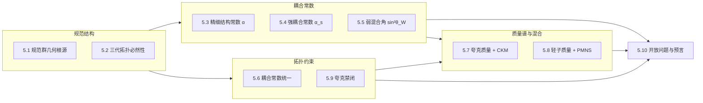

# 5.0 前言——标准模型的几何重建

> **核心主张**：粒子物理标准模型不是有效场论，而是几何论在凝聚相附近的唯一可能结果。它的规范群结构、三代代数性质、耦合常数数值、质量谱层级——全部是几何拓扑和谱刚性的必然输出。标准模型的 **19个自由参数**被消解为**少于5个几何输入参数**（三个角度 $\theta_M, \theta_C, \theta_I$ + 两个谱比 $\lambda_1/\lambda_2, \kappa_w/\kappa_w'$），而且这5个参数本身不是自由的——它们由谱刚性方程唯一锁定。

---

## I. 第5卷在几何论体系中的位置

前四卷分别完成：
- **第0卷**：从零开始——三公理、六项作用量、乘积球面谱刚性（纯数学入口）
- **第1卷**：几何结构——三分切丛、全息屏、约束截面、渗透函数（几何框架）
- **第2卷**：量纲桥——谱三元组 → 长度/时间/质量标度的重建（纯数→物理的桥梁）
- **第3+4卷**：动力学——信息场/因果场/M场的扩散演化与完全耦合

第5卷**不再引入新几何结构**，而是展示：上面这个几何框架在凝聚相附近自动输出——不需要额外假设——整个标准模型的物理内容。

## II. 标准模型参数的几何消解

在几何论中，所谓"标准模型自由参数"的消解方式如下：

| 标准模型参数 | 几何论处理 | 来源 |
|:---|:---|:---:|
| 规范群 $SU(3)\times SU(2)\times U(1)$ | **几何必然**：三分切丛七子结构 → 扇区组合规范群分类定理 | #240, #351, #357 |
| 三代费米子 | **拓扑必然**：$N_{\text{gen}} = \dim(\Delta^2)+1 = 3$，第四代简并 | #171, #197 |
| $\alpha = e^2/4\pi$ | **纯几何**：$\alpha = 1/S_e$, $S_e=137.035999084$ | #175 |
| $\alpha_s(M_Z) = 0.1184$ | **纯几何**：$\alpha_s = \sqrt{N\cdot\lambda_1^{\text{eff}}/\lambda_2^{\text{eff}}}\cdot\sin\theta_M = 0.1192$ | #276, #277 |
| $\sin^2\theta_W = 0.23122$ | **纯几何**：$\sin^2\theta_W = \frac{\sin\theta_I}{\sin\theta_C(1+\sin^2\theta_I\sqrt{\kappa_w/\kappa_w'})} = 0.23124$ | #213, #230 |
| 夸克质量谱 + CKM | **几何约束**：由S₃对称性破缺路径 + 颜色单态条件确定 | 8, 27 |
| 轻子质量谱 + PMNS | **几何约束**：$m_e = K\sin^3\theta_M$ 推广到三代 | 7, 53, 55 |
| Higgs机制 | **不需要**：质量来自几何约束（呼吸模式），不是自发对称破缺 | 0.6.5 |
| 质子稳定性 | **拓扑保护**：颜色单态定理 → 色禁闭 → 质子不衰变（或衰变率极低） | #333, 58 |

标准模型的19个自由参数在几何论中被消解为以下**封闭几何参数集**：

$$\boxed{\text{SM参数} = \mathcal{F}(\theta_M, \theta_C, \theta_I, \lambda_1^{\text{eff}}/\lambda_2^{\text{eff}}, \kappa_w/\kappa_w')}$$

其中五个几何参数均由谱刚性方程唯一锁定——它们不是拟合结果，而是解。

## III. 第5卷路线图

## IV. 读者须知

### 需要的前置知识
- **第0卷**（三公理 + 六项作用量 + 谱刚性）：否则$\theta_M,\theta_C,\theta_I$没有定义
- **第1卷**（三分切丛 + 约束截面 + 渗透函数）：否则$\lambda_1/\lambda_2, \kappa_w/\kappa_w'$没有来源
- **第2卷**（量纲桥）：否则$S_e$和$K$的来源不清
- **标准模型基础知识**（$SU(3)\times SU(2)\times U(1)$、CKM/PMNS、色禁闭）：否则读了也不知道在重建什么

### 不需要的前置知识
- 量子场论细节（耦合常数跑动、重整化群等——这些都是层展效应）
- Higgs机制（几何论不需要它）
- 大统一理论（SU(5)、SO(10)、E₆等——几何论不走那条路）

### 符号约定
- 所有角度值均以**度**为单位，除非特别标注为弧度
- 主库定理引用格式：`[[#175]]`（精细结构常数的几何形式）
- 原始手稿引用格式：`[[61]]`（规范群几何根源文章）

---

## V. 主库定理引用索引

本卷涉及的主库已验证定理如下（按章节分布）：

| 定理编号 | 定理名称 | 首次使用章节 |
|:---:|:---|:---:|
| #351 | SU(3)色对称性起源链 | 5.1 |
| #357 | SU(3)结构定理 | 5.1 |
| #240 | 扇区数规范群分类定理 | 5.1 |
| #273 | U(1)冻结约化定理 | 5.1 |
| #308 | 对角嵌入Δ | 5.1 |
| #171 | 三代必然性纯拓扑版 | 5.2 |
| #197 | 第四代简并定理 | 5.2 |
| #172 | 叶空间≅S²定理 | 5.2 |
| #175 | 精细结构常数的几何形式 | 5.3 |
| #276 | 强耦合常数的纯几何骨架 | 5.4 |
| #277 | 强耦合标度公式 | 5.4 |
| #213 | 弱混合角的纯几何骨架 | 5.5 |
| #230 | 弱混合角的纯几何形式 | 5.5 |
| #362 | 裸弱混合角定理 | 5.5 |
| #333 | 颜色单态定理 | 5.9 |
| #325 | θ_M^(2)对称性解析定理 | 5.8 |
| #335 | W₁₃≈0最近邻耦合 | 5.8 |
| #59 | 引力统一 | 5.6 |

---

*5.0 前言 · 第5卷 标准模型的几何重建*
