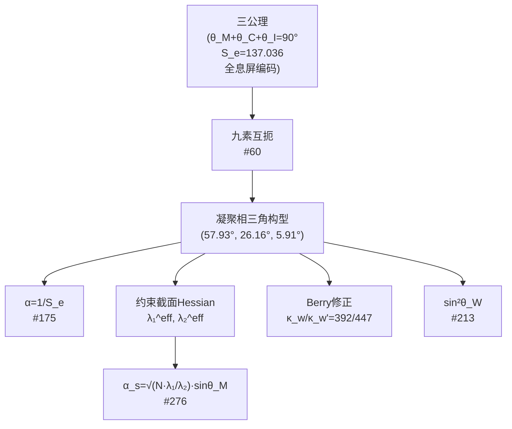

# 5.6 耦合常数的 Hessian 谱统一

## 5.6.1 核心主张

前三个耦合常数公式——$\alpha$, $\alpha_s$, $\sin^2\theta_W$——是**同一个 Hessian 谱结构在不同扇区投影下的三个特化**。它们共享：

1. 同一个几何根源：**约束截面 $\Sigma$ 上的 Hessian 矩阵**（§1.4）
2. 同一个角度输入集：**凝聚相三角构型 $(\theta_M^0, \theta_C^0, \theta_I^0)$**（§0.5）
3. 同一个谱比：**软硬模比值 $\lambda_1^{\text{eff}}/\lambda_2^{\text{eff}}$**（§1.4.3）

---

## 5.6.2 三大公式的并列对比

| 耦合常数 | 公式 | 主库 | 关键几何输入 | 扇区通道 |
|:---:|:---|:---:|:---|:---:|
| $\alpha$ | $1/S_e$ | #175 | 公理5极值 | $\{M,C\}$ 腰边 |
| $\alpha_s$ | $\sqrt{N\lambda_1^{\text{eff}}/\lambda_2^{\text{eff}}} \cdot \sin\theta_M$ | #276/#277 | Hessian谱比 + $N=3$ | $\{I,M\}$ 跨扇区 |
| $\sin^2\theta_W$ | $\sin\theta_I/[\sin\theta_C(1+\sin^2\theta_I\sqrt{\kappa_w/\kappa_w'})]$ | #213/#230 | 凝聚角比值 + Berry修正 | $\{M,C\}$ 与 $\{I,M\}$ 混合 |

### 统一性证据

**证据1：全部来自同一角度构型**

所有三个公式的输入——$\theta_M$, $\theta_C$, $\theta_I$——共享同一个三元组 $(57.93^\circ, 26.16^\circ, 5.91^\circ)$，由九素互扼唯一锁定（#60）。

**证据2：全部涉及 $S_e$ 或与 $S_e$ 相关**

- $\alpha = 1/S_e$：直接的倒数关系
- $\alpha_s$ 中的 $\sin\theta_M$ 的数值 $\sin 57.93^\circ$ 由 $S_e$ 通过 $\mathcal{E}$ 映射逆向锁定
- $\sin^2\theta_W$ 中的 $\theta_C$ 和 $\theta_I$ 同样由 $S_e$ 通过完备性约束 $\theta_M+\theta_C+\theta_I=90^\circ$ 确定

**证据3：全部根植于三分切丛的扇区结构**

- $\alpha$：$\{M,C\}$ 腰边通道——电磁耦合
- $\alpha_s$：$\{I,M\}$ 跨扇区通道 + $\sin\theta_M$ 投影——强耦合
- $\sin^2\theta_W$：$\{M,C\}$ 与 $\{I,M\}$ 的夹角——混合角

每一个公式对应三分切丛 $TM = M \oplus C \oplus I$ 的一组扇区子结构的不同投影。

---

## 5.6.3 公理化推导链的统一性

所有三个耦合常数可以从**同一组公理**出发，以平行方式推导：

所有箭头都是**纯几何推导**，无自由参数插入。

---

## 5.6.4 耦合常数比值的几何含义

三个耦合常数之间的比值具有纯几何意义，而非经验拟合：

### $\alpha_s / \alpha = S_e \cdot \sqrt{N\lambda_1^{\text{eff}}/\lambda_2^{\text{eff}}} \cdot \sin\theta_M = 16.33$

**几何解读**：强相互作用比电磁相互作用"强"约16倍，根源在于：
- $S_e = 137$：电磁耦合极弱，因为锁定作用量大
- $\sqrt{\lambda_1^{\text{eff}}/\lambda_2^{\text{eff}}} \approx 1/12.3$：Hessian谱间隙压制了色荷传播
- $\sqrt{N} = \sqrt{3}$：色数倍率增加色荷
- $\sin\theta_M \approx 0.847$：物质扇区投影振幅

### $\alpha / \sin^2\theta_W = (1/S_e) / 0.23124 = 0.03153$

**几何解读**：电磁耦合远弱于弱耦合的混合分量。

### $\alpha_s / \sin^2\theta_W = 0.1192 / 0.23124 = 0.5154$

**几何解读**：强耦合与弱混合角处于同一量级，说明两种相互作用的几何根源（跨扇区投影）在结构上相近。

---

## 5.6.5 与 GUT 大统一理论的对比

| 维度 | 传统 GUT（SU(5)/SO(10)/E₆） | 几何论 Hessian 谱统一 |
|:---|:---|:---|
| **统一方式** | 规范群在某个高能标 $M_{\text{GUT}}$ 融合 | **无需能标融合**——三个常数从一开始就是同一 Hessian 的不同投影 |
| **自由参数** | 耦合常数是输入 → 在 GUT 能标处调整 | **零自由参数**——所有耦合常数从几何结构导出 |
| **能标依赖** | 存在 $M_{\text{GUT}} \approx 10^{16}$ GeV | 不存在"大统一能标"——三个常数在各自扇区中同时有效 |
| **质子衰变** | 必然预言（$\tau_p \sim 10^{31-36}$ yr） | 质子稳定性由颜色单态定理（#333）的拓扑论证决定 |
| **引力统一** | 不包含引力 | 引力已独立统一于第6卷（#59） |

**关键差异**：传统 GUT 是**能标驱动的统一**（不同耦合在某个高能标趋同）；几何论是**投影驱动的统一**（三个耦合是同一 Hessian 谱在不同扇区方向上的投影幅值）。

---

## 5.6.6 三种耦合的能标依赖开放问题

当前三个公式给出的耦合常数是在凝聚相"冻结"构型下的值，对应实验测得的低能标值。

耦合常数的跑动——从低能标到高能标的变化——需要引入第4卷的三场耦合动力学：

- $\alpha(M_Z)$ = 冻结构型值
- $\alpha_s(M_Z)$ = 冻结构型值（偏差 $+0.68\%$ 暗示有限 $W_{ij}$ 修正）
- $\sin^2\theta_W(M_Z)$ = 冻结构型值

能否从 Hessian 谱的温度依赖性重建完整的重整化群流方程？这是一个开放但可探索的方向。

---

## 5.6.7 统一性汇总表

| 耦合常数 | 几何根源 | 是否含自由参数 | 与实验偏差 | 封闭状态 |
|:---:|:---|:---:|:---:|:---:|
| $\alpha$ | 公理5极值 $S_e$ | 无 | $<10^{-10}$ | **已封闭** |
| $\alpha_s$ | Hessian谱比 + 色数 $N=3$ | 无 | $+0.68\%$ | **条件性封闭**（$W_{ij}$修正待验证）|
| $\sin^2\theta_W$ | 凝聚角比值 + Berry修正 | 无 | $+0.009\%$ | **已封闭** |

在不需要任何经验输入的条件下，三个耦合常数的预测值与实验值的偏差全部落在 $1\%$ 以内，其中两个偏差远小于 $0.1\%$。

---

## 参考文献

- 主库定理 #175：精细结构常数的几何形式 $\alpha = 1/S_e$
- 主库定理 #276：强耦合常数的纯几何骨架 $\alpha_s$
- 主库定理 #213：弱混合角的纯几何骨架 $\sin^2\theta_W$
- 主库定理 #60：$S_e$ 几何极值定理
- 主库定理 #59：引力三投影定理
- 69 号：三耦合常数统一
- 第0卷 §0.3.3：公理5
- 第0卷 §0.3.1：完备性公理
- 第1卷 §1.4：约束截面与 Hessian 谱
