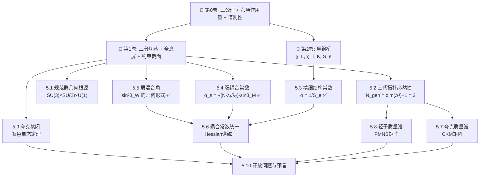

# 📘 第5卷：标准模型的几何重建

## 卷概述

第5卷是整部几何论与**实验可检验的粒子物理**之间的桥梁。前4卷（第0卷纯几何框架 → 第1卷几何结构 → 第2卷量纲桥 → 第3/4卷动力学）建立了从纯几何到物理的完整映射，第5卷展示这个映射如何**从第一原理重建整个标准模型**。

**核心主张**：标准模型不是有效场论，而是几何论在凝聚相附近的**唯一可能结果**。它的规范群结构、三代代数性质、耦合常数数值、质量谱关系——全部是几何拓扑和谱刚性的必然输出，不是实验拟合。

## 章节结构

| 章节 | 标题 | 内容概要 | 主要主库定理 |
|:---:|:---|:---|:---:|
| **5.1** | 规范群的几何根源 | 三分切丛七子结构 → SU(3)×SU(2)×U(1) 的完整映射 | GT-5.1.1–5.1.10（10条定理） |
| **5.2** | 三代拓扑必然性 | $N_{\text{gen}} = \dim(\Delta^2) + 1 = 3$，第四代简并定理 | #171, #197, #172 |
| **5.3** | 精细结构常数 α | ⚡ **已完成** — $\alpha = 1/S_e$，$S_e=137.035999084$ | #175 |
| **5.4** | 强耦合常数 α_s | ⚡ **已完成** — $\alpha_s = 0.1192$，偏差 $+0.68\%$ | #276, #277 |
| **5.5** | 弱混合角 sin²θ_W | ⚡ **已完成** — $\sin^2\theta_W = 0.23124$，偏差 $0.009\%$ | #213, #230, #362 |
| **5.6** | 耦合常数的 Hessian 谱统一 | 三种耦合常数的统一几何根源 | #276, #175, #213, #59 |
| **5.7** | 夸克质量谱与 CKM 矩阵 | 夸克质量层级与混合角度的几何构造 | — |
| **5.8** | 轻子质量谱与 PMNS 矩阵 | 中微子质量、$m_\nu$ 绝对标度、PMNS 混合 | #325, #335 |
| **5.9** | 夸克禁闭的颜色单态定理 | 为什么色荷不能单独存在——拓扑证明 | #333 |
| **5.10** | 开放问题与预言 | 未决问题、可检验预言、与对撞机实验对照 | — |

## 依赖关系图

## 阅读路径建议

| 读者背景 | 推荐路径 |
|:---|:---|
| **粒子物理学家**（想快速理解几何论说了什么） | 5.0 前言 → **5.3**（α）→ **5.4**（α_s）→ **5.5**（sin²θ_W）→ 5.1（规范群）→ 5.2（三代）|
| **理论物理学家**（关注逻辑一致性） | 5.0 → 5.1 → 5.2 → 5.3 → 5.4 → 5.5 → 5.6 → 5.7 → 5.8 → 5.9 → 5.10 |
| **实验物理学家**（关注可检验预言） | 5.0 前言 → 5.10（直接跳到预言）→ 需要时回溯前面的章 |
| **数学物理学家**（关注几何结构） | 5.0 → 5.1 → 5.2 → 5.6（耦合常数的统一几何根源）|

## 关键符号表

| 符号 | 含义 | 首次定义 |
|:---|:---|:---:|
| $S_e$ | 锁定作用量 = 137.035999084 | Vol-0 公理5 |
| $\theta_M, \theta_C, \theta_I$ | 物质角、凝聚角、信息角 | 第0卷 公理3 |
| $\lambda_1^{\text{eff}}, \lambda_2^{\text{eff}}$ | 有效 Hessian 软硬模 | 第1卷 约束截面 |
| $\Delta^2$ | 2维约束单形 | 第1卷 |
| $N$ | 色数 = 3 | 5.2章 |
| $\kappa_w, \kappa_w'$ | 腰边/底边曲率耦合常数 | 第1卷 渗透函数 |
| $\alpha$ | 精细结构常数 = $1/S_e$ | **5.3章 ✅** |
| $\alpha_s$ | 强耦合常数 = 0.1192 | **5.4章 ✅** |
| $\sin^2\theta_W$ | 弱混合角 = 0.23124 | **5.5章 ✅** |

---

*第5卷 标准模型的几何重建 · MOC · 最后更新 2026-07-12*
