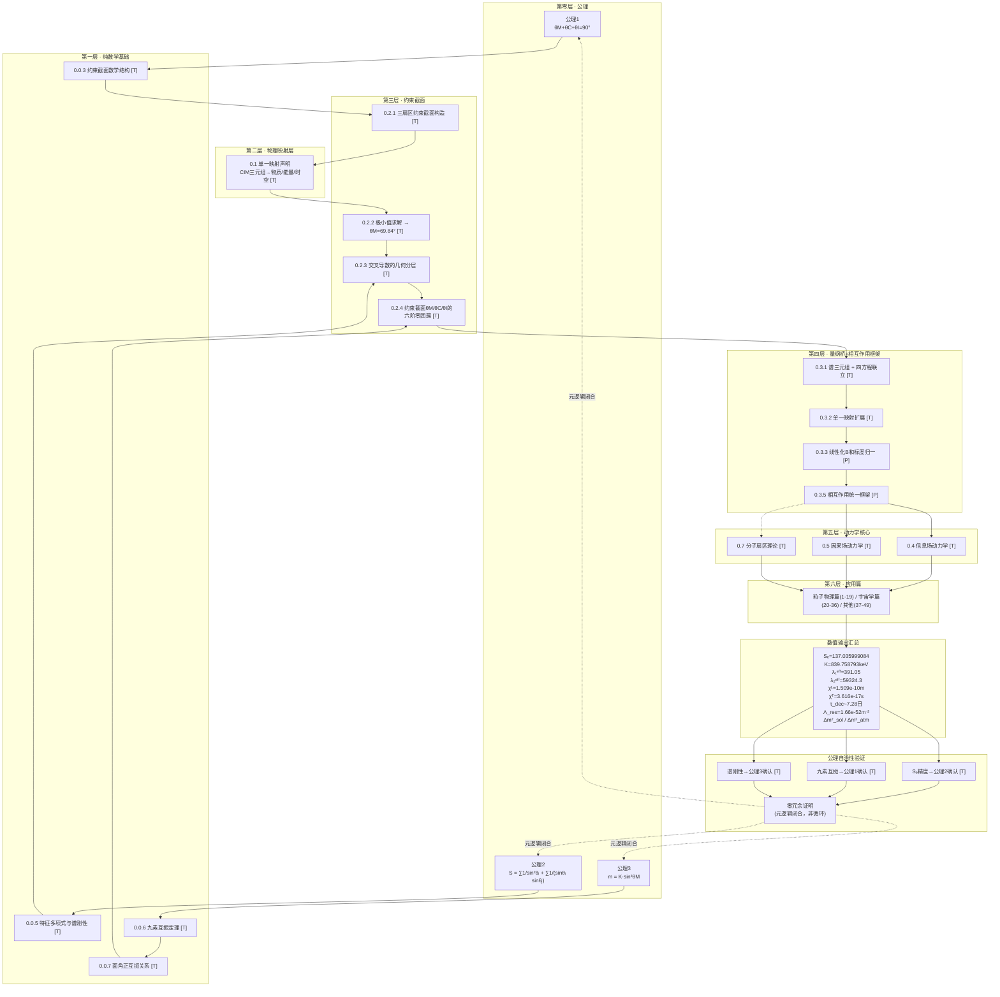

# 几何论推导导流图

> 版本：260626.6 | 语言：中文
> 依赖标注：[T]=定理 [P]=命题 [R]=研究方向 [H]=假设
> 数值来源：括号内标注文章编号，如(31号)
> 编译状态：校验通过 ✓



---

## 主要推导路径

### 路径一：粒子物理主链（[T]占比最高）
```
公理 → 九素互扼 → 约束截面 → 量纲桥 → 相互作用框架 → 粒子物理应用
```
数值产出：Sₑ, K, λ₁ᵉᶠᶠ, λ₂ᵉᶠᶠ, χᴸ, χᵀ, τ_dec, 中微子质量平方差

### 路径二：宇宙学分支
```
量纲桥(Λ_res计算) → 信息场滚落(48号) → 宇宙学应用(20-36号)
```
数值产出：Λ_res≈1.66×10⁻⁵²m⁻², CMB偶极异常2.14倍增强

### 路径三：分子/生物分支
```
量纲桥 → 分子扇区理论(0.7) → 生物温度适配区间
```
状态：部分为[R]，D3→B4的反馈环尚在构建中

---

## 关键开放研究点 [R]

| 编号 | 位置 | 内容 |
|:---|:---|:---|
| R1 | D2→D1 | 因果场-信息场耦合方程传播到物理空间的严格推导 |
| R2 | B4→D3 | 分子扇区从相互作用框架分离的边界条件 |
| R3 | L7→L8 | 所有数值误差在约束截面上的完整传播分析 |
| R4 | V4回馈 | 元逻辑闭合的形式化证明（当前为认知论证） |

---

## 版本记录

| 版本 | 日期 | 变更 |
|:---|:---|:---|
| v3 | 260626.6 | Mermaid重写，颜色分区，开放研究点表格 |
| v2 | 260626.6 | 字符画版，修复层级/收敛/闭环问题 |
| v1 | 260626.6 | 初始字符画版 |

> 注意：本图顶部需以 ````mermaid` 和 ```` 包裹以在支持Mermaid的Markdown渲染器（如GitHub、Obsidian、Typora）中正确显示。
