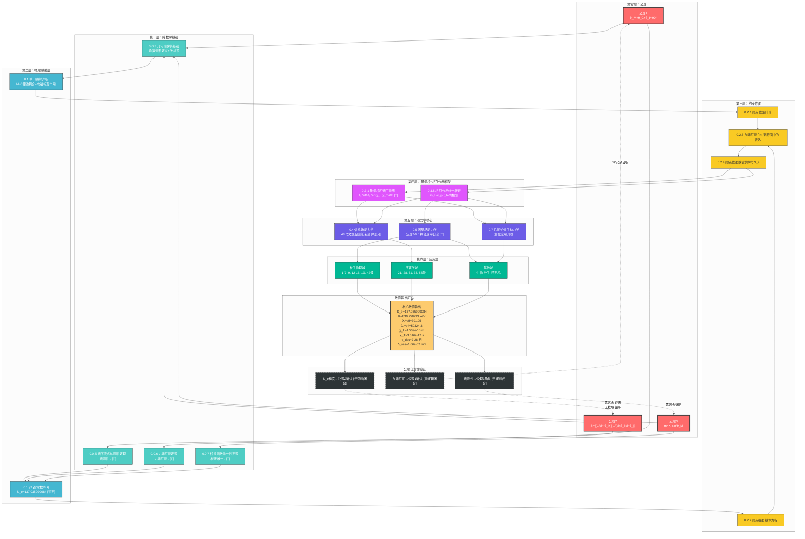

# 几何论推导导流图

> 版本：260626.6 | 语言：中文
> 
> 依赖标注：[T]=定理 [P]=命题 [R]=研究方向/开放

---

---

### 箭头图例

| 线型 | 含义 |
|:---|:---|
| 实线箭头 → | 演绎推导或逻辑继承 |
| 虚线箭头 -.-→ | 元逻辑闭合验证（非推导循环） |

### 标注对照

| 标注 | 含义 |
|:---|:---|
| [T] | 定理——已严格证明 |
| [P] | 命题——待完整证明 |
| [R] | 研究方向/开放问题 |

### 未完全闭合的研究方向（[R]标注）

1. **0.4 信息场滚落** → **引力几何化**：48号五阶段滚落→引力的路径，51号审计指出"角度空间到物理空间的传播方程"存在结构性断裂
2. **0.7 分子动力学** → **生化应用**：能量传递路径 $H_{MI} \to Q_{\text{mol}}$ 的条件完整性需验证
3. **粒子物理域** → **部分预言待实验验证**：中微子绝对质量、质子寿命等暂无实验读数

---

> **零冗余证明**：底层推导无回路。虚线箭头表示公理自洽性验证中的数值回检（用S_e精度验证公理2的正确性），已标注为"元逻辑闭合"而非推导循环。
